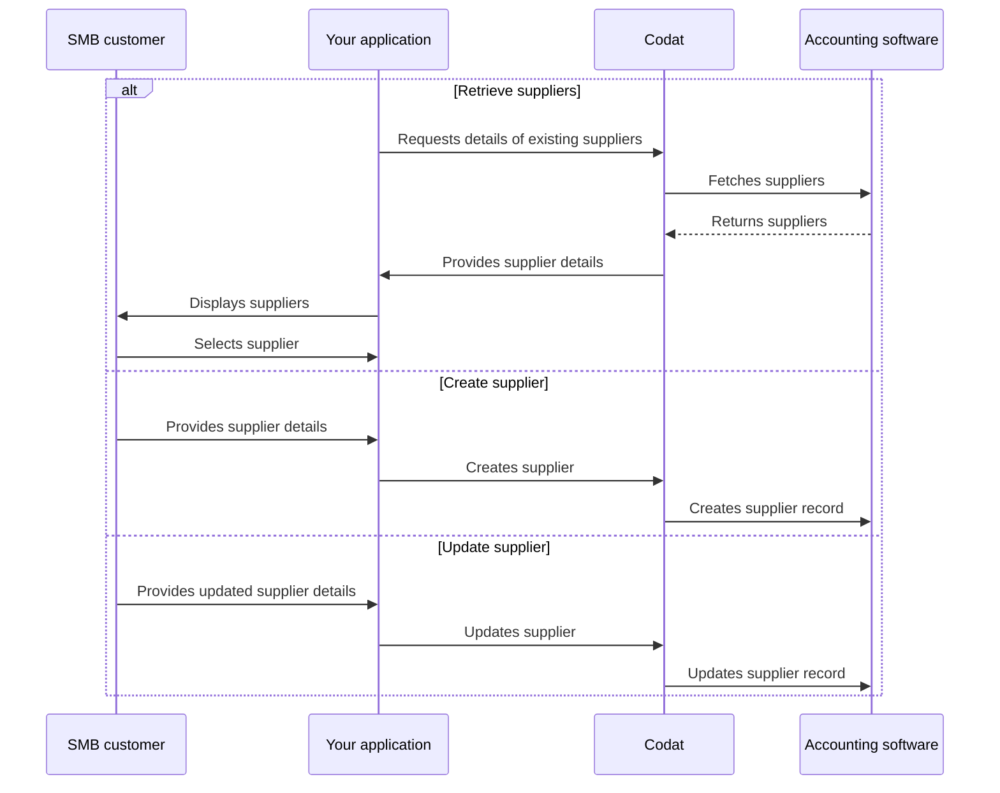

import Tabs from "@theme/Tabs";
import TabItem from "@theme/TabItem";
import ManageSuppliers from "../_manage-suppliers.md";

## Overview

In accounts payable, each bill is associated with a _supplier_. The supplier represents a business or a sole trader that provides goods or services to your SMB customer.

Their records also contain key information, such as contact details, that can be used to notify the supplier once a payment is made.

To pay a bill in Bill Pay, you can use your customer's existing suppliers or create a new one. We have highlighted this alternative sequence of steps in our detailed process diagram below.

<b>Detailed process diagram</b>

```mermaid

  sequenceDiagram
      participant smb as SMB customer
      participant app as Your application
      participant codat as Codat
      participant acctg as Accounting software

      alt Retrieve suppliers
        app ->> codat: Requests details of existing suppliers
        codat ->> acctg: Fetches suppliers
        acctg -->> codat: Returns suppliers
        codat ->> app: Provides supplier details
        app ->> smb: Displays suppliers
        smb ->> app: Selects supplier
      else Create supplier
        smb ->> app: Provides supplier details
        app ->> codat: Creates supplier
        codat ->> acctg: Creates supplier record
      else Update supplier
        smb ->> app: Provides updated supplier details
        app ->> codat: Updates supplier
        codat ->> acctg: Updates supplier record
      end
```

:::tip Narrow down the supplier list

Supplier endpoints of the Bill Pay solution return only **active** suppliers from the accounting platform. You can use [query parameters](/using-the-api/querying) to narrow down the list of results further.
:::

<ManageSuppliers
  listendpoint="/sync-for-payables-v2-api#/operations/list-suppliers"
  createendpoint="/sync-for-payables-v2-api#/operations/create-supplier"
/>

## Update supplier

If your customer's existing supplier changes address or business name, you can reflect this change in their accounting software using the [Update supplier](sync-for-payables-v2-api#/operations/update-supplier) endpoint.

Include all fields in the request, even if their values haven't changed. If you leave a field out, its value will be **deleted** from the supplier record.

:::info Software coverage

This action is currently only supported for FreeAgent, QuickBooks Online, and Xero.

:::

### Software-specific behavior

Each accounting software has some limitations when updating suppliers. We've summarized them below.

#### Xero

| Limitation             | Description                                                                                                                                      |
|------------------------|--------------------------------------------------------------------------------------------------------------------------------------------------|
| **Supplier name**      | It's not possible to clear the supplier name. Sending a `null` or `""` value for `supplierName`, or `null` value for both `supplierName` and `contactName` keeps the existing supplier name. |
| **Duplicate names**    | Supplier names must be unique. Updating a name to match an existing supplier returns a `400` response.                                                        |
| **Archived suppliers** | It's not possible to update archived suppliers via the Xero API. To unarchive, do it manually in Xero.|                                                 |

#### QuickBooks Online

| Limitation             | Description                                                                                                                                               |
|------------------------|-----------------------------------------------------------------------------------------------------------------------------------------------------------|
| **Supplier name**      | If `supplierName` is `null` in the request, QBO uses the value in `contactName` instead. If both fields are `null`, QBO returns a `400` response.|
| **Default currency**   | It's not possible to update the supplier's currency. Sending a `defaultCurrency` in the request that differs from the current value results in a `400` response. Send a `null` value to leave it unchanged.                      |
| **Archived suppliers** | All changes to archived suppliers are ignored. Include `"status": "Active"` in the update request to reactivate an archived supplier and apply the changes.|

#### FreeAgent

| Limitation           | Description                                                                                                                        |
|----------------------|------------------------------------------------------------------------------------------------------------------------------------|
| **Supplier name**    | If `supplierName` is `null` in the request, FreeAgent uses the value in `contactName` instead (the value must contain a space). If both fields are `null`, FreeAgent returns a `400` response.         |
| **Country**          | It's not possible to clear the supplier's country. Sending a `null` value or excluding the field from the request sets the value to the company's default country.                    |
| **Default currency** | FreeAgent doesn't support currency at supplier level. Any value sent in the request is ignored, and the response returns the company's base currency. |

:::tip Recap

You have learnt how to view, create, and update your customer's suppliers who provide them with goods and services.

Next, you can choose to manage your supplier's bills or payment methods prior to paying those bills.

:::

---

## Read next

- [Manage your customer's bills](/payables/sync/bills)
- [Pay your customer's bills](/payables/sync/pay-bill)
