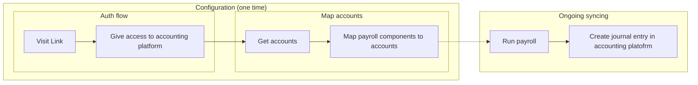

import Products from "@components/global/Products";
import { IntegrationsList } from "@components/global/Integrations";
import { integrationsFilterPayroll } from "@components/global/Integrations/integrations";

Use Codat to integrate your customers' payroll data from their HR and payroll platforms into their accounting platforms and to support its reconciliation.

### How Codat helps

[Sync for Payroll](/sync-for-payroll-api) supports HR, payroll, and vertical SaaS companies integrate their product with their customers' accounting platforms. 

Integrating with Codat helps your SMB customers remove complexity and repetition from payroll processing, eliminate manual entry and mapping of payroll data, and save time on tasks that usually need to be completed multiple times a month. 

## Features

## How it works

### [Connect to your SMB's accounting platform](/auth-flow/overview)

Codat handles authorization and linking to your SMB's accounting platform and takes into account intricate details such as rate limits.

### [Categorize and map payroll components](mapping)

Each business may need to reconcile payroll costs, pensions, and taxes to different nominal accounts, based on their business type and the accounting platform they use. Codat provides an endpoint to pull chart of accounts and tracking categories data in order to avoid manual categorization efforts and give flexibility to SMBs for reconciling data. As a payroll platform, you will need to build a flexible interface for your customer to perform the mapping.  

### [Sync payruns with your customers accounting software](sync-payroll)

Use Codat's create and update functionality to post a journal showing the correct amounts against each account. These transactions can easily be reconciled against the business's bank feed.

## Compatible integrations

<IntegrationsList filter={integrationsFilterPayroll} />