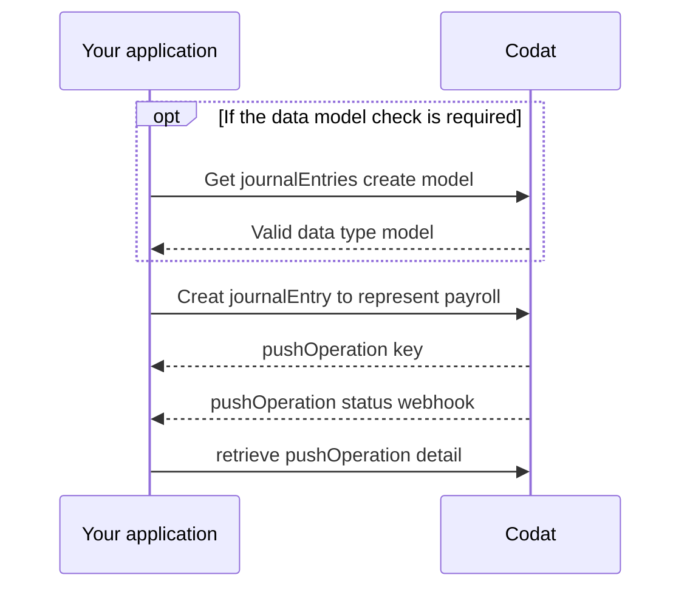

import Tabs from "@theme/Tabs";
import TabItem from "@theme/TabItem"

## Generate payroll object

Before you can record the payroll in the accounting platform, you'll need to generate a line item object for each employee for each corresponding payroll component. That means you'll likely have multiple line items for each employee.

Each line item object should have the following information:

- `description` - a title such as the month of the payroll or payrun
- `accountRef` - The corresponding account
- `netAmount` - Net amount paid to employee
- `currency` - The currency corresponding to the amount
- `tracking` - A list of references to records for tracking

## Record payroll

Steps:
- [Get Journal push model](sync-payroll#get-journal-push-model)
- [Creating a payroll entry](sync-payroll#creating-a-payroll-entry)
- [Monitoring the status of the request](sync-payroll#monitoring-the-status-of-the-request)



In order to record payroll entries in the accounting platform, you can use the [create journal entries](/sync-for-payroll-api#/operations/create-journal-entry) endpoint to push payroll to the mapped accounts on the SMB's general ledger.

The journal entry can then be reconciled against the debit entry in the companies bankfeeds.

### Get Journal push model

Before creating a journalEntry - you should first check the datamodel, This helps you ensure all required properties are included in your request. 

Checking the model may be a one-time activity (for integrations with static properties) or be required more frequently (for ERP integrations with higher customization options).

Let's use our Get create journalEntries model endpoint to view integration-specific requirements for creating the journalEntries data type in Xero.

<Tabs>

<TabItem value="Request URL" label="Request URL">

```http
GET https://api.codat.io/companies/{companyId}/connections/{connectionId}/options/journalEntries
```

</TabItem>

<TabItem value="Sample Xero Response" label="Sample Xero Response">

```json
{
  "type": "Object",
  "displayName": "JournalEntry",
  "properties": {
    "postedOn": {
      "type": "DateTime",
      "displayName": "Posted On",
      "description": "The date the entry was posted in the originating system",
      "required": true,
      "validation": {
        "warnings": [],
        "information": [
          {
            "field": "PostedOn",
            "details": "If no date is specified, it will default to today's date."
          }
        ]
      }
    },
    "journalLines": {
      "type": "Array",
      "displayName": "Journal Lines",
      "description": "A collection of detail lines that represent the transactions associated in this entry",
      "properties": {
        "description": {
          "type": "String",
          "displayName": "Description",
          "description": "The description for the journal line",
          "required": true,
          "validation": {
            "warnings": [],
            "information": [
              {
                "field": "JournalLines.Description",
                "details": "Must not be longer than 4000 characters long and must be the same for all lines."
              }
            ]
          }
        },
        "netAmount": {
          "type": "Number",
          "displayName": "Net Amount",
          "description": "The amount for the journal line, excluding tax",
          "required": true,
          "validation": {
            "warnings": [],
            "information": [
              {
                "field": "JournalLines.NetAmount",
                "details": "Must be provided."
              }
            ]
          }
        },
        "accountRef": {
          "type": "Object",
          "displayName": "Nominal Account Reference",
          "description": "Reference to the nominal account the line is linked to",
          "properties": {
            "id": {
              "type": "String",
              "displayName": "Account ID",
              "description": "The identifier for the account",
              "required": true,
              "validation": {
                "warnings": [
                  {
                    "field": "AccountRef.Id",
                    "details": "Must be a valid GUID."
                  },
                  {
                    "field": "AccountRef.Id",
                    "details": "Must match the ID of an existing account."
                  }
                ],
                "information": [
                  {
                    "field": "AccountRef.Id",
                    "details": "Must be provided."
                  }
                ]
              }
            }
          },
          "required": true,
          "validation": {
            "warnings": [],
            "information": [
              {
                "field": "JournalLines.AccountRef",
                "details": "Must be provided."
              }
            ]
          }
        },
        "tracking": {
          "type": "Object",
          "displayName": "Tracking",
          "description": "Information this item is being tracked against",
          "properties": {
            "recordRefs": {
              "type": "Array",
              "displayName": "Record References",
              "description": "A collection of records this item is being tracked against",
              "properties": {
                "id": {
                  "type": "String",
                  "displayName": "Identifier",
                  "description": "The reference identifier for the record",
                  "required": true,
                  "validation": {
                    "warnings": [],
                    "information": [
                      {
                        "field": "RecordRefs.Id",
                        "details": "Must not be a parent tracking category."
                      },
                      {
                        "field": "RecordRefs.Id",
                        "details": "Must be provided."
                      }
                    ]
                  }
                }
              },
              "required": false,
              "validation": {
                "warnings": [],
                "information": [
                  {
                    "field": "Tracking.RecordRefs",
                    "details": "Tracking categories must not have the same parent tracking category."
                  },
                  {
                    "field": "Tracking.RecordRefs",
                    "details": "Maximum of 2 Tracking Categories."
                  }
                ]
              }
            }
          },
          "required": false
        }
      },
      "required": true,
      "validation": {
        "warnings": [],
        "information": [
          {
            "field": "JournalLines",
            "details": "At least 2 must be provided."
          }
        ]
      }
    }
  },
  "required": true
}
```

</TabItem>

</Tabs>

The response indicates that the following properties must be populated (`requried: true`) when you create a journalEntry to represent payroll in Xero:
- `postedOn` 
- `journalLines` which also require the following sub properties
    - `description`
    - `netAmount`
    - `accountRef`
    - `tracking`


### Creating a payroll entry
:::caution Properties not in the _Get model_ response
If you attempt to create or update a record using properties not documented in the  _Get journalEntries model_ response, you may receive validation errors in response to your request.
:::

When creating the payroll Journal Entry, you should create a line item for each payroll component, and the sum of the amounts on the payroll component should be equal to the sum of the debit on the mapped bank account that the payment is being made from.

in the example below, there are five journalEntry line's:
1. The first line credits(increases the balance) of the "Payroll Wage Expenses" by $7,291.67
1. The second line credits the "Payroll Tax Payable" account by $452.08
1. The third line credits the "Payroll Expenses 401k" account by $1166.67
1. The fourth line debits(reduces the balance) the "Checking" account by $8,910.42, the debit against the bank account should equal the sum of the payroll components.


<Tabs>

<TabItem value="Request URL" label="Request URL">

```http title="Create journal entries"
POST https://api.codat.io/companies/{companyId}/connections/{connectionId}/push/journalEntries
```

</TabItem>

<TabItem value="Example request body" label="Example request body">

```json title="Example request body"

{
    "postedOn": "2023-02-14T00:00:00",
    "createdOn": "2023-02-14T00:00:00",
    "journalLines": [
        {
            "description": "August Payroll",
            "netAmount": 7291.67,
            "currency": "USD",
            "accountRef": {
                "id": "92",
                "name": "Payroll Wage Expenses"
            },
            "tracking": {
               "recordRefs": [
                            {
                                "id": "DEPARTMENT_1",
                                "dataType": "trackingCategories"
                            }
                        ]
            }
        },
        {
            "description": "August Payroll",
            "netAmount": 452.08,
            "currency": "USD",
            "accountRef": {
                "id": "96",
                "name": "Payroll Tax Payable"
            },
            "tracking": {
                "recordRefs": []
            }
        },
        {
            "description": "August Payroll",
            "netAmount": 1166.67,
            "currency": "USD",
            "accountRef": {
                "id": "97",
                "name": "Payroll Expenses 401k"
            },
            "tracking": {
                "recordRefs": []
            }
        },
        {
            "description": "August Payroll",
            "netAmount": -8910.42,
            "currency": "USD",
            "accountRef": {
                "id": "35",
                "name": "Checking"
            },
            "tracking": {
                "recordRefs": []
            }
        }
    ]
}


```

</TabItem>

<TabItem value="Example response" label="Example response">

```json
{
	"changes": [
		{
			"type": "Created",
			"recordRef": {
				"dataType": "journalEntries"
			}
		}
	],
	"data": {
		"postedOn": "2023-08-14T00:00:00",
		"createdOn": "2023-08-14T00:00:00",
		"journalLines": [
			{
				"description": "August Payroll",
				"netAmount": 7291.67,
				"currency": "USD",
				"accountRef": {
					"id": "92",
					"name": "Payroll Wage Expenses"
				},
				"tracking": {
					"recordRefs": [
						{
							"id": "DEPARTMENT_1",
							"dataType": "trackingCategories"
						}
					]
				}
			},
			{
				"description": "August Payroll",
				"netAmount": 452.08,
				"currency": "USD",
				"accountRef": {
					"id": "96",
					"name": "Payroll Tax Payable"
				},
				"tracking": {
					"recordRefs": []
				}
			},
			{
				"description": "August Payroll",
				"netAmount": 1166.67,
				"currency": "USD",
				"accountRef": {
					"id": "97",
					"name": "Payroll Expenses 401k"
				},
				"tracking": {
					"recordRefs": []
				}
			},
			{
				"description": "August Payroll",
				"netAmount": -8910.42,
				"currency": "USD",
				"accountRef": {
					"id": "35",
					"name": "Checking"
				},
				"tracking": {
					"recordRefs": []
				}
			}
		]
	},
	"dataType": "journalEntries",
	"companyId": "d7f743a9-1804-4116-8c8a-e606f7e2f66c",
	"pushOperationKey": "b9c1381a-8742-4a45-9dc5-528101dbd0e3",
	"dataConnectionKey": "fa139396-523a-4a58-bf2b-8da82c8a673f",
	"requestedOnUtc": "2023-08-14T14:53:44.6401039Z",
	"status": "Pending",
	"statusCode": 202
}
```

</TabItem>

</Tabs>

When you make the request, you will receive a pushOperation response, this will include the following information:

- **pushOperationKey**: a unique idempotent identifier generated by Codat to represent this single pushOperation that can be used to track its status
- **dataType**: the type of data being created, in this case, `journalEntry`
- **status**: the status of the create operation, which can be `Pending`, `Failed`, `Success` or `TimedOut` 
- **requestedOnUtc**: the datetime (in UTC) when the operation was requested 
- **completedOnUtc**: the datetime (in UTC) when the operaion was completed, null if `Pending`
- **validation**: a human-readable object that contains validation details, including errors, encountered during the operation.
- **changes**: an array that communicates which record has changed (`recordRef` property) and the manner in which it changed (`type` property that can be `Unknown`, `Created`, `Modified`, or `Deleted`)

### Monitoring the status of the request
After your request has been accepted, it will have a status of `Pending`. You should use the [Push Operation Status Changed](../using-the-api/webhooks/core-rules-types#push-operation-status-has-changed) webhooks to track when the status of your pushOperation changes to `Success` or `Failed`.

If the request is successfull, you will receive a webhook like this:

```json
{
 "CompanyId":"d7f743a9-1804-4116-8c8a-e606f7e2f66c",
 "RuleId":"c40791fe-b6fd-45c3-9bf7-0a16abf1b8fd",
 "Type":"Push Operation Status Changed",
 "AlertId":"a62bfb38-d73c-4aab-9bb6-d8014bba5f29",
 "Message":"journalEntries triggered notification for PushOperationStatusChanged at 2023-08-14T18:19:42.742Z",
 "Data":{
    "dataType":"journalEntries",
    "status":"Success",
    "pushOperationKey":"b9c1381a-8742-4a45-9dc5-528101dbd0e3"
    }
}
```

If you want to see a history of all pushOperations for your company, you can retrieve these from the [list-push-operations](/sync-for-payroll-api#/operations/list-push-operations) endpoint.