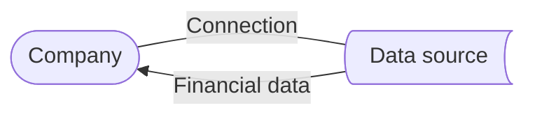

This page provides the definitions and relationships between the key terms and data concepts that Spend Insights uses to analyze your customers' spend. We recommend you review these before using the Spend Insights solution to ensure you're making the most of its capabilities. 

### Company

In Codat, each one of your small and medium-sized business (SMB) customers is represented by a **company**. The company shares their financial data with us via a [connection](/spend-insights/guides/key-terms#connection).

### Connection

When a company agrees to share access to their financial data, we establish a link to their accounting software or ERP system to read and analyze the data. This link is called a **connection**.

### Data source

Codat calls the accounting software or ERP system that contains your customer's financial data a **data source**. Spend Insights reads the data from the data source to provide you with detailed and actionable supplier spend analysis. We use a [connection](/spend-insights/guides/key-terms#connection) to read that data. 

### Supplier

:::tip Also known as

Vendor, creditor, trade creditor

:::

A **supplier** is a person or company that provides goods or services to a business (your SMB customer) in exchange for payment.

### Bill

:::tip Also known as

Invoice, purchase invoice, vendor invoice, supplier invoice, bill payable

:::

A **bill** is a document issued by a supplier to a business (your SMB customer), requesting payment for goods or services provided on credit. It contains the following details:

- Bill issue date as recorded in the accounting system
- Bill amount and currency
- Line items that describe what the bill is for

### Payment

:::tip Also known as

Vendor payment, bill payment

:::

A **payment** is a record of money transferred from a business (your SMB customer) to a supplier in full or partial settlement of one or more bills. It is allocated against an accounts payable account.

### Expense

:::tip Also known as

Direct cost, overhead, product costs, spend, spend transaction, payment

:::

An **expense** is a record of money spent by a business (your SMB customer) and paid immediately at the point of purchase, or a refund associated with such transaction. 

Common examples include credit and debit card payments and online purchases. Unlike bills, expenses don't impact accounts payable.

### Total spend

:::tip Also known as

Total expenditure, total expenses, total purchases

:::

**Total spend** is the total amount of money paid by a business (your SMB customer) to its suppliers over a given period. This includes [bills](/spend-insights/guides/key-terms#bill) paid through accounts payable and [expenses](/spend-insights/guides/key-terms#direct-cost) paid immediately at the point of purchase.

### Payment terms

**Payment terms** are the conditions agreed between a supplier and a business (your SMB customer) that determine when a bill must be paid. 

They are typically expressed as a number of days from the date of the bill.

### Settlement period

The **settlement period** is the length of time between the issue of a bill by the supplier and its payment by the business (your SMB customer).

### Payment method

A **payment method** is the means by which a business (your SMB customer) pays money to a supplier, either to settle a bill or at the point of incurring an expense.
