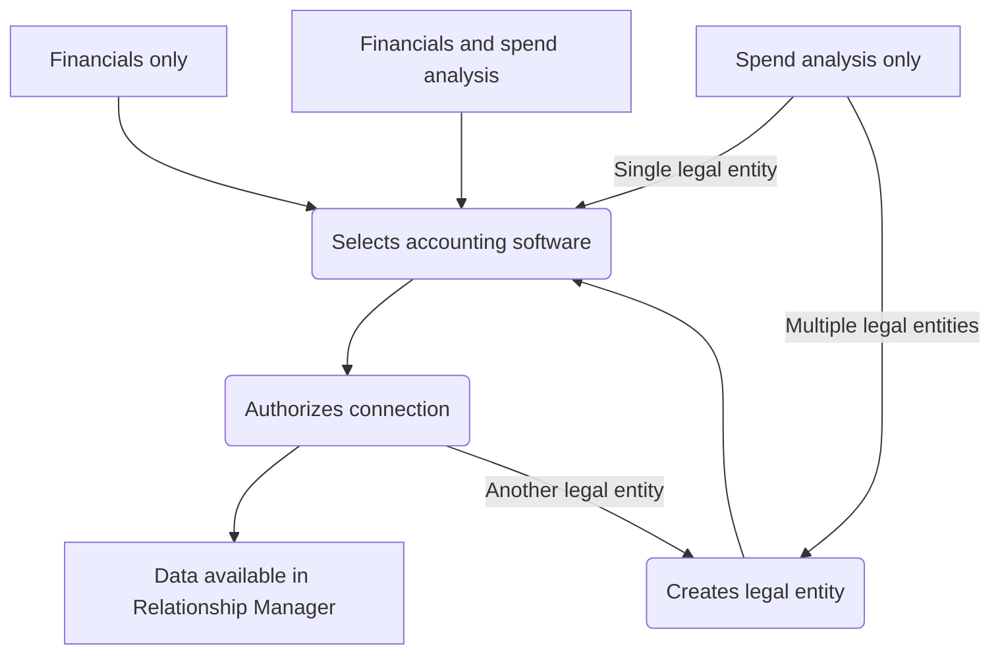

import ReadNext from "@components/global/ReadNext";

## Overview

Our [Relationship Manager Portal](https://relationships.codat.io/) is your one-stop shop to view the clients and relationships you are responsible for. Here, your organization's clients are represented as [companies](../../terms/company). 

In this guide, you will see the connection journeys your customer goes through when you send them a business data request. 

## Initial business data request

When you initiate a request for your customer's business data, you can ask them for one or both of these types of data:

- **Financials**, which includes a profit and loss statement and a balance sheet statement enriched with our [categorization](/lending/features/financial-statements-overview#categorized-financial-accounts) feature.

- **Spend analysis**, which provides accounts payable and supplier information to the level of individual transactions, payment methods, terms, etc.

We provide detailed guidance on requesting this data in our [Analyze your customers' spend data](/supplier-enablement/guides/analyze-spend) guide.

Once you submit the information request, your customer will receive an email that will prompt them to start a journey to authorize your access to their data. The content of this email will differ based on the type of data you selected.

For any type of information you requested, they will need to follow a [software connection journey](/supplier-enablement/guides/customer-journey#software-connection-journey). If you requested spend analysis data, the customer will also go through [multi-entity journey](/supplier-enablement/guides/customer-journey#multi-entity-connection-journey) steps.

| Requested data type  | Software connection journey | Multi-entity journey |
|----------------------|-----------------------------|----------------------|
| Financials only      | ✔️                           | ❌                    |
| Spend analysis only           | ✔️                           | ✔️                    |
| Financials and spend analysis| ✔️                           | ❌                    |

### Journey overview

Next, let's review the details of these journeys.

## Multi-entity connection journey

## Software connection journey

The information request email your client receives contains a call-to-action button that initiates 

will contain a call-to-action button 

For any type of information you requested, your customer will have to authorize a connection to their accounting software. This will allow you to see their business data via Codat's Relationship Manager. 

Regardless of the information type you requested, your customer will always have to go through the software connection journey to allow you to see their business data via Codat's Relationship Manager Portal. 

They will receive a request email with a call-to-action that 

The information request email auto-sent to 

there will be a button

The content of the email will differ depending on the information type you selected.

they will press a button. This will initiate Codat's Link flow. the look, feel, and content of the flow will depend on the settings selected by your organization. 

in the flow, the customer will choose their software that they are going to let us access. They will then be redirected to that software to provide their credentials and authorize our access. 

<ReadNext
  links={[
    ["Supplier Enablement overview", "/supplier-enablement/overview", ],
  ]}
>
</ReadNext>