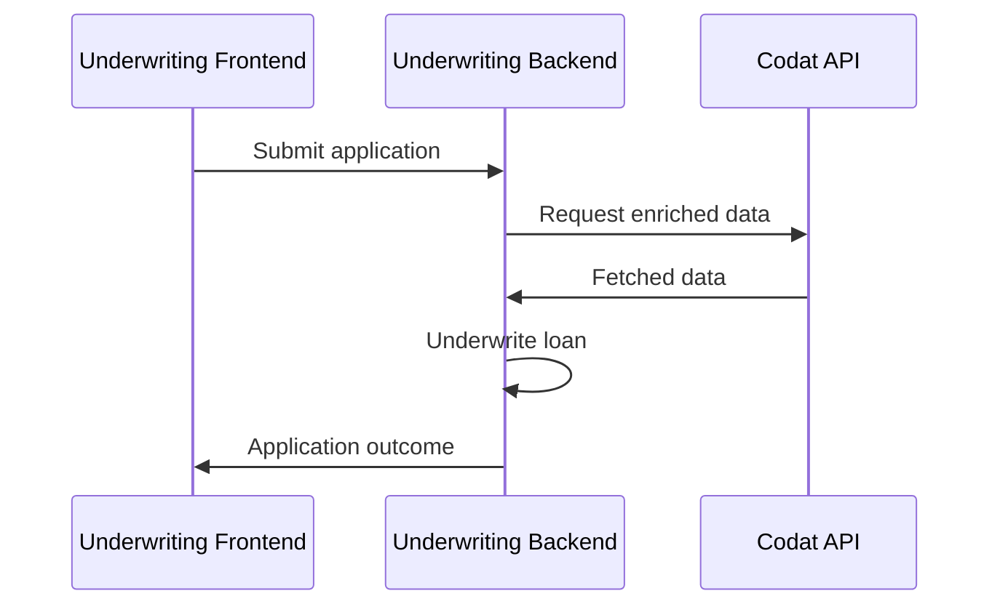

import Tabs from '@theme/Tabs';
import TabItem from '@theme/TabItem';

## 🚀 In this section, you will...
* Review the basic process flow followed by the demo app,
* Create and fill a new loan application,
* Create a Codat company and connect it to the Codat Sandbox,
* Fetch financial data to assess the applicant's financial health, 
* Categorize accounts to meet Assess' requirements, and
* Receive a decision on the loan. 

:::note Underwriting demo process flow

You can also review the detailed [swimlane diagram](https://github.com/codatio/build-guide-underwriting-be#implementing-the-solution) of the flow followed by the demo app.
:::  

## <input type="checkbox" unchecked /> Start a new loan application  

💡 Use [Swagger](http://localhost:5069/swagger/index.html) to interact with the various endpoints used by the demo app. It has three endpoints that support the creation and processing of the application form, and three endpoints to interact with webhook rules you have previously set up. Swagger should have opened in your browser automatically when you first ran the app. 

Call the `/applications/start` endpoint to trigger the creation of a new loan application. This returns the application `id` which the app uses as the company name to create a company using Codat's `POST /companies` endpoint in the background. 

This allows us to assign the application a reference in Codat, even though we don't have the company details yet. When the new company is created, Codat stores the company and application `id`s and returns them in the endpoint response together with a `linkUrl`. For example:  

```json
{
   "id": "1c727866-6923-4f81-aa7b-c7fd8c533586",
   "dateCreated": "2023-01-18T00:00:00Z",
   "codatCompanyId": "a9e28b79-6a98-4190-948d-3bd4d60e7c0a",
   "status": "Started", 
   "linkUrl": "https://link.codat.io/company/a9e28b79-6a98-4190-948d-3bd4d60e7c0a"
}
```
🙏🏽 This step is normally performed by the borrower.

## <input type="checkbox" unchecked /> Provide application details  

Once you receive the the application id, complete the application form using the `/applications/{applicationId}/form` endpoint. In our demo, we request the applicant's full name, company name, and the loan amount, length, and purpose.If the details provided are valid, they are stored against the application `id` with an acknowledgement of their receipt. 

```json title="Example application form"
  {
    "id": "applicationId", 
    "companyName": "Example Company",
    "fullName": "John Smith",
    "loanAmount": 25000.00, // must be greater than zero 
    "loanTerm": 36, // must be at least 12 months
    "loanPurpose": "Growth marketing campaign"
  }
```
🙏🏽 This step is normally performed by the borrower.

## <input type="checkbox" unchecked /> Share financial data  

Next, you need to provide Codat access to an accounting platform so that we can fetch the data required to underwrite the application. 

To enable this, open the `linkUrl` returned by our `POST /companies` endpoint in your browser window. Follow the flow built using our [Link feature](/auth-flow/overview), and select the **Codat Sandbox** as the source of accounting data. Choose a **Small UK Company** as your company type. You don't need to enter any credentials to authorize this connection. You should also skip the step of uploading business documents. 

🙏🏽 This step is normally performed by the borrower.


## <input type="checkbox" unchecked /> Manually categorize accounts 

While Codat’s Assess product is able to automatically categorize most of the source chart of accounts accounts, it is not always possible, and a manual intervention may be required. 

In our demo, when accounts are pulled from Codat's Accounting Sandbox and categorized, one account remains without a specified category. You need to assign a category to it before the demo application is ready for underwriting. This is because the Profit and Loss, and Balance Sheet data types in Assess depend on fully categorized accounts.

To do that, click on the **Companies** tab in the top menu in the [Codat Portal](https://app.codat.io/). Next, click on the company you are performing underwriting for, and navigate to **Products > Assess**. The red **Categorization required** button to the right of the company name indicates there are uncategorized accounts in the chart. 

Clicking the button takes you to the **Account categorization** page which displays a list of all the uncategorized accounts. Select the **Account type**, **Account subtype**, and **Account detail** from drop down lists. Once this is done, **Save** the categorization. 

💰 This step is normally performed by the lender.


## <input type="checkbox" unchecked /> Make the decision on the loan 

The demo app now has all the components that it needs to produce an underwriting decision. The decision is automatically made by the 
[LoanUnderwriter](https://dev.azure.com/codat/Codat%20Spikes/_git/DemosUnderwriting?path=/Codat.Demos.Underwriting.Api/Services/LoanUnderwriter.cs&version=GBmain) service based on thresholds that need to be passed by the applicant. We then update the loan application with a relevant status to indicate the decision made on the loan, or any errors that occurred in the process. You can poll the `GET applications/{applicationId}` endpoint in [Swagger](http://localhost:5069/swagger/index.html) anytime to check the status of your loan. 

🙏🏽💰 The decisioning is normally performed by the lender, but the borrower is able to query an application's status at any point. 

:::tip Ready for more?
does a regular tip work?
:::

<Tabs>
  <TabItem value="assess" label="Assess in the Portal">  

  Navigate to <b>Products > Assess</b> in the [Codat Portal](https://app.codat.io/) and explore the visual representation of the financial data pulled by our endpoints. Focus on Profit and Loss, and Balance Sheet data, as these are used in the app for loan underwriting. 

  </TabItem>
  
  <TabItem value="thresh" label="Thresholds">  

  In the `appsettings.json` file of the `\DemosUnderwriting\Codat.Demos.Underwriting.Api\` directory, set your own example thresholds for data points used by the app's underwriting service. Play around with the values to see how this affects the application decision.

  </TabItem>

  <TabItem value="comptype" label="Company types">  

  Start another loan application, and choose a company type different from <b>Small UK Company</b> when linking the Sandbox. This will provide you with a different set of financial data to be used in the decision-making. 

  </TabItem>

  <TabItem value="realco" label="Real company">  

  Take the demo one step further and use real credentials to access existing financial data in an accounting platform. Set up the [integration](/integrations/accounting/overview) you plan to use, and connect to it while following the auth flow. Then, review how the app makes a decision based on your company's real data. 

  </TabItem>

</Tabs>


## Recap

You have now successfully run the demo app, covering all the key underwriting process steps. You have started and completed an application, connected and fetched accounting data, and received a decision on your loan application. Next, you can [read more](/underwriting/uw-decision) about the underwriting logic we included in our demo app, and how exactly the financial data is fetched. 