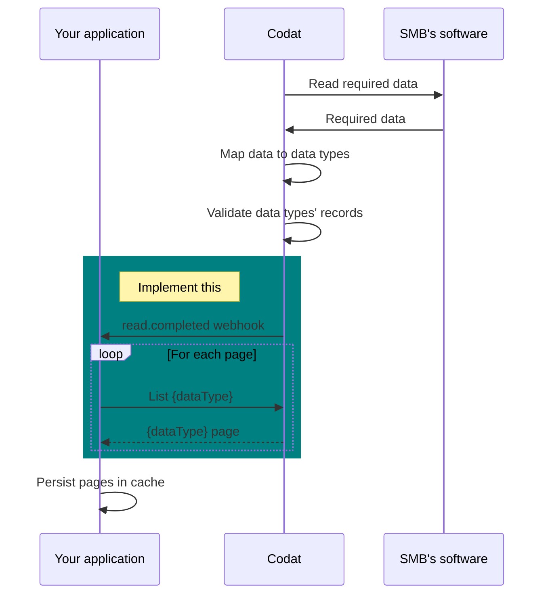

- create data - add a prerequisite on having a company
- for create and get data, make the first ages their landing pages
- retrieve data needs a sequence doagram for fetching data


## Prerequisites

- Company that s been created
- company must have an active connection, ie `Linked` status
- your codat instance is configured to fetch the required data types for your product

Once you've create a company, you can start retrieving data.

## Process

assumption is, the company has connected
we assume you re pulling large data sets, therefore required to use our pagination 

see Paginate data

whil ewe fetch the required data for the data types and post mapping, we re validating - basic checks, eg does the sum of line items match  the total amounts, does a balance sheet balance, 

while we attempt to create accurate records where possible, there are osme cases where we want to remove pagination. 
default is we fail on the validation, you can remove validation requirements by speaking to support. this is often relevant for ERP integrations where - incomplete accounts. 

1. listen to read complete
2. page through data types



using the above process, we want you to inspect the read.complete payload, for the data types fetched (cahced), the status (whether the data types were completed). use the `payload.modifiedFromDate` as your modified from date in the query string. for eample, for for read.completed event for suppllier enablement, you need bills and billPayments. you will receive a read.compelted webhook with both data types. we want code snippets here. once you receive the webhook, you want to : /bills?query=payload.modifiedFromDate<modifiedDate


### Queue a new data sync (Optional)

If there are datasets which are not as up-to-date as you require, you can queue a data sync as described [here](/using-the-api/queueing-data-syncs).

Once you've queued the sync, you can poll the [`GET /companies/{companyId}/dataStatus`](/platform-api#/operations/get-company-data-status) endpoint (as described above) to [monitor progress of the sync](/core-concepts/status).

:::note Configuring the sync schedule

You can configure a sync schedule in the Codat portal to keep each data type at an acceptable freshness. For more information, please refer to your onboarding docs or raise a ticket with our support team through the [support request form](https://codat.zendesk.com/hc/en-gb/requests/new).
:::

## Request a specific data type

Codat exposes endpoints that enable you to easily query each of the supported data types.

For example, when querying invoices, you can use the [`GET /companies/{companyId}/data/invoices`](/accounting-api#/operations/list-invoices) endpoint, with query string parameters as below:

- `pageSize` – the size of page you wish to retrieve
- `page` – which page number you wish to retrieve
- `orderBy` – the property you wish to order the response by
- `query` – any filter you wish to perform on the returned data (see [Querying](/using-the-api/querying) for details)


:::caution Minimal data sync frequency

You should refresh at least one data type monthly to ensure your connection token does not expire when not actively synchronising data, unless only a one-time sync is required.
:::

## Check data 'freshness'

Use the `GET /companies/{companyId}/dataStatus` endpoint to check the [last time each data type was synchronized](/core-concepts/status).

In this request, `companyId` is [the unique ID that you have received in a response to creating this company](/using-the-api/managing-companies#create-a-codat-company).

When you’re reading data for the first time, use this endpoint to check if the sync was successful.

`GET /companies/{companyId}/dataStatus`

```json title="Response for a successful first sync"
{
  "suppliers": {
    "dataType": "suppliers",
    "lastSuccessfulSync": "2019-06-11T13:26:54.6884704Z",
    "currentStatus": "Complete",
    "latestSyncId": "31632c48-23dc-4cb1-b3ff-0829343c8e85",
    "latestSuccessfulSyncId": "31632c48-23dc-4cb1-b3ff-0829343c8e85"
  },
  ...
}
```

```json title="Response for an unsuccessful first sync"
{
  "suppliers": {
    "dataType": "suppliers”
    "currentStatus": "FetchError",
    "latestSyncId": "31632c48-23dc-4cb1-b3ff-0829343c8e85",
  },
  ...
}
```

## Refresh data

There are [two POST endpoints in the API](/platform-api#/operations/refresh-company-data) for queuing a refresh of data:

1. `/companies/{companyId}/data/all`
   - Will queue a dataset for each of the data types marked as _Fetch on first link_ in your [data type settings](/core-concepts/data-type-settings), where that data type is supported by the company's linked data connections
2. `/companies/{companyId}/data/queue/{dataType}`
   - Will queue a dataset for the specified data type
   - _dataType_ is the key of the data type e.g. `invoices`

:::info Multiple dataset queued exception

If you try to queue a synchronization for a data type that is already in process, you'll receive an exception.

```
"error": "DatasetAlreadyInProgressException: Cannot queue {dataType} sync for {companyId} as previous sync {dataSetId} is still in progress"
```
:::

Refreshing data can take different amounts of time depending on the integration and the amount of data being retrieved. You can use [webhooks](/using-the-api/webhooks/overview) to be updated when the operation completes.

### Records deleted between syncs

For our accounting source data types, Codat stores records deleted by a company in the underlying accounting software between successive data syncs to ensure better consistency in the data. If such records are not relevant for your use case, you can exclude them by [querying](/using-the-api/querying) on the `metadata.isDeleted!=true` flag. 

Records that were created and deleted by a company before the first sync took place will never be read and stored by Codat. 

## Scheduled refresh

Codat can also refresh data at a set schedule, based on the set 'Sync frequency' for each data type.

### Sync frequency

The recommended sync frequency is weekly. It provides you with recent enough data while catering for data types that do not change often and decreasing the number of API calls required. 

Some data types like company, tax rates and charts of accounts will rarely change (monthly if at all), but are so small to sync they have no performance impact.

However, you can set a more frequent sync schedule if it is required for your use case. 

- **Monthly**: We recommend that you sync at least one data type monthly (e.g. Company info) to ensure connection token does not expire when not actively synchronizing data (unless only a one-time sync is required).
- **Weekly (recommended)**: Keeps data reasonably fresh, particularly where data types change less frequently, while also reducing the number of required API calls.
- **Daily**: Gives you close-to-live picture of most data types while staying within the conservative rate limits of most accounting software.
- **Hourly**: Recommended for specific use cases only and may require consideration for the rate limits, e.g. invoices and payments for invoice financing. 

## 💡 Tips and traps

- Ensure to perform a monthly sync for at least one data type to keep your connection token operational if you are not performing active synchronization. You can disregard this if you only require a one-time sync.

- If you are building your own reports or accessing Codat-generated ones that rely on multiple data types, fetch all required data types before you generate the report. Otherwise, there may be inconsistencies in the data freshness. You can check for possible inconsistencies using the data types' `lastSuccessfulSync` properties. 

    For example, if you calculate a company's accounts receivable (AR) position using invoices, credit notes, payments, account transactions, and customers with `lastSuccessfulSync` dates of `2023-07-10`, and compare it to the AR position on the balance sheet with the `lastSuccessfulSync` of `2023-07-11`, the results are likely to differ.

- For most data types, we retrieve all available history. For financial statement data types (`balanceSheet`, `profitAndLoss`, `cashFlowStatement`), we retrieve 24 months of history. These default settings can be overriden via our API using [advanced sync settings](/knowledge-base/advanced-sync-settings).
---

## Read next

- [Status codes and errors](/using-the-api/errors)
- [Advanced sync settings](/knowledge-base/advanced-sync-settings)


---

## Read next

- [Managing companies](/using-the-api/querying)
