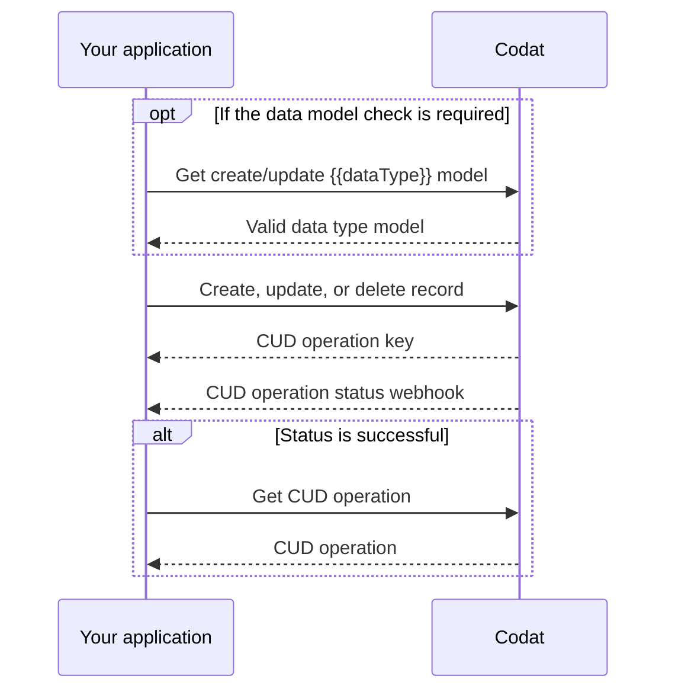

import Tabs from "@theme/Tabs";
import TabItem from "@theme/TabItem";

:::note Data coverage

View the full details of Codat's support for creating and updating data for each accounting platform in our <a class="external" href="https://knowledge.codat.io/supported-features/accounting" target="_blank">Data Coverage Explorer</a>.

:::

Codat offers the ability to create, update, and delete records in the source platforms of our integrations using our standard data models. We support the following operations (also known as CUD): 

- **Create** a new record using the `POST` method.
- **Update** an existing record using the `PUT` method.
- **Delete** an existing record using the `DELETE` method.

The CUD process first requires you to [check the data model](/using-the-api/push#use-a-valid-data-model) of the data type you want to create, update, or delete. This helps you ensure all required properties are included in your request. Checking the model may be a one-time activity (for integrations with static properties) or be required more frequently (for integrations with higher customization options).

Next, you are ready to [perform the CUD operation](/using-the-api/push#perform-the-operation) using the relevant data model. You will receive a CUD operation key in return. You can then use it to [monitor the status of the operation](/using-the-api/push#monitor-the-status-of-your-operation), or display its results.



### Asynchronous operations

Data creation and updates will be handled asynchronously and will take between a few seconds to a couple of minutes to complete, depending on the underlying platform. This means you will receive a `Pending` status in response to your CUD request. You can [monitor the status of your request via a webhook](/using-the-api/push#monitor-the-status-of-your-operation) to verify when the operation completes (preferred), or poll the status. 

A CUD operation may be `Pending` indefinitely for integrations using offline connectors when the desktop application is unreachable. Manage this by setting [timeouts](/using-the-api/push#monitor-the-status-of-your-operation#timeouts). 

### Supplemental data

We have introduced [supplemental data](/using-the-api/supplemental-data/overview) to many of our data types, enabling you to enrich these data types with additional properties not included in Codat's out-of-the box data models. You can create, update, and delete supplemental data using the same process as outlined above.

## Use a valid data model

Each integration may have different requirements to the request body of a CUD operation. So, before triggering the operation, you need to know how the data should be inserted into the source platform. You can access the integration-specific model requirements using Codat's _Get model_ endpoints.

In most cases, the models provide static data, such as detailing mandatory properties. Some platforms, like Netsuite, offer greater customization to their users, so the corresponding model may differ.

:::info Deleting records
Our data deletion endpoints, where available, simply require the record `id`, `companyId`, and `connectionId` to be included in the request URL.
:::

Let's use our [Get create account model](/accounting-api#/operations/get-create-chartOfAccounts-model) endpoint to view integration-specific requirements for creating the `chartOfAccounts` data type in Xero. 

```sh
GET https://api.codat.io/companies/{companyId}/connections/{connectionId}/options/chartOfAccounts
```
The response indicates that three properties must be populated: 

- `nominalCode`, a string that can be up to 10 characters long
- `name`, an unrestricted string
- `fullyQualifiedCategory`, an enum property that accepts a string chosen from a list of options

The `displayName` on the options can be used to display a more descriptive name, such as "Current assets".  

```json title="Partial Get create account model response"
{
  "type": "Object",
  "displayName": "Nominal Account",
  "description": "Nominal Accounts are the categories a business uses to record transactions",
  "properties": {
    "nominalCode": {
      "type": "String",
      "displayName": "Nominal Code",
      "description": "Identifier for the nominal account.",
      "required": true,
      "validation": {
        "warnings": [
          {
            "field": "NominalCode",
            "details": "Max length of 10 characters."
          }
        ],
        "information": []
      }
    },
    "name": {
      "type": "String",
      "displayName": "Name",
      "description": "Name of account as it appears in the chart of accounts or general ledger.",
      "required": true,
      "validation": {
        "warnings": [],
        "information": [
          {
          ...
          }
        ]
      }
    },
    ...
    "fullyQualifiedCategory": {
      "type": "String",
      "displayName": "Fully Qualified Category",
      "description": "Account type and category for nominal account.",
      "options": [
        {
          "value": "Asset.Current",
          "type": "String",
          "displayName": "Current Asset",
          "required": false
        },
        ...
      ],
      "required": true
    }
  },
  "required": true
}
```

## Perform the operation

:::caution Properties not in the _Get model_ response
If you attempt to create or update a record using properties not documented in the  _Get model_ response, you may receive validation errors in response to your request.
:::

Let's try creating a new account using our [Create account](/accounting-api#/operations/create-account) endpoint. The request body should be a JSON object which conforms to the structure of the [Get create account model](/accounting-api#/operations/get-create-chartOfAccounts-model) we called previously. 

We base our models on the `GET` request, which includes `modifiedDate` and `sourceModifiedDate` that are not used when creating or updating a record. 

We will try to create an account using a valid request body, and a request body that leads to a validation error:

<Tabs>
   <TabItem value="wo" label="Create an account">  

  ```json  
    {
      "nominalCode": "4200123456", 
      "name": "Codat Assets Account", 
      "fullyQualifiedCategory": "Asset.Current" 
    }
  ```
   </TabItem>

   <TabItem value="with" label="Create an account with an error">  

  ```json  
    {
      "nominalCode": "350045006500", // Nominal code intentionally consits of too many characters
      "name": "Excessive Length Account", 
      "fullyQualifiedCategory": "Asset.Current" 
    }
  ```
   </TabItem>
</Tabs>

This results in a corresponding response from the endpoint, which includes the following details:

- **pushOperationKey**: a unique identifier generated by Codat to represent this single CUD operation that can be used to track its status
- **dataType**: the type of data being created, in this case, `chartOfAccounts`
- **status**: the status of the create operation, which can be `Pending`, `Failed`, `Success` or `TimedOut` 
- **requestedOnUtc**: the datetime (in UTC) when the operation was requested 
- **completedOnUtc**: the datetime (in UTC) when the operaion was completed, null if `Pending`
- **validation**: a human-readable object that contains validation details, including errors, encountered during the operation
- **changes**: an array that communicates which record has changed (`recordRef` property) and the manner in which it changed (`type` property that can be `Unknown`, `Created`, `Modified`, or `Deleted`)

<Tabs>
   <TabItem value="wo" label="Account creation response">  

  ```json
    {
      "changes": [...],
      "data": {
        "id": "fdeaba98-6f74-4b03-9a67-3708ea442417",
        "nominalCode": "4200123456",
        "name": "Codat Assets Account",
        "fullyQualifiedCategory": "Asset.Current",
        "type": "Unknown",
        "status": "Unknown",
        "isBankAccount": false,
        "modifiedDate": "2023-03-21T17:17:59.4604771Z",
        "validDatatypeLinks": []
      },
      "dataType": "chartOfAccounts",
      "companyId": "fa115de8-5269-474e-8b63-fd697ec04b1b",
      "pushOperationKey": "8e42e5f6-c596-4ddf-a5e4-fdc9977f5a99",
      "dataConnectionKey": "c39b4839-9017-4fed-b1c6-af6b31ae32a5",
      "requestedOnUtc": "2023-03-21T17:17:58.9235368Z",
      "completedOnUtc": "2023-03-21T17:17:59.4815194Z",
      "status": "Success",
      "validation": {
        "errors": [],
        "warnings": []
      },
      "statusCode": 200
    }
  ```
  
   </TabItem>

   <TabItem value="with" label="Account creation with a validation error">  

  ```json
    {
      "changes": [...],
      "data": {
        "nominalCode": "350045006500",
        "name": "Excessive Assets Account",
        "fullyQualifiedCategory": "Asset.Current",
        "type": "Unknown",
        "status": "Unknown",
        "isBankAccount": false,
        "validDatatypeLinks": []
      },
      "dataType": "accounts",
      "companyId": "fa115de8-5269-474e-8b63-fd697ec04b1b",
      "pushOperationKey": "0c74f21b-0a43-492e-9aa8-0c8ad928e5b6",
      "dataConnectionKey": "983a8fd1-a47b-48fa-b1ac-af88a6bcd3cd",
      "requestedOnUtc": "2023-03-21T17:25:32.0939249Z",
      "completedOnUtc": "2023-03-21T17:25:32.1587863Z",
      "status": "Failed",
      "errorMessage": "An error occurred in a downstream service. Correlation ID: 72e161a142c17bb5b3e480f873df0b21. Message: Push failed for Account: see validation for more information",
      "validation": {
        "errors": [
          {
            "itemId": "NominalCode",
            "message": "Failed to push to Account as NominalCode must not be longer than 10 characters long.",
            "validatorName": "Account"
          }
        ],
        "warnings": []
      },
      "statusCode": 400
    }
  ```
   </TabItem>
</Tabs>

## Monitor the status of your operation

Your operation will initially be in a `Pending` status. You can track an update on the final `Success` or `Failed` state to communicate the outcome of the operation to the user, or take further action in case of failures. We recommend listening to our webhooks for this purpose. 

In the **Monitor > Alerting rules > Create new rule** [view](https://app.codat.io/monitor/rules) of the Codat Portal, create a subscription to the _Push operation status has changed_ rule type. You can review detailed instructions in our documentation for [subscribing to rules](/introduction/webhooks/core-rules-create) and receiving webhooks as [email alerts](/introduction/webhooks/receive-webhooks-as-email).

You will receive the following response from the _Push operation status has changed_ webhook:

```json 
{
 "CompanyId":"fa115de8-5269-474e-8b63-fd697ec04b1b",
 "RuleId":"c40791fe-b6fd-45c3-9bf7-0a16abf1b8fd",
 "Type":"Push Operation Status Changed",
 "AlertId":"a62bfb38-d73c-4aab-9bb6-d8014bba5f29",
 "Message":"accounts triggered notification for PushOperationStatusChanged at 2019-05-22T18:19:42.742Z",
 "Data":{
    "dataType":"chartOfAccounts",
    "status":"Success",
    "pushOperationKey":"8e42e5f6-c596-4ddf-a5e4-fdc9977f5a99"
 }
```

You can also use our endpoints to monitor the status of your create, update, or delete operation. List all operations for a company using the [List push operations](/codat-api#/operations/get-company-push-history) endpoint, or list a single operation via the [Get push operation](/codat-api#/operations/get-push-operation). This is useful when you want to include summary information to your customers outlining the status of their CUD history.

### Timeouts

It is possible for an operation to be in a `Pending` status indefinitely, for example, if a user's on-premise software is offline. Codat provides a timeout functionality for such scenarios. 

To control the timeframe in which you want your CUD operation to complete, use the `timeoutInMinutes` parameter. If the deadline expires, the status of the operation will change to `TimedOut`.

## 💡 Tips and traps

- When a CUD operation successfully completes, this changes the specific record in Codat's system, but does not change any *associated* records. For example, if you create a payment against an invoice, the payment becomes available in Codat once the operation completes, but the invoice may still show a non-zero `amountDue`. To view the fully updated associated records, you need to [requeue all the relevant datasets](/using-the-api/queueing-data-syncs).

- Data successfully created in the target platform is visible almost immediately when retrieving that data type from Codat. If you produce point-in-time reports or use the `modifiedDate` to pull only recent changes from the API, this may impact the consistency of your data. 

  For example, you may have checked your accounts receivable position based on the balance sheet and invoice data types pulled yesterday. If you created an invoice today, this will cause a discrepancy as there may have been changes to invoices not seen between the `lastSyncUtc` and the maximum `modifiedDate` of the invoices.

- There is no coordination between the fetch and CUD operations to guarantee the correct order. This means, if you trigger a CUD operation while a pull is in progress for the same data type, fetched data may overwrite created or updated data in our API. We recommend you do not create or update a data type while it has a pull in progress. 

