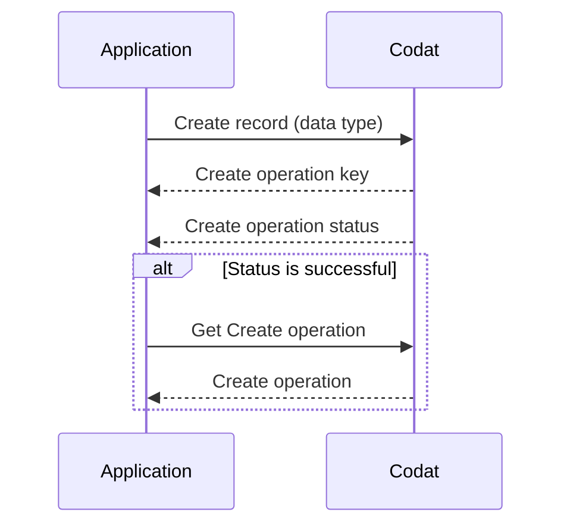

import Tabs from "@theme/Tabs";
import TabItem from "@theme/TabItem";

:::note Data coverage

View the full details of Codat's support for creating and updating data for each accounting platform in our <a class="external" href="https://knowledge.codat.io/supported-features/accounting" target="_blank">Data Coverage Explorer</a>.

:::

A core feature that Codat offers is the ability to create, update, and delete records in the source platforms of our integrations using a single data model. 

We support the following operations (abbreviated to CUD): 

- Create a new record using the `POST` method
- Update an existing record using the `PUT` method  
- Delete an existing record using the `DELETE` method

## CUD process flow

At Codat, 

dcoplowe2 hours ago
We need to add how CRD operations work in Codat. Introduce the sequence diagram and explain it.

dcoplowe2 hours ago
This then provides context on the options endpoint



### Synchronous vs asynchronous push

You should assume that all data creation and updates will be processed asynchronously when integrating with Codat. It may take a few seconds to a couple of minutes to complete the operation, depending on the underlying platform. This means you will receive a `Pending` status in response to your request. You can use the details in this response to [monitor the status of your request via a webhook](/using-the-api/push#monitor-the-status-of-your-operation). 

For the few integrations that perform these requests synchronously, the behavior remains the same. 

## Use a valid model

First, you need to know how the data needs to be inserted into the source platform. This includes not only names or amounts, but also details that may be handled differently across different accounting packages. 

Each integration has different requires in order for create and update methods to be valid. You can access the integration specific model requirements using Codat's model endpoints. In general, these provide static data such as whether the property is required, however, in some cases such as ERP systems, they offer greater customization and therefore the model endpoint provides data specific to the SMBs setup. This includes not only names or amounts, but also details that may be handled differently across different accounting packages.

Use our [Options](https://docs.codat.io/codat-api#/operations/get-companies-companyId-connections-connectionId-push) endpoint to understand integration-specific requirements and view example responses:

```sh
GET https://api.codat.io/companies/{companyId}/connections/{connectionId}/options/{dataType}
```
For example, if you used this endpoint to get details for creating a Chart of Accounts entry through a connection with Xero, you would receive the following response, presented here partially. 

The response indicates that three properties must be populated: 

- `nominalCode`, a string that can be up to 10 characters long
- `name`, an unrestricted string
- `fullyQualifiedCategory`, an enum property that accepts a string chosen from a list of options.

The `displayName` on the options can be used to display a more descriptive name, such as "Current assets".  

```json title="Partial Chart of Accounts options response"
{
  "type": "Object",
  "displayName": "Nominal Account",
  "description": "Nominal Accounts are the categories a business uses to record transactions",
  "properties": {
    "nominalCode": {
      "type": "String",
      "displayName": "Nominal Code",
      "description": "Identifier for the nominal account.",
      "required": true,
      "validation": {
        "warnings": [
          {
            "field": "NominalCode",
            "details": "Max length of 10 characters."
          }
        ],
        "information": []
      }
    },
    "name": {
      "type": "String",
      "displayName": "Name",
      "description": "Name of account as it appears in the chart of accounts or general ledger.",
      "required": true,
      "validation": {
        "warnings": [],
        "information": [
          {
            "field": "Name",
            "details": "Payments are enabled to this account if the name ends in .PaymentsEnabled."
          }
        ]
      }
    },
    "description": {
      "type": "String",
      "displayName": "Description",
      "description": "Description for the nominal account.",
      "required": false
    },
    "fullyQualifiedCategory": {
      "type": "String",
      "displayName": "Fully Qualified Category",
      "description": "Account type and category for nominal account.",
      "options": [
        {
          "value": "Asset.Current",
          "type": "String",
          "displayName": "Current Asset",
          "required": false
        },
      ],
      "required": true
    }
  },
  "required": true
}
```

## Create a new record

:::caution Creating data not in the Options response

If you attempt to create a record using fields that are not documented in the Options response, you may receive validation errors in response to your request.
:::

Use the `POST /companies/{companyId}/connections/{connectionId}/push/{dataType}` endpoint to create a record in the target platform. The request body should be a JSON object which conforms to the structure of the [Options endpoint response](/using-the-api/push#understand-your-options) we explored previously. 

You can also review our data model schemas (for example, the [Accounts](/accounting-api#/schemas/Account) data type) to check the full scope of fields returned in the response. Note that we base our schemas on the `GET` request, which includes `modeifiedDate` and `sourceModifiedDate` that are not used when creating or updating a record. 

Try to create a new account via our [Create account](https://docs.codat.io/accounting-api#/operations/create-account) endpoint using a valid request body, or a request body that leads to a validation error:

<Tabs>
   <TabItem value="wo" label="Create an account">  

  ```json  
    {
      "nominalCode": "4200123456", 
      "name": "Codat Assets Account", 
      "fullyQualifiedCategory": "Asset.Current" 
    }
  ```
   </TabItem>

   <TabItem value="with" label="Create an account with an error">  

  ```json  
    {
      "nominalCode": "350045006500", // Nominal code intentionally consits of too many characters
      "name": "Excessive Length Account", 
      "fullyQualifiedCategory": "Asset.Current" 
    }
  ```
   </TabItem>
</Tabs>

This results in a corresponding response from the endpoint, which is a PushOperation object and is structured as follows:

- **pushOperationKey**: A unique identifier generated by Codat to represent this single push operation that can be used to track the status of the push
- **dataType**: The type of data being pushed, in this case, `chartOfAccounts`
- **status**: The status of the push operation, which can be `Pending`, `Failed`, `Success` or `TimedOut` 
- **requestedOnUtc**: The datetime (in UTC) when the push was requested 
- **completedOnUtc**: The datetime (in UTC) when the push was completed, null if Pending
- **validation**: A human-readable object describing validation decisions Codat has made when pushing data into the platform. If a push has failed because of validation errors, they will be detailed here.

<Tabs>
   <TabItem value="wo" label="Account creation response">  

  ```json
    {
      "changes": [],
      "data": {
        "id": "fdeaba98-6f74-4b03-9a67-3708ea442417",
        "nominalCode": "4200123456",
        "name": "Codat Assets Account",
        "fullyQualifiedCategory": "Asset.Current",
        "type": "Unknown",
        "status": "Unknown",
        "isBankAccount": false,
        "modifiedDate": "2023-03-21T17:17:59.4604771Z",
        "validDatatypeLinks": []
      },
      "dataType": "chartOfAccounts",
      "companyId": "fa115de8-5269-474e-8b63-fd697ec04b1b",
      "pushOperationKey": "8e42e5f6-c596-4ddf-a5e4-fdc9977f5a99",
      "dataConnectionKey": "c39b4839-9017-4fed-b1c6-af6b31ae32a5",
      "requestedOnUtc": "2023-03-21T17:17:58.9235368Z",
      "completedOnUtc": "2023-03-21T17:17:59.4815194Z",
      "status": "Success",
      "validation": {
        "errors": [],
        "warnings": []
      },
      "statusCode": 200
    }
  ```
  
   </TabItem>

   <TabItem value="with" label="Account creation with a validation error">  

  ```json
    {
      "changes": [],
      "data": {
        "nominalCode": "350045006500",
        "name": "Excessive Assets Account",
        "fullyQualifiedCategory": "Asset.Current",
        "type": "Unknown",
        "status": "Unknown",
        "isBankAccount": false,
        "validDatatypeLinks": []
      },
      "dataType": "chartOfAccounts",
      "companyId": "6ce1d272-64a7-4853-b6cf-1f79db124775",
      "pushOperationKey": "0c74f21b-0a43-492e-9aa8-0c8ad928e5b6",
      "dataConnectionKey": "983a8fd1-a47b-48fa-b1ac-af88a6bcd3cd",
      "requestedOnUtc": "2023-03-21T17:25:32.0939249Z",
      "completedOnUtc": "2023-03-21T17:25:32.1587863Z",
      "status": "Failed",
      "errorMessage": "An error occurred in a downstream service. Correlation ID: 72e161a142c17bb5b3e480f873df0b21. Message: Push failed for Account: see validation for more information",
      "validation": {
        "errors": [
          {
            "itemId": "NominalCode",
            "message": "Failed to push to Account as NominalCode must not be longer than 10 characters long.",
            "validatorName": "Account"
          }
        ],
        "warnings": []
      },
      "statusCode": 400
    }
  ```
   </TabItem>
</Tabs>

## Monitor the status of your operation

Your operation will initially be in a `Pending` status. You can track an update on the final `Success` or `Failed` state to communicate the outcome of the operation to the user, or take further action in case of failures. 

We recommend listening to our webhooks for this purpose. 

In the **Monitor > Alerting rules > Create new rule** [view](https://app.codat.io/monitor/rules) of the Codat Portal, create a subscription to the _Push operation status has changed_ rule type. You can review detailed instructions in our documentation for [subscribing to rules](/introduction/webhooks/core-rules-create) and receiving webhooks as [email alerts](/introduction/webhooks/receive-webhooks-as-email-alerts).

You will receive the following response from the _Push operation status has changed_ webhook:

```json 
{
 "companyId":"f6bc5f14-87fb-438f-8d2d-db6a0964aef1",
 "ruleId":"c40791fe-b6fd-45c3-9bf7-0a16abf1b8fd",
 "type":"Push Operation Status Changed",
 "alertId":"a62bfb38-d73c-4aab-9bb6-d8014bba5f29",
 "message":"accounts triggered notification for PushOperationStatusChanged at 2019-05-22T18:19:42.742Z",
 "data":{
    "dataType":"accounts",
    "status":"Success",
    "pushOperationKey":"476afa1c-9f27-4def-bf0d-0914ad89ed27"
 }
}
```

:::info Polling for status

You can also use our endpoints to monitor the status of your create, update, or delete operation:
- List all CUD operations for a company using `GET /companies/{companyId}/push`
- Get a single CUD operation by ID using `GET /companies/{companyId}/push/{pushOperationKey}`
:::

### Timeouts

It is possible for an operation to be in a `Pending` status indefinitely, for example, if a user's on-premise software is offline. Codat provides a timeout functionality for such scenarios. 

If the `timeoutInMinutes` property has been set on a CUD operation, Codat guarantees that the operation will not be processed after that deadline. If the deadline expires, the status of the operation will change to `TimedOut`.

## Pitfalls

- When a CUD operation successfully completes, this reflects in the specific record in Codat's system, but does not change any *associated* records. For example, if you create a payment against an invoice, the payment becomes available in Codat once the operation completes, but the invoice may still show a non-zero `amountDue`. To view the fully updated associated records, you'll need to requeue all the relevant datasets.

- Data successfully created in the target platform is visible almost immediately when retrieving that data type from Codat. If you produce point-in-time reports or use the `modifiedDate` to pull only recent changes from the API, this may impact the consistency of your data. 

  For example, you may have checked your accounts receivable position based on the balance sheet and invoice data types pulled yesterday. If you then created an invoice today, this will cause a discrepancy as there may have been changes to invoices not seen between the `lastSyncUtc` and the maximum `modifiedDate` of the invoices.

- There is no coordination between the fetch and CUD systems to guarantee the correct order of operations. This means, if you trigger a CUD operation while a pull is in progress for the same data type, pulled data may overwrite pushed data in our API. Therefore, we recommend you do not create or update a data type while it has a pull in progress. 

