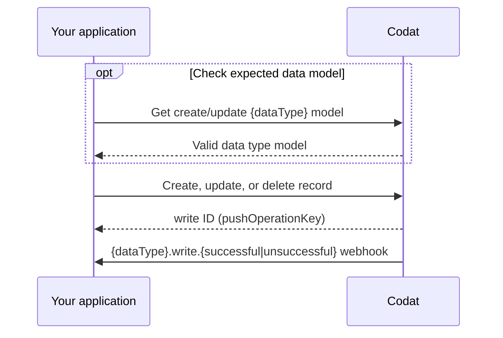
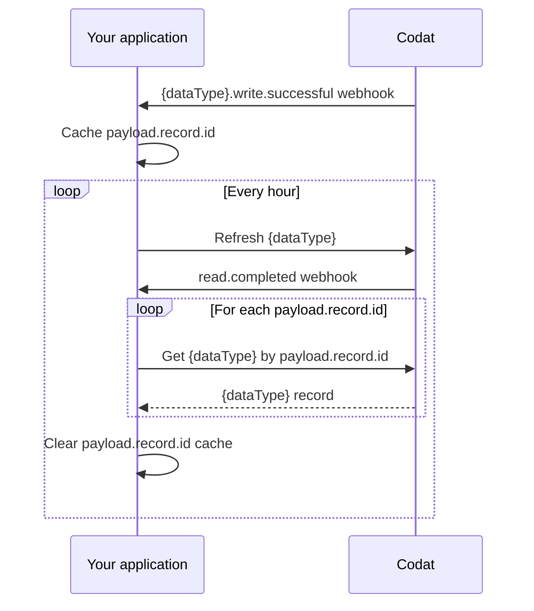

import Tabs from "@theme/Tabs";
import TabItem from "@theme/TabItem";
import Lottie from '@components/Lottie'
import webhooks from '../../static/animations/webhooks.json'


Codat offers the ability to create, update, and delete records in the source platforms of our integrations using our standard data models.
We support the following write operations: 

- **Create** a new record using the `POST` method.
- **Update** an existing record using the `PUT` method.
- **Delete** an existing record using the `DELETE` method.

:::note Push operations and write requests

Codat now refers to push operations as write requests.

:::

## Supported accounting data types and write types

| `dataType`       | Create  | Update  | Delete  |
|------------------|---------|---------|---------|
| bankAccounts     | &#9989; | &#9989; | -       |  
| bankTransactions | &#9989; | -       | -       |
| billCreditNotes  | &#9989; | &#9989; | -       |  
| billPayments     | &#9989; | -       | &#9989; | 
| bills            | &#9989; | &#9989; | &#9989; | 
| chartOfAccounts  | &#9989; | -       | -       | 
| creditNotes      | &#9989; | &#9989; | -       | 
| customers        | &#9989; | &#9989; | -       | 
| directCosts      | &#9989; | -       | &#9989; | 
| directIncomes    | &#9989; | -       | -       | 
| invoices         | &#9989; | &#9989; | &#9989; | 
| items            | &#9989; | -       | -       | 
| journalEntries   | &#9989; | -       | &#9989; | 
| journals         | &#9989; | -       | -       | 
| payments         | &#9989; | -       | -       | 
| purchaseOrders   | &#9989; | &#9989; | -       | 
| suppliers        | &#9989; | &#9989; | -       | 
| transfers        | &#9989; | -       | -       |

:::note Data coverage

View the full details of Codat's support for creating and updating data for each accounting software in our <a class="external" href="https://knowledge.codat.io/supported-features/accounting" target="_blank">Data Coverage Explorer</a>.

:::

## Process
To perform a write request, follow these steps:

1. **[Check the expected data model](#check-the-expected-data-model)**: For **Create** and **Update** requests, ensure you’re using the correct data model for the data type you want to write. This ensures all required properties are included. Depending on the integration, this step may be a one-time task (for static properties) or a regular check (for highly customizable integrations).

2. **[Make a write request](#make-a-write-request)**: You will receive a write operation ID in response. This can be used to [track the status of the operation](#monitor-the-status-of-your-operation).

3. **[Consume the relevant `{dataType}.write.{successful|unsuccessful}` webhook](#consume-the-data-types-write-webhook)**: Subscribe to these webhooks and we will let you know when your write operation has completed.



:::info Need access to records?

If your use case involves displaying created or updated records to your customers, [learn how to access records](#accessing-created-or-updated-records).

:::

## Asynchronous operations

Write requests are asynchronous operations and will take between a few seconds to a couple of minutes to complete, depending on the underlying platform.
This means you will receive a `Pending` status in response to your write request.

A write request may be `Pending` indefinitely for integrations using offline connectors when the desktop application is unreachable.
Manage this by setting [timeouts](/using-the-api/push#monitor-the-status-of-your-operation#timeouts). 

## Supplemental data

We have introduced [supplemental data](/using-the-api/supplemental-data/overview) to many of our data types, enabling you to enrich these data types with additional properties not included in Codat's out-of-the box data models. You can create, update, and delete supplemental data using the same process as outlined above.

## Check the expected data model

Each integration may have different requirements to the body of a write request.
So, before making the request, you need to know how the data should be inserted into the source platform.
You can access the integration-specific model requirements using Codat's _Get model_ endpoints.

In most cases, the models provide static data, such as detailing mandatory properties.
Some platforms, like Netsuite, offer greater customization to their users, so the corresponding model may differ.

Let's use our [Get Create Account Model](/sync-for-expenses-api#/operations/get-create-chartOfAccounts-model) endpoint from the [Sync for Expenses](/expenses/overview) product to view integration-specific requirements for creating the `chartOfAccounts` data type in Xero.

```sh
GET https://api.codat.io/companies/{companyId}/connections/{connectionId}/options/chartOfAccounts
```
The response indicates that three properties must be populated: 

- `nominalCode`, a string that can be up to 10 characters long
- `name`, an unrestricted string
- `fullyQualifiedCategory`, an enum property that accepts a string chosen from a list of options

The `displayName` on the options can be used to display a more descriptive name, such as "Current assets". 

<details>
  <summary><b>Partial Get create account model response</b></summary>

```json
{
  "type": "Object",
  "displayName": "Nominal Account",
  "description": "Nominal Accounts are the categories a business uses to record transactions",
  "properties": {
    "nominalCode": {
      "type": "String",
      "displayName": "Nominal Code",
      "description": "Identifier for the nominal account.",
      "required": true,
      "validation": {
        "warnings": [
          {
            "field": "NominalCode",
            "details": "Max length of 10 characters."
          }
        ],
        "information": []
      }
    },
    "name": {
      "type": "String",
      "displayName": "Name",
      "description": "Name of account as it appears in the chart of accounts or general ledger.",
      "required": true,
      "validation": {
        "warnings": [],
        "information": [
          {
          ...
          }
        ]
      }
    },
    ...
    "fullyQualifiedCategory": {
      "type": "String",
      "displayName": "Fully Qualified Category",
      "description": "Account type and category for nominal account.",
      "options": [
        {
          "value": "Asset.Current",
          "type": "String",
          "displayName": "Current Asset",
          "required": false
        },
        ...
      ],
      "required": true
    }
  },
  "required": true
}
```
</details>

## Make a write request

:::caution Properties not in the _Get model_ response
If you attempt to create or update a record using properties not documented in the  _Get model_ response, you may receive validation errors in response to your request.

In some cases, our API references include `id`, `modifiedDate`, and `sourceModifiedDate` in create or update requests.
These properties are read-only and cannot be used in write requests.

:::

Let's create a new account using our [Create account](/sync-for-expenses-api#/operations/create-account) endpoint from the [Sync for Expenses](/expenses/overview) product.
The request must fulfil the requirements defined in the [Get create account model](/sync-for-expenses-api#/operations/get-create-chartOfAccounts-model) we called previously.

We will create an account using a valid request, and a request that leads to a validation error:

<Tabs>

<TabItem value="typescript" label="TypeScript">
  <Tabs>
    <TabItem value="wo" label="Create an account">  

```typescript
const accountCreateResponse = await expensesClient.accounts.create({
      companyId: companyId,
	  connectionId: connectionId,
	  accountPrototype: {
        nominalCode: "4200123456",
        name: "Codat Assets Account",
        fullyQualifiedCategory: "Asset.Current",
	  }
  }
);
```
    </TabItem>

    <TabItem value="with" label="Create an account with an error">  

```typescript
const accountCreateResponse = await expensesClient.accounts.create({
      companyId: companyId,
	  connectionId: connectionId,
	  accountPrototype: {
        nominalCode: "350045006500", // Nominal code intentionally consists of too many characters
        name: "Excessive Length Account",
        fullyQualifiedCategory: "Asset.Current",
	  }
  }
);
```
    </TabItem>
  </Tabs>
</TabItem>

<TabItem value="python" label="Python">
  <Tabs>
    <TabItem value="wo" label="Create an account">  

```python
account_create_response = expenses_client.accounts.create(operations.CreateAccountRequest(
      company_id=company_id,
	  connection_id=connection_id,
      account_prototype=shared.AccountPrototype(
        nominal_code='4200123456',
        name='Codat Assets Account',
        fully_qualified_category='Asset.Current',
      )
  )
)
```
    </TabItem>

    <TabItem value="with" label="Create an account with an error">  

```python
account_create_response = expenses_client.accounts.create(operations.CreateAccountRequest(
      company_id=company_id,
	  connection_id=connection_id,
      account_prototype=shared.AccountPrototype(
        nominal_code='350045006500', # Nominal code intentionally consists of too many characters
        name='Excessive Length Account',
        fully_qualified_category='Asset.Current',
      )
  )
)
```
    </TabItem>
  </Tabs>
</TabItem>

<TabItem value="csharp" label="C#">
  <Tabs>
    <TabItem value="wo" label="Create an account">  

```c#
var accountCreateResponse = await expensesClient.Accounts.CreateAsync(new CreateAccountRequest() {
    CompanyId = companyId,
	ConnectionId = connectionId,
    AccountPrototype = new AccountPrototype(){
      NominalCode = "4200123456",
      Name = "Codat Assets Account",
      FullyQualifiedCategory = "Asset.Current",
	}
});
```
    </TabItem>

    <TabItem value="with" label="Create an account with an error">  

```c#
var accountCreateResponse = await expensesClient.Accounts.CreateAsync(new CreateAccountRequest() {
    CompanyId = companyId,
	ConnectionId = connectionId,
    AccountPrototype = new AccountPrototype(){
      NominalCode = "350045006500", // Nominal code intentionally consists of too many characters
      Name = "Excessive Length Account",
      FullyQualifiedCategory = "Asset.Current",
	}
});
```
    </TabItem>
  </Tabs>
</TabItem>

<TabItem value="go" label="Go">
  <Tabs>
    <TabItem value="wo" label="Create an account">  

```go
ctx := context.Background()
accountCreateResponse, err := expensesClient.Accounts.Create(ctx, operations.CreateAccountRequest{
  CompanyID: companyID,
  ConnectionID: connectionID,
  AccountPrototype: &shared.AccountPrototype{
    NominalCode: syncforexpenses.String("4200123456"),
    Name: syncforexpenses.String("Codat Assets Account"),
    FullyQualifiedCategory: syncforexpenses.String("Asset.Current"),
  }
})
```
    </TabItem>

    <TabItem value="with" label="Create an account with an error">  

```go
ctx := context.Background()
accountCreateResponse, err := expensesClient.Accounts.Create(ctx, operations.CreateAccountRequest{
  CompanyID: companyID,
  ConnectionID: connectionID,
  AccountPrototype: &shared.AccountPrototype{
    NominalCode: syncforexpenses.String("350045006500"), // Nominal code intentionally consists of too many characters
    Name: syncforexpenses.String("Excessive Length Account"),
    FullyQualifiedCategory: syncforexpenses.String("Asset.Current"),
  }
})
```
    </TabItem>
  </Tabs>
</TabItem>

<TabItem value="java" label="Java">
  <Tabs>
    <TabItem value="wo" label="Create an account">  

```java
CreateAccountRequest accountCreateRequest = CreateAccountRequest.builder()
  .companyId(companyId)
  .connectionId(connectionId)
  .accountPrototype(AccountPrototype.builder()
      .nominalCode("4200123456")
      .name("Codat Assets Account")
      .fullyQualifiedCategory("Asset.Current")
      .build())
  .build();

CreateAccountResponse accountCreateResponse = expensesClient.accounts().create()
  .request(accountCreateRequest)
  .call();
```
    </TabItem>

    <TabItem value="with" label="Create an account with an error">  

```java
CreateAccountRequest accountCreateRequest = CreateAccountRequest.builder()
  .companyId(companyId)
  .connectionId(connectionId)
  .accountPrototype(AccountPrototype.builder()
      .nominalCode("350045006500") // Nominal code intentionally consists of too many characters
      .name("Excessive Length Account")
      .fullyQualifiedCategory("Asset.Current")
      .build())
  .build();

CreateAccountResponse accountCreateResponse = expensesClient.accounts().create()
  .request(accountCreateRequest)
  .call();
```
    </TabItem>
  </Tabs>
</TabItem>

</Tabs>

This results in a corresponding response from the endpoint, which includes the following details:

- **pushOperationKey**: a unique identifier generated by Codat to represent this single write operation that can be used to track its status
- **dataType**: the type of data being created, in this case, `chartOfAccounts`
- **status**: the status of the create operation, which can be `Pending`, `Failed`, `Success` or `TimedOut` 
- **requestedOnUtc**: the datetime (in UTC) when the operation was requested 
- **completedOnUtc**: the datetime (in UTC) when the operation was completed, null if `Pending`
- **validation**: a human-readable object that contains validation details, including errors, encountered during the operation
- **changes**: an array that communicates which record has changed (`recordRef` property) and the manner in which it changed (`type` property that can be `Unknown`, `Created`, `Modified`, or `Deleted`)

<details>
  <summary><b>Example responses</b></summary>
  <Tabs>
    <TabItem value="wo" label="Account creation response">  

    ```json
      {
        "changes": [...],
        "dataType": "chartOfAccounts",
        "companyId": "fa115de8-5269-474e-8b63-fd697ec04b1b",
        "pushOperationKey": "8e42e5f6-c596-4ddf-a5e4-fdc9977f5a99",
        "dataConnectionKey": "c39b4839-9017-4fed-b1c6-af6b31ae32a5",
        "requestedOnUtc": "2023-03-21T17:17:58.9235368Z",
        "completedOnUtc": "2023-03-21T17:17:59.4815194Z",
        "status": "Success",
        "validation": {
          "errors": [],
          "warnings": []
        },
        "statusCode": 200
      }
    ```
    
    </TabItem>

    <TabItem value="with" label="Account creation with a validation error">  

    ```json
      {
        "changes": [...],
        "dataType": "chartOfAccounts",
        "companyId": "fa115de8-5269-474e-8b63-fd697ec04b1b",
        "pushOperationKey": "8e42e5f6-c596-4ddf-a5e4-fdc9977f5a99",
        "dataConnectionKey": "c39b4839-9017-4fed-b1c6-af6b31ae32a5",
        "requestedOnUtc": "2023-03-21T17:17:58.9235368Z",
        "completedOnUtc": "2023-03-21T17:17:59.4815194Z",
        "status": "Failed",
        "errorMessage": "An error occurred in a downstream service. Correlation ID: 72e161a142c17bb5b3e480f873df0b21. Message: Push failed for Account: see validation for more information",
        "validation": {
          "errors": [
            {
              "itemId": "NominalCode",
              "message": "Failed to push to Account as NominalCode must not be longer than 10 characters long.",
              "validatorName": "Account"
            }
          ],
          "warnings": []
        },
        "statusCode": 400
      }
    ```
    </TabItem>
</Tabs>

</details>

:::info Deleting records

Our data deletion endpoints, where available, simply require the record `id`, `companyId`, and `connectionId` to be included in the request URL.
:::


## Monitor the status of your operation

Your operation will initially be in a `Pending` status. You can track an update on the final `Success` or `Failed` state to communicate the outcome of the operation to the user, or take further action in case of failures. We recommend [listening to our webhooks](#consume-the-data-types-write-webhook) for this purpose. 

You can also use our endpoints to monitor the status of your create, update, or delete operation. List all operations for a company using the [List push operations](/platform-api#/operations/get-company-push-history) endpoint, or get a single operation via the [Get push operation](/platform-api#/operations/get-push-operation).
This is useful when you want to include summary information to your customers outlining the status of their write history.

### Handle unsuccessful write operations

There are three common reasons a write operation might fail. Here's how to handle each scenario:

#### Timeouts

An operation can remain in a `Pending` status indefinitely, such as when a user's on-premise software is offline.
To handle this, Codat provides a timeout feature.

Use the `timeoutInMinutes` query parameter to set a maximum duration for your write operation. If the operation exceeds the specified time limit, its status will update to `TimedOut`.

#### Invalid Properties

A write operation can fail if a field's value references a non-existent record in the accounting software.
When this happens, use the [Get push operation](/platform-api#/operations/get-push-operation) endpoint to check the validation object for details on what went wrong.

#### Application Errors

In some cases, Codat or the integration may throw an error.
You can inspect the `errorMessage` field for your write operation via the [Get push operation](/platform-api#/operations/get-push-operation) endpoint to diagnose the issue.

If an application error is identified, please raise a support ticket for further assistance.

## Consume the data type's write webhook

Subscribe to the [`{dataType}.write.{successful|unsuccessful}`](/platform-api#/webhooks/dataType-.write.successful/post) webhook to track the outcome of a completed write request.
The payload includes information about the company and, on success, contains the record's ID.

In the **Settings > Webhooks > Events > Configure consumer** [view](https://app.codat.io/monitor/events) of the Codat Portal, click **Add endpoint** to create a webhook consumer that listens for the `{dataType}.write.{successful|unsuccessful}` event types. You can review detailed instructions in our documentation for [consuming webhook messages](/using-the-api/webhooks/create-consumer).

<details>
  <summary><b>Example payload</b></summary>

```json
{
  "id": "bae71d36-ff47-420a-b4a6-f8c9ddf41140",
  "eventType": "bills.write.successful",
  "generatedDate": "2023-05-03T10:00:23.000Z",
  "payload": {
    "id": "a9367074-b5c3-42c4-9be4-be129f43577e",
    "type": "Create",
    "referenceCompany": {
      "id": "70af3071-65d9-4ec3-b3cb-5283e8d55dac",
      "name": "Toft stores"
    },
    "connectionId": "12571faf-0898-47e7-afdd-0fe9eb0a9bf5",
    "requestedOnDate": "2023-05-03T10:00:00.000Z",
    "completedOnDate": "2023-05-03T10:00:23.000Z",
    "status": "Success",
    "record": {
      "id": "bil_1Nispe2eZvKYlo2Cd31jOCgZ"
    }
  }
}
```

</details>

## Accessing created or updated records

Codat does not store written records in its cache.
To retrieve a created or updated record, we recommend setting the sync frequency of the relevant `dataType` to hourly.

Next, cache the following properties from the `{dataType}.write.successful` payload sent by Codat:

- `payload.referenceCompany.id` – The ID of the company the record was written against.
- `payload.connectionId` – The connection ID linking the company to the accounting software where the record was created or updated.
- `payload.record.id` – The ID of the record that was created or updated.

Once these properties are cached, use the relevant data type's `GET` request to access the modified records.


