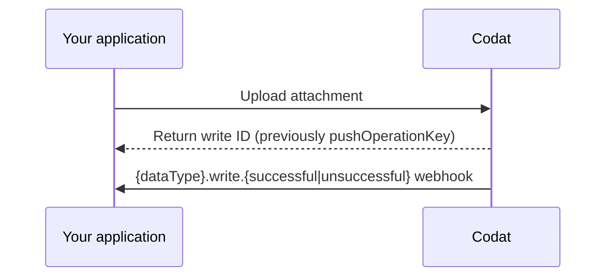

import Tabs from "@theme/Tabs";
import TabItem from "@theme/TabItem";

Codat offers the ability to upload attachment to records in the supported accounting software. You can write an attachment for the following accounting data types: 

| Data type       | UploadAttachment |
|------------------|------------------|
| `billCreditNotes`  | &#9989;          |  
| `bills`            | &#9989;          | 
| `directCosts`      | &#9989;          | 
| `directIncomes`    | &#9989;          | 
| `invoices`         | &#9989;          | 
| `transfers`        | &#9989;          |


## Attachment upload process

An attachment upload process at Codat consists of the following steps:

1. **[Make a write request](#make-a-write-request).**

   Once completed, you will receive a write request ID. Use it to track the status of the request.

3. **[Consume the relevant write webhook](#consume-the-write-webhook).**

   Subscribe to the relevant `{dataType}.write.{successful|unsuccessful}` webhook to receive notifications of the success or failure of the write request.




### Make a write request

To upload an attachment to a record, include the company ID, relevant connection ID, the record ID for the data type, and the attachment file itself in your API call.

In the example below, we are uploading an attachment for our `bills` data type.

<Tabs>

<TabItem value="typescript" label="TypeScript">

```typescript
const uploadAttachmentResponse = await sdk.bills.uploadAttachment({
    companyId: companyId,
    connectionId: connectionId,
    billId: billId,
    attachmentUpload: {
      file: {
        content: new TextEncoder().encode(fileContent),
        fileName: fileName,
      },
    },
});
```
</TabItem>

<TabItem value="python" label="Python">

```python
upload_attachment_response = sdk.bills.upload_attachment(operations.UploadBillAttachmentRequest(
    company_id=company_id,
    connection_id=connection_id,
    bill_id=bill_id,
    attachment_upload=shared.AttachmentUpload(
        file=shared.CodatFile(
            content=file_content.encode(),
            file_name=file_name,
        )
    )
))
```
</TabItem>

<TabItem value="csharp" label="C#">

```c#
var uploadAttachmentResponse = await skd.Bills.UploadAsync(new UploadBillAttachmentRequest() {
    CompanyId = companyId,
	ConnectionId = connectionId,
    BillId = billId,
    File = new CodatFile(){
        Content = fileContent,
        FileName = fileName
    }
});
```
</TabItem>

<TabItem value="go" label="Go">

```go
ctx := context.Background()
uploadAttachmentResponse, err := sdk.Bills.UploadAttachment(ctx, operations.UploadBillAttachmentRequest{
    CompanyID: companyID,
    ConnectionID: connectionID,
    BillID: billID,
    AttachmentUpload: &shared.AttachmentUpload{
        File: shared.CodatFile{
            Content: []byte(fileContent),
            FileName: fileName,
        },
    },
})
```
</TabItem>

<TabItem value="java" label="Java">

```java
UploadBillAttachmentRequest uploadAttachmentRequest = UploadBillAttachmentRequest.builder()
    .companyId(companyId)
    .connectionId(connectionId)
    .billId(billId)
    .attachmentUpload(AttachmentUpload.builder()
        .file(CodatFile.builder()
                .content(fileContent.getBytes())
                .fileName(fileName)
                .build())
        .build())
    .build();

UploadBillAttachmentResponse uploadAttachmentResponse = sdk.bills().uploadAttachment()
    .request(uploadAttachmentRequest)
    .call();
```
</TabItem>

</Tabs>

### Consume the write webhook

Subscribe to our data type-specific webhooks to track the outcome of a completed write request:

- `{dataType}.write.successful`
- `{dataType}.write.unsuccessful`

To create a webhook consumer for these event types, navigate to **Settings > Webhooks > Events > Configure consumer** in the [Codat Portal](https://app.codat.io) and click **Add endpoint**. See [Build webhook consumers to subscribe to events](/using-the-api/webhooks/create-consumer) for detailed instructions. 

The webhook's payload includes information about the company ID and record ID the attachment upload was attempted for. If the write operation is successful, the payload also includes the attachment ID. We provided an example webhook payload for a successful write operation uploading an attachment to a bill. 

<details>
  <summary><b>Example webhook payload</b></summary>

```json
{
  "id": "bae71d36-ff47-420a-b4a6-f8c9ddf41140",
  "eventType": "bills.write.successful",
  "generatedDate": "2023-05-03T10:00:23.000Z",
  "payload": {
    "id": "a9367074-b5c3-42c4-9be4-be129f43577e",
    "type": "Create",
    "referenceCompany": {
      "id": "70af3071-65d9-4ec3-b3cb-5283e8d55dac",
      "name": "Toft stores"
    },
    "connectionId": "12571faf-0898-47e7-afdd-0fe9eb0a9bf5",
    "requestedOnDate": "2023-05-03T10:00:00.000Z",
    "completedOnDate": "2023-05-03T10:00:23.000Z",
    "status": "Success",
    "record": {
      "id": "bil_1Nispe2eZvKYlo2Cd31jOCgZ"
    },
    "attachmentId": "att_2Ksoie6eDvErJo249lsieqpD9"
  }
}
```

</details>
