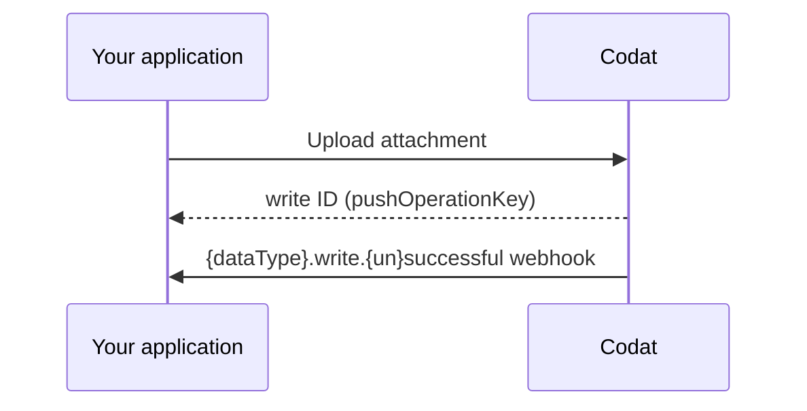

import Tabs from "@theme/Tabs";
import TabItem from "@theme/TabItem";

### Supported accounting data types

| `dataType`       | UploadAttachment |
|------------------|------------------|
| billCreditNotes  | &#9989;          |  
| bills            | &#9989;          | 
| directCosts      | &#9989;          | 
| directIncomes    | &#9989;          | 
| invoices         | &#9989;          | 
| transfers        | &#9989;          |


:::note Software coverage

View the full details of Codat's support for uploading attachments for each accounting software in our <a class="external" href="https://knowledge.codat.io/supported-features/accounting" target="_blank">Data Coverage Explorer</a>.

:::

### Process

To perform an attachment upload request, follow these steps:

1. **[Make a write request](#make-a-write-request)**: Once completed, you will receive a write request ID, which can be used to track the status of the request.

2. **[Consume the relevant `{dataType}.write.{unsuccessful,successful}` webhook](#consume-the-data-types-write-webhook)**: Subscribe to this webhook to receive notifications on the success or failure of the write request.




## Make a write request

To upload an attachment to a record, you’ll need the company ID, relevant connection ID, the record ID for the data type, and the file itself.

<Tabs>

<TabItem value="typescript" label="TypeScript">

```typescript
const uploadAttachmentResponse = await sdk.bills.uploadAttachment({
    companyId: companyId,
    connectionId: connectionId,
    billId: billId,
    attachmentUpload: {
      file: {
        content: new TextEncoder().encode(fileContent),
        fileName: fileName,
      },
    },
});
```
</TabItem>

<TabItem value="python" label="Python">

```python
upload_attachment_response = sdk.bills.upload_attachment(operations.UploadBillAttachmentRequest(
    company_id=company_id,
    connection_id=connection_id,
    bill_id=bill_id,
    attachment_upload=shared.AttachmentUpload(
        file=shared.CodatFile(
            content=file_content.encode(),
            file_name=file_name,
        )
    )
))
```
</TabItem>

<TabItem value="csharp" label="C#">

```c#
var uploadAttachmentResponse = await skd.Bills.UploadAsync(new UploadBillAttachmentRequest() {
    CompanyId = companyId,
	ConnectionId = connectionId,
    BillId = billId,
    File = new CodatFile(){
        Content = fileContent,
        FileName = fileName
    }
});
```
</TabItem>

<TabItem value="go" label="Go">

```go
ctx := context.Background()
uploadAttachmentResponse, err := sdk.Bills.UploadAttachment(ctx, operations.UploadBillAttachmentRequest{
    CompanyID: companyID,
    ConnectionID: connectionID,
    BillID: billID,
    AttachmentUpload: &shared.AttachmentUpload{
        File: shared.CodatFile{
            Content: []byte(fileContent),
            FileName: fileName,
        },
    },
})
```
</TabItem>

<TabItem value="java" label="Java">

```java
UploadBillAttachmentRequest uploadAttachmentRequest = UploadBillAttachmentRequest.builder()
    .companyId(companyId)
    .connectionId(connectionId)
    .billId(billId)
    .attachmentUpload(AttachmentUpload.builder()
        .file(CodatFile.builder()
                .content(fileContent.getBytes())
                .fileName(fileName)
                .build())
        .build())
    .build();

UploadBillAttachmentResponse uploadAttachmentResponse = sdk.bills().uploadAttachment()
    .request(uploadAttachmentRequest)
    .call();
```
</TabItem>

</Tabs>

## Consume the data type's write webhook

Subscribe to the [`{dataType}.write.{un}successful`](/platform-api#/webhooks/dataType-.write.successful/post) webhook to track the outcome of a completed write request.
The payload includes information about the company, record ID to upload the attachment to and, on success, the attachment ID.

In the **Settings > Webhooks > Events > Configure consumer** [view](https://app.codat.io/monitor/events) of the Codat Portal, click **Add endpoint** to create a webhook consumer that listens for the `{dataType}.write.{un}successful` event types. You can review detailed instructions in our documentation for [consuming webhook messages](/using-the-api/webhooks/create-consumer).

<details>
  <summary><b>Example payload</b></summary>

```json
{
  "id": "bae71d36-ff47-420a-b4a6-f8c9ddf41140",
  "eventType": "bills.write.successful",
  "generatedDate": "2023-05-03T10:00:23.000Z",
  "payload": {
    "id": "a9367074-b5c3-42c4-9be4-be129f43577e",
    "type": "Create",
    "referenceCompany": {
      "id": "70af3071-65d9-4ec3-b3cb-5283e8d55dac",
      "name": "Toft stores"
    },
    "connectionId": "12571faf-0898-47e7-afdd-0fe9eb0a9bf5",
    "requestedOnDate": "2023-05-03T10:00:00.000Z",
    "completedOnDate": "2023-05-03T10:00:23.000Z",
    "status": "Success",
    "record": {
      "id": "bil_1Nispe2eZvKYlo2Cd31jOCgZ"
    },
    "attachmentId": "att_2Ksoie6eDvErJo249lsieqpD9"
  }
}
```

</details>