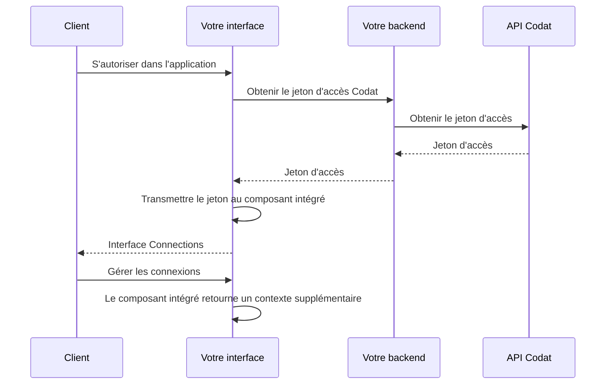

import Tabs from "@theme/Tabs";
import TabItem from "@theme/TabItem";

## Aperçu

Donnez à vos clients la possibilité de gérer les autorisations d'accès qu'ils vous ont accordées en utilisant notre **SDK Connections** dans votre interface utilisateur. Cela est essentiel d'un point de vue réglementaire, renforce la confiance entre vous et votre client et est requis par certains logiciels comptables (par exemple, Xero).


### Fonctionnalité

Avec son interface élégante et son déploiement à faible code, le composant offre les fonctionnalités critiques suivantes :

- Affiche les connexions comptables, bancaires et commerciales dans les statuts `Linked`, `Unlinked` et `Deauthorized`.
- Fournit les détails de la date de première autorisation et de la date de synchronisation la plus récente.
- Permet à l'utilisateur de déconnecter une connexion active, la définissant sur un état `Unlinked` et conservant les données précédemment récupérées.
- Permet à l'utilisateur de réautoriser une connexion précédemment déliée ou désautorisée, la rétablissant au statut `Linked`.
- Fournit des contrôles supplémentaires sur des intégrations spécifiques (par exemple, [Mettre en pause le connecteur](/integrations/accounting/quickbooksdesktop/installing-the-quickbooks-connector#pause-the-connector) pour QuickBooks Desktop).

Vous pouvez en savoir plus sur les [statuts de connexion](https://docs.codat.io/core-concepts/connections#connection-status) chez Codat.

## Exemple d'implémentation

Nous avons fourni [des exemples riches sur GitHub](https://github.com/codatio/sdk-connections/tree/main/examples) qui illustrent comment vous pouvez ajouter le composant Connections à votre projet.

## Prérequis

### Votre application

Vous avez besoin d'une application JavaScript pour afficher le composant. Le composant peut être utilisé dans n'importe quelle partie de votre application et fonctionne avec tous les principaux frameworks JavaScript, tels que React et Typescript. Vous pouvez également l'implémenter en JavaScript vanilla. Nous ne recommandons pas de l'utiliser dans un iframe car il ne fonctionnera pas pour des raisons de sécurité (CORS).

:::tip SDK Link et SDK Connections

Le SDK Connections est un composant indépendant et ne nécessite pas notre [SDK Link](/auth-flow/authorize-embedded-link) pour fonctionner. Vous pouvez utiliser le SDK Link dans votre application pour améliorer l'expérience du flux d'authentification de vos clients et atteindre un taux de conversion moyen de 89 %.

:::

### Jeton d'accès

Une fois que votre client s'est autorisé dans votre application, utilisez le endpoint [Get company access token](/platform-api#/operations/get-company-access-token) pour récupérer un jeton d'accès pour l'entreprise de ce client.

:::tip Validité du jeton
Le jeton n'est valide que pendant un jour et s'applique à une seule entreprise.
:::

<Tabs groupId="language">

<TabItem value="nodejs" label="TypeScript">

```javascript
const accessTokenRes = await platformClient.connectionManagement.getAccessToken(
  {
    companyId: companyId,
  },
);

if (accessTokenRes.statusCode == 200) {
  const accessToken =
    accessTokenRes.connectionManagementAccessToken.accessToken;
  console.log(accessToken);
}
```

</TabItem>

<TabItem value="python" label="Python">

```python
access_token_req = operations.GetConnectionManagementAccessTokenRequest(
    company_id=company_id,
)

access_token_res = platform_client.connection_management.get_access_token(access_token_req)

if access_token_res.connection_management_access_token is not None:
    print(access_token_res.connection_management_access_token.access_token)
```

</TabItem>

<TabItem value="csharp" label="C#">

```csharp
var accessTokenRes = await platformClient.ConnectionManagement.GetAccessTokenAsync(new() {
    CompanyId = companyId,
};);

if(accessTokenRes.StatusCode != 200){
  throw new Exception("Could not create company");
}

var accessToken = accessTokenRes.ConnectionManagementAccessToken.AccessToken;
Console.WriteLine(accessToken);
```

</TabItem>

<TabItem value="go" label="Go">

```go
ctx := context.Background()
accessTokenReq, err := platformClient.ConnectionManagement.GetAccessToken(ctx,
  operations.GetConnectionManagementAccessTokenRequest{
    CompanyID: companyID,
	}
)

if accessTokenReq.StatusCode == 200 {
  accessToken := accessTokenReq.ConnectionManagementAccessToken.AccessToken
  fmt.Println("%s", accessToken)
}
```

</TabItem>

<TabItem value="java" label="Java">

```java
GetConnectionManagementAccessTokenRequest accessTokenReq = GetConnectionManagementAccessTokenRequest.builder()
  .companyId(companyId)
  .build();

GetConnectionManagementAccessTokenResponse accessTokenRes = platformClient.connectionManagement().getAccessToken()
  .request(accessTokenReq)
  .call();

if (accessTokenRes.connectionManagementAccessToken().isPresent()) {
  accessToken = companyResponse.connectionManagementAccessToken().get().accessToken;
  System.out.println(accessToken);
}
```

</TabItem>

</Tabs>

Transmettez le jeton au composant Connections afin que nous puissions obtenir les informations spécifiques à l'entreprise et les afficher dans l'interface. Nous avons résumé ce processus sur le diagramme :



### Paramètres CORS

Les paramètres [Cross-origin resource sharing](https://en.wikipedia.org/wiki/Cross-origin_resource_sharing) (CORS) sont requis pour que le composant Connections fonctionne. Pour contrôler la liste de domaines à partir desquels votre application peut effectuer des demandes de jeton, enregistrez les origines autorisées à l'aide du endpoint [Set CORS settings](/platform-api#/operations/set-cors-settings).

Pour afficher les origines que vous avez précédemment enregistrées pour votre instance, utilisez le endpoint [Get CORS settings](/platform-api#/operations/get-cors-settings).

## Commencer

:::tip Installer le package npm

Profitez de notre [package npm](https://www.npmjs.com/package/@codat/sdk-connections) pour ne pas avoir à importer et maintenir manuellement les définitions de types. Vous en tirerez le meilleur parti si vous utilisez Typescript.

`$ npm i -S @codat/sdk-connections`

:::

<Tabs>
<TabItem value="react" label="React">

#### Commencer avec React

Pour un exemple du composant en action, [consultez notre application de démonstration](https://github.com/codatio/sdk-connections/tree/main/examples/languages/react).

1. **Créer un composant qui monte le SDK**

Vous pouvez copier et coller l'exemple de fichier <a href="https://github.com/codatio/sdk-connections/blob/main/examples/languages/react/src/components/CodatConnections.tsx" target="_blank">`CodatConnections.tsx`</a> à un emplacement approprié dans votre application. Nous recommandons de définir le composant sur `width: 460px; height: 840px` car il est optimisé pour être le plus beau avec ces paramètres. L'extrait de code ci-dessous utilise ces paramètres.

2. **Utiliser le composant pour monter le SDK**

   Nous suggérons d'envelopper le composant `CodatConnections` dans une fenêtre modale afin que vous puissiez [ajuster son positionnement](https://github.com/codatio/sdk-connections/blob/main/examples/languages/react/src/app/page.module.css). Il peut également gérer quand [afficher les connexions](https://github.com/codatio/sdk-connections/blob/main/examples/languages/react/src/app/page.tsx), en transmettant le [jeton d'accès](/auth-flow/optimize/connection-management#access-token) et les callbacks pertinents.

```js
// ConnectionManagement.tsx

import {
  DisconnectCallbackArgs,
  ErrorCallbackArgs,
} from "@codat/sdk-connections";

import { CodatConnections } from "./components/CodatConnections";
import { useState } from "react";

export const ConnectionManagement = ({
  accessToken,
}: {
  accessToken: string;
}) => {
  const [modalOpen, setModalOpen] = useState(false);

  const onDisconnect = (connection: DisconnectCallbackArgs) =>
    alert(`On disconnect callback - ${connection.connectionId}`);
  const onReconnect = (connection: DisconnectCallbackArgs) =>
    alert(`On reconnect callback - ${connection.connectionId}`);
  const onClose = () => setModalOpen(false);
  const onError = (error: ErrorCallbackArgs) =>
    alert(`On error callback - ${error.message}`);

  return (
    <div>
      <p>Some content</p>
      <button onClick={() => setModalOpen(true)}>Manage connections</button>
      {modalOpen && (
        <div className="modal-wrapper">
          <CodatConnections
            accessToken={accessToken}
            onDisconnect={onDisconnect}
            onReconnect={onReconnect}
            onError={onError}
            onClose={onClose}
          />
        </div>
      )}
      ;
    </div>
  );
};
```

3. **Si vous utilisez des en-têtes de politique de sécurité de contenu (CSP) :**
   - Ajoutez Codat à la liste d'autorisation en ajoutant `*.codat.io` à `default-src` (ou à chacun de `script-src, style-src, font-src, connect-src, img-src`).
   - Ajoutez `unsafe-inline` à `style-src`. N'utilisez pas de hash car celui-ci peut changer à tout moment sans avertissement.

4. **Si vous utilisez TypeScript**, étendez vos déclarations de types avec nos types en installant le package avec `npm install --save-dev @codat/sdk-connections`. Sinon, supprimez le code lié aux types dans les extraits.

</TabItem>

<TabItem value="nextjs" label="NextJS">

#### Commencer avec NextJS

Pour un exemple du composant en action, [consultez notre application de démonstration](https://github.com/codatio/sdk-connections/tree/main/examples/languages/next/).

:::note NextJS et urlImports

NextJS a une opinion sur la stratégie d'importation que nous suggérons et dispose d'une fonctionnalité expérimentale appelée [urlImports](https://nextjs.org/docs/app/api-reference/next-config-js/urlImports). Si vous suivez notre exemple NextJS, vous serez averti que vous devez utiliser la fonctionnalité urlImports.

Le SDK Connections et urlImports ne sont pas compatibles, car NextJS suppose que les ressources sont statiques et met en cache le SDK, causant divers problèmes.

Dans l'extrait ci-dessous, vous verrez que nous utilisons la fonctionnalité [magic comments](https://webpack.js.org/api/module-methods/#magic-comments) de webpack pour éviter la mise en cache de NextJS et utiliser le comportement normal d'[import()](https://developer.mozilla.org/en-US/docs/Web/JavaScript/Reference/Operators/import).
:::

1. **Créer un composant qui monte le SDK**

Vous pouvez copier et coller l'exemple de fichier <a href="https://github.com/codatio/sdk-connections/blob/main/examples/languages/next/src/components/CodatConnections.tsx" target="_blank">`CodatConnections.tsx`</a> à un emplacement approprié dans votre application. Nous recommandons de définir le composant sur `width: 460px; height: 840px` car il est optimisé pour être le plus beau avec ces paramètres.

Nous utilisons [`"use client"`](https://react.dev/reference/rsc/use-client) dans le script pour définir ceci comme du code côté client, et l'import est ignoré dans webpack pour éviter la mise en cache de NextJS (comme ci-dessus).

2. **Utiliser le composant pour monter le SDK**

Nous suggérons d'envelopper le composant `CodatConnections` dans une fenêtre modale afin que vous puissiez [ajuster son positionnement](https://github.com/codatio/sdk-connections/blob/main/examples/languages/next/src/app/page.module.css). Il peut également gérer quand [afficher les connexions](https://github.com/codatio/sdk-connections/blob/main/examples/languages/next/src/app/page.tsx), en transmettant le [jeton d'accès](/auth-flow/optimize/connection-management#access-token) et les callbacks pertinents.

```js
// page.tsx

"use client";

import {
  DisconnectCallbackArgs,
  ErrorCallbackArgs,
  ReconnectCallbackArgs,
} from "@codat/sdk-connections";

import { CodatConnections } from "./components/CodatConnections";
import Image from "next/image";
import styles from "./page.module.css";
import { useState } from "react";

export default function Home() {
  const [accessToken, setAccessToken] = useState(""); //provide accessToken
  const [modalOpen, setModalOpen] = useState(false);

  const onDisconnect = (connection: DisconnectCallbackArgs) =>
    alert(`On disconnect callback - ${connection.connectionId}`);
  const onReconnect = (connection: ReconnectCallbackArgs) =>
    alert(`On reconnect callback - ${connection.connectionId}`);
  const onClose = () => setModalOpen(false);
  const onError = (error: ErrorCallbackArgs) =>
    alert(`On error callback - ${error.message}`);

  return (
    <main className={styles.main}>
      {/* // ... some other components */}
      {modalOpen && (
        <div className={styles.modalWrapper}>
          <CodatConnections
            accessToken={accessToken}
            onDisconnect={onDisconnect}
            onReconnect={onReconnect}
            onError={onError}
            onClose={onClose}
          />
        </div>
      )}
    </main>
  );
}
```

3. **Si vous utilisez des en-têtes de politique de sécurité de contenu (CSP) :**
   - Ajoutez Codat à la liste d'autorisation en ajoutant `*.codat.io` à `default-src` (ou à chacun de `script-src, style-src, font-src, connect-src, img-src`).
   - Ajoutez `unsafe-inline` à `style-src`. N'utilisez _pas_ de hash car celui-ci peut changer à tout moment sans avertissement.

4. **Si vous utilisez TypeScript**, étendez vos déclarations de types avec nos types en installant le package avec `npm install --save-dev @codat/sdk-connections`. Sinon, supprimez le code lié aux types dans les extraits.

</TabItem>

<TabItem value="javascript" label="JavaScript">

#### Commencer avec JavaScript

Pour un exemple du composant en action, [consultez notre application de démonstration](https://github.com/codatio/sdk-connections/tree/main/examples/languages/javascript/).

1. **Créer une `div` cible pour le composant `CodatConnections`**

Elle devrait avoir un `id` de `codat-connections-container`.

Le composant `CodatConnections` sera monté dans cette div. Nous recommandons de définir `width: 460px; height: 840px` pour cet élément et de le styliser comme une fenêtre modale en l'imbriquant dans un wrapper modal (par exemple, `position: fixed; inset: 0`). Le composant est optimisé pour être le plus beau avec ces paramètres.

Le composant `CodatConnections` créé s'étend pour s'adapter à 100 % des dimensions spécifiées.

2. **Importer le composant SDK Connections**

Si vous utilisez le composant à l'intérieur d'une balise `script`, la balise doit avoir `type="module"` défini.

```bash
import { CodatConnections } from "https://connections-sdk.codat.io";
```

3. **Définir les callbacks**

```js
const closeCallback = () => {
  connectionsSdkTarget.style.pointerEvents = "none";
  connectionsSdkTarget.removeChild(connectionsSdkTarget.children[0]);
};

const onClose = () => closeCallback();
const onReconnect = (connection) =>
  alert(`On reconnect callback  = ${connection.connectionId}`);
const onDisconnect = (connection) =>
  alert(`On disconnect callback  = ${connection.connectionId}`);
const onError = (error) => alert(`On error callback : ${error.message}`);
```

5. **Initialiser le composant SDK Link dans votre application**

Fournissez le `accessToken` pour l'entreprise dont vous souhaitez gérer les connexions :

```js
const connectionsSdkTarget = document.querySelector(
  "#codat-connections-container",
);

const openModal = () => {
  connectionsSdkTarget.style.pointerEvents = "initial";
  new CodatConnections({
    target: connectionsSdkTarget,
    props: {
      accessToken,
      onReconnect,
      onClose,
      onDisconnect,
      onError,
    },
  });
};
```

4. **Si vous utilisez des en-têtes de politique de sécurité de contenu (CSP)** :
   - Ajoutez Codat à la liste d'autorisation en ajoutant `*.codat.io` à `default-src` (ou à chacun de `script-src, style-src, font-src, connect-src, img-src`).
   - Ajoutez `unsafe-inline` à `style-src`. N'utilisez _pas_ de hash car celui-ci peut changer à tout moment sans avertissement.

5. **Si vous utilisez TypeScript**, étendez vos déclarations de types avec nos types en installant le package avec `npm install --save-dev @codat/sdk-connections`. Sinon, supprimez le code lié aux types dans les extraits.

</TabItem>

<TabItem value="angular" label="Angular">

#### Commencer avec Angular

Pour un exemple du composant en action, [consultez notre application de démonstration](https://github.com/codatio/sdk-connections/tree/main/examples/languages/angular/).

:::note Angular et urlImports

Dans l'extrait ci-dessous, nous utilisons la fonctionnalité [magic comments](https://webpack.js.org/api/module-methods/#magic-comments) de webpack pour éviter la mise en cache d'Angular et utiliser le comportement normal d'[import()](https://developer.mozilla.org/en-US/docs/Web/JavaScript/Reference/Operators/import).
:::

1. **Créer un composant qui monte le SDK**

Consultez le dossier <a href="https://github.com/codatio/sdk-connections/tree/main/examples/languages/angular/src/app/codat-connections" target="_blank">`codat-connections`</a> pour un exemple de module.

2. **Définir le jeton d'accès et les callbacks**

```js
//app.component.ts

accessToken = ''; // provide access token
connectionsSdkOpen = false;

openConnectionsSdk() {
  if (this.accessToken) {
    this.connectionsSdkOpen = true;
  }
}

closeConnectionsSdk() {
  this.connectionsSdkOpen = false;
}

onDisconnect(connection) {
  alert(`On disconnect callback : ${connection.connectionId}`);
}

onReconnect(connection) {
  alert(`On reconnect callback : ${connection.connectionId}`);
}

onError(error) {
  alert(`On error callback : ${error.message}`);
}
```

3. **Utiliser le composant pour monter le SDK**

```html
<!-- app.component.html -->

<button (click)="openConnectionsSdk()">Manage connections</button>
<app-codat-connections
  [accessToken]="accessToken"
  (connection)="onDisconnect($event)"
  (connection)="onReconnect($event)"
  (close)="closeConnectionsSdk()"
  (error)="onError($event)"
  *ngIf="connectionsSdkOpen"
></app-codat-connections>
```

4. **Si vous utilisez des en-têtes de politique de sécurité de contenu (CSP)** :
   - Ajoutez Codat à la liste d'autorisation en ajoutant `*.codat.io` à `default-src` (ou à chacun de `script-src, style-src, font-src, connect-src, img-src`).
   - Ajoutez `unsafe-inline` à `style-src`. N'utilisez _pas_ de hash car celui-ci peut changer à tout moment sans avertissement.

5. **Si vous utilisez TypeScript**, étendez vos déclarations de types avec nos types en installant le package avec `npm install --save-dev @codat/sdk-connections`. Sinon, supprimez le code lié aux types dans les extraits.

</TabItem>

<TabItem value="vue" label="Vue">

#### Commencer avec Vue

Pour un exemple du composant en action, [consultez notre application de démonstration](https://github.com/codatio/sdk-connections/tree/main/examples/languages/vue/).

1. **Créer un composant qui monte le SDK**

Vous pouvez copier et coller l'exemple de fichier <a href="https://github.com/codatio/sdk-connections/blob/main/examples/languages/vue/src/components/CodatConnections.vue" target="_blank">`CodatConnections.vue`</a> à un emplacement approprié dans votre application. Nous recommandons de définir `width: 460px; height: 840px` pour ce composant car il est optimisé pour être le plus beau avec ces paramètres.

2. **Utiliser ce composant pour monter le SDK**

Nous suggérons d'envelopper le composant `CodatConnections` dans une fenêtre modale afin que vous puissiez [ajuster son positionnement](https://github.com/codatio/sdk-connections/blob/main/examples/languages/vue/src/App.vue). Il peut également gérer quand [afficher les connexions](https://github.com/codatio/sdk-connections/blob/main/examples/languages/vue/src/App.vue), en transmettant le [jeton d'accès](/auth-flow/optimize/connection-management#access-token) et les callbacks pertinents.

```js
// App.vue

<script setup lang="ts">
  import CodatConnections from './components/CodatConnections.vue'
  import { ref } from 'vue'
  import type { DisconnectCallbackArgs, ReconnectCallbackArgs, ErrorCallbackArgs } from 'https://connections-sdk.codat.io'

  const accessToken = ref('') //provide access token
  const modalOpen = ref(false)

  const onDisconnect = (connection: DisconnectCallbackArgs) =>
    alert(`On disconnect callback - ${connection.connectionId}`);
  const onReconnect = (connection: ReconnectCallbackArgs) =>
    alert(`On reconnect callback - ${connection.connectionId}`);
  const onClose = () => (modalOpen = false);
  const onError = (error: ErrorCallbackArgs) =>
    alert(`On error callback - ${error.message}`);
</script>

<div class="app">
  <main>
      {#if modalOpen}
      <div class="modal-wrapper">
        <CodatConnections {accessToken} {onDisconnect} {onReconnect} {onClose} {onError} />
      </div>
    {/if}
  </main>
</div>
```

4. **Si vous utilisez des en-têtes de politique de sécurité de contenu (CSP)** :
   - Ajoutez Codat à la liste d'autorisation en ajoutant `*.codat.io` à `default-src` (ou à chacun de `script-src, style-src, font-src, connect-src, img-src`).
   - Ajoutez `unsafe-inline` à `style-src`. N'utilisez _pas_ de hash car celui-ci peut changer à tout moment sans avertissement.

5. **Si vous utilisez TypeScript**, étendez vos déclarations de types avec nos types en installant le package avec `npm install --save-dev @codat/sdk-connections`. Sinon, supprimez le code lié aux types dans les extraits.

</TabItem>

<TabItem value="svelte" label="Svelte">

#### Commencer avec Svelte

Pour un exemple du composant en action, [consultez notre application de démonstration](https://github.com/codatio/sdk-connections/tree/main/examples/languages/svelte/).

1. **Créer un composant qui monte le SDK**

Vous pouvez copier et coller l'exemple de fichier <a href="https://github.com/codatio/sdk-connections/blob/main/examples/languages/svelte/src/lib/CodatConnections.svelte" target="_blank">`CodatConnections.svelte`</a> à un emplacement approprié dans votre application. Nous recommandons de définir `width: 460px; height: 840px` pour ce composant car il est optimisé pour être le plus beau avec ces paramètres.

2. **Utiliser le composant pour monter le SDK**

Nous suggérons d'envelopper le composant `CodatConnections` dans une fenêtre modale afin que vous puissiez [ajuster son positionnement](https://github.com/codatio/sdk-connections/blob/main/examples/languages/svelte/src/App.svelte). Il peut également gérer quand [afficher les connexions](https://github.com/codatio/sdk-connections/blob/main/examples/languages/svelte/src/App.svelte), en transmettant le [jeton d'accès](/auth-flow/optimize/connection-management#access-token) et les callbacks pertinents.

```js
// App.svelte

<script lang="ts">
  import CodatConnections from "./lib/CodatConnections.svelte";
  import type {
    DisconnectCallbackArgs,
    ReconnectCallbackArgs,
    ErrorCallbackArgs,
  } from "https://connections-sdk.codat.io";

  let modalOpen = false;
  let accessToken = ""; //provide access token

  const onDisconnect = (connection: DisconnectCallbackArgs) =>
    alert(`On disconnect callback - ${connection.connectionId}`);
  const onReconnect = (connection: ReconnectCallbackArgs) =>
    alert(`On disconnect callback - ${connection.connectionId}`);
  const onClose = () => (modalOpen = false);
  const onError = (error: ErrorCallbackArgs) =>
    alert(`On error callback - ${error.message}`);
</script>

// App.svelte

<div class="app">
  <main>
    {#if modalOpen}
      <div class="modal-wrapper">
        <CodatConnections
          {accessToken}
          {onDisconnect}
          {onReconnect}
          {onClose}
          {onError}
        />
      </div>
    {/if}
  </main>
</div>

```

4. **Si vous utilisez des en-têtes de politique de sécurité de contenu (CSP)** :
   - Ajoutez Codat à la liste d'autorisation en ajoutant `*.codat.io` à `default-src` (ou à chacun de `script-src, style-src, font-src, connect-src, img-src`).
   - Ajoutez `unsafe-inline` à `style-src`. N'utilisez _pas_ de hash car celui-ci peut changer à tout moment sans avertissement.

5. **Si vous utilisez TypeScript**, étendez vos déclarations de types avec nos types en installant le package avec `npm install --save-dev @codat/sdk-connections`. Sinon, supprimez le code lié aux types dans les extraits.

</TabItem>

</Tabs>

## Options d'interface

Le composant **ne prend pas en charge** les paramètres de [marque](/auth-flow/customize/branding) et de [personnalisation](/auth-flow/customize/customize-link) que vous pouvez appliquer à notre [parcours d'authentification Link](/auth-flow/authorize-embedded-link) dans le [portail Codat](https://app.codat.io/settings). Cependant, vous pouvez utiliser la propriété `options` du SDK pour modifier certains de ces paramètres.

```js
<CodatConnections
  accessToken={accessToken}
 onClose: () => void = () => {};
 onError: ({correlationId?: string;
  message?: string;
  errorCode?: number;
  userRecoverable: boolean}) => void = () => {};
onReconnect: (args: {connectionId: string}) => void = () => {};
onDisconnect: (args: {connectionId: string}) => void = () => {};
  options={{
      text: {...},
  }}
/>
```

La propriété `options` est facultative et accepte un objet contenant les propriétés facultatives suivantes :

| Propriété | Description                                                       |
| --------- | ----------------------------------------------------------------- |
| `text`    | Contient des options qui contrôlent le texte affiché à l'utilisateur. |

L'objet est appliqué au moment où le composant SDK est monté et ne prend pas en charge le rechargement. Assurez-vous de modifier les options avant de monter le composant.

### Texte personnalisé

Utilisez la propriété `text` pour contrôler une partie du texte affiché dans l'interface Connections. Vous pouvez remplacer les options de texte suivantes :

| Option                                                                                                                        | Type et description                                                                                                                                                                                                                                                                    |
| ----------------------------------------------------------------------------------------------------------------------------- | -------------------------------------------------------------------------------------------------------------------------------------------------------------------------------------------------------------------------------------------------------------------------------------- |
| `accounting.connectionDetails.dataTypes`<br/>`banking.connectionDetails.dataTypes`<br/>`commerce.connectionDetails.dataTypes` | `array[string]` _(accepte Markdown)_ <br/><br/>Liste des types de données demandés affichés avant de déconnecter ou de reconnecter un logiciel comptable, bancaire ou commercial. <br/><br/> Si cela n'est pas défini, l'interface n'affichera pas de liste de types de données lors de la déconnexion ou de la reconnexion. |

## Journal des modifications

:::tip Gestion des changements

Comme pour toutes les solutions Codat, ce SDK est soumis à [notre politique de gestion des changements](/using-the-api/change-policy). Nous donnerons un préavis approprié pour les modifications apportées à celui-ci et à toutes les API associées. Nous avons mis en place des mesures de test et de sécurité rigoureuses pour garantir que vous pouvez importer notre SDK en toute confiance.
:::

#### Avril 2024

- Version initiale du SDK.

---

## Lire ensuite

- [Optimiser votre flux d'authentification](/auth-flow/optimize/optimize-the-connection-journey)
