import Tabs from "@theme/Tabs";
import TabItem from "@theme/TabItem";

:::info Intégrations et langages

Ce tutoriel se concentre sur le rapprochement des flux bancaires avec QuickBooks Online (QBO) et utilise notre bibliothèque client Bank Feeds. La bibliothèque Bank Feeds est disponible en [C#](https://github.com/codatio/client-sdk-csharp/tree/main/bank-feeds), [TypeScript](https://github.com/codatio/client-sdk-typescript/tree/main/bank-feeds), [Python](https://github.com/codatio/client-sdk-python/tree/main/bank-feeds) et [Go](https://github.com/codatio/client-sdk-go/tree/main/bank-feeds).

:::

## Résumé

🎯 Notre intégration QuickBooks Online Bank Feeds permet à vos clients de connecter des comptes bancaires depuis votre application vers QBO. Découvrez comment vous pouvez soutenir vos utilisateurs en synchronisant les données de leurs transactions bancaires vers QBO Bank Feeds, en vous assurant que les enregistrements correspondent les uns aux autres.

⏳ Temps de révision estimé : 10-15 minutes

## Pourquoi rapprocher les transactions bancaires

Traditionnellement, le rapprochement bancaire se fait en comparant un relevé bancaire aux écritures du grand livre. Cependant, les méthodes désuètes telles que le traitement manuel des données et le web scraping ne satisfont plus la demande des PME pour des processus efficaces et sans effort.

Aidez vos clients PME à synchroniser leurs relevés bancaires numériquement avec leur logiciel de comptabilité et à rapprocher automatiquement les transactions, éliminant ainsi l'effort manuel, réduisant le potentiel d'erreurs et facilitant le rapprochement des transactions.

Cela fait gagner du temps à vos clients et leur donne le contexte dont ils ont besoin pour analyser et optimiser correctement leurs dépenses.

## Aperçu de la solution

Nous avons fait le gros du travail pour vous en créant des intégrations de flux bancaires avec un modèle de données standardisé vers les logiciels de comptabilité que vos clients utilisent déjà. Cela vous donne accès à des données en temps réel que vous pouvez récupérer, créer ou mettre à jour pour soutenir vos clients. Dans ce tutoriel, nous nous concentrons sur notre intégration QuickBooks Online Bank Feeds.

:::tip Prérequis

1. Assurez-vous d'avoir activé l'intégration QuickBooks Online Bank Feeds. Vous pouvez le faire dans le [portail Codat](https://app.codat.io/settings/integrations/bankfeeds), ou [en savoir plus](/integrations/bank-feeds/qbo-bank-feeds/qbo-bank-feeds-setup) pour des instructions détaillées.

2. Intuit doit avoir approuvé votre entreprise pour qu'elle apparaisse dans l'écran de sélection bancaire de QuickBooks Online. Soumettez une demande à Codat afin que nous puissions organiser cela avec Intuit en votre nom.

Nous supposons également que votre application dispose d'une interface utilisateur avec laquelle vos utilisateurs PME interagissent.

:::

### Préparation

Utilisez nos SDK pour implémenter facilement la solution de flux bancaires dans votre application. Nous recommandons fortement d'utiliser nos SDK pour rendre votre développement simple à implémenter et facile à maintenir.

Tout d'abord, installez la bibliothèque client :

<Tabs groupId="language">

<TabItem value="csharp" label="C#">

```bash
    dotnet add package Codat.BankFeeds
```

</TabItem>

<TabItem value="nodejs" label="TypeScript">

```bash
    npm add @codat/platform
```

ou

```bash
    yarn add @codat/platform
```

</TabItem>

<TabItem value="python" label="Python">

```bash
    pip install codat-bankfeeds
```

</TabItem>

<TabItem value="go" label="Go">

```bash
    go get github.com/codatio/client-sdk-go/bank-feeds
```

</TabItem>

</Tabs>

Ensuite, importez le package et ajoutez votre clé API encodée en Base64 dans un en-tête d'autorisation. Vous pouvez copier votre en-tête d'autorisation dans la section [Développeurs](https://app.codat.io/developers/api-keys) du portail Codat. Dans notre exemple, nous avons choisi d'appeler la bibliothèque client `bank_feeds_client`.

<Tabs groupId="language">

<TabItem value="csharp" label="C#">

```c#
using Codat.BankFeeds;
using CodatPlatform.Models.Shared;

var bankFeedsClient = new CodatBankFeedsSDK(
    security: new Security() {
        AuthHeader = "Basic BASE_64_ENCODED(API_KEY)",
    }
);
```

</TabItem>

<TabItem value="nodejs" label="TypeScript">

```javascript
import { CodatBankFeeds } from "@codat/bank-feeds";

const bankFeedsClient = new CodatBankFeeds({
  authHeader: "Basic BASE_64_ENCODED(API_KEY)",
});
```

</TabItem>

<TabItem value="python" label="Python">

```python
from codat_bankfeeds import CodatBankFeeds
from codat_bankfeeds.models import operations, shared

bank_feeds_client = CodatBankFeeds(
    security=shared.Security(
        auth_header="Basic BASE_64_ENCODED(API_KEY)",
    ),
)
```

</TabItem>

<TabItem value="go" label="Go">

```go
package main

import(
	"github.com/codatio/client-sdk-go/bank-feeds"
	"github.com/codatio/client-sdk-go/bank-feeds/pkg/models/shared"
)

func main() {
    bankFeedsClient := codatbankfeeds.New(
        codatbankfeeds.WithSecurity(shared.Security{
            AuthHeader: "Basic BASE_64_ENCODED(API_KEY)",
        }),
    )
}
```

</TabItem>

</Tabs>

### Flux du processus de flux bancaires

```mermaid
    sequenceDiagram
        participant frontend as Utilisateur
        participant backend as Banque
        participant codat as Codat
        participant qbo as Portail QBO
        frontend ->> backend: Connecter le flux bancaire
        backend ->> codat: Créer une entreprise avec connexion QBO Bank Feeds
        codat -->> backend: ID d'entreprise avec connexion QBO Bank Feeds
        backend ->> codat: Créer un compte de flux bancaire
        codat -->> backend: Compte de flux bancaire
        backend ->> codat: Obtenir les identifiants QBO Bank Feeds via proxy
        codat -->> backend: Identifiants QBO Bank Feeds
        backend -->> frontend: Identifiants QBO Bank Feeds
        frontend ->> qbo: Compléter la liaison QBO Bank Feeds
        loop lot de transactions
            backend ->> codat: Créer des transactions bancaires
            codat -->> backend: Confirmer le statut de l'opération
        end
        loop lot de transactions, périodiquement
            qbo ->> codat: Demander des transactions bancaires
            codat -->> qbo: Fournir des transactions bancaires
        end
```



## Procédure détaillée de la solution

Fournissez à vos utilisateurs un lien ou un bouton dans votre application afin qu'ils puissent déclencher la connexion de leurs comptes bancaires à QBO Bank Feeds. Utilisez un appel à l'action approprié, tel que _Connecter le compte à QuickBooks_.

Lorsqu'un utilisateur PME clique sur le bouton ou le lien que vous avez ajouté, lancez le processus décrit ci-dessous pour créer une entreprise Codat avec une connexion QBO Bank Feeds et offrez la possibilité d'autoriser cette connexion.

### Créer une entreprise avec une connexion QBO Bank Feeds

Utilisez notre point de terminaison [Create company](/bank-feeds-api#/operations/create-company) pour déclencher la création d'entreprise, qui représentera votre client PME dans Codat. En réponse, vous recevrez un ID d'entreprise, qui est requis par les points de terminaison suivants.

<Tabs groupId="language">

<TabItem value="csharp" label="C#">

```c#
var companyCreatedRes = await bankFeedsClient.Companies.CreateAsync(new CompanyRequestBody() {
    Name = "Elaborate Events, Inc",
  });

if(companyCreatedRes.Company != null) {
    var company = companyCreatedRes.Company;
    logger.LogInformation('{CompanyId} {CompanyName}', company.Id, company.Name);
}
```

</TabItem>

<TabItem value="nodejs" label="TypeScript">

```javascript
bankFeedsClient.companies.create({
    name: "Elaborate Events, Inc",
}).then((companyCreatedRes: CreateCompanyResponse) => {
    if (companyCreatedRes.statusCode == 200) {
        console.log(companyCreatedRes.company.id, companyCreatedRes.company.name)
    }
});
```

</TabItem>

<TabItem value="python" label="Python">

```python
req = shared.CompanyRequestBody(
    name='Elaborate Events, Inc'
    )

company_created_res = bank_feeds_client.companies.create(req)
print(company_created_res.company.id, company_created_res.company.name)
```

</TabItem>

<TabItem value="go" label="Go">

```go
ctx := context.Background()

companyCreatedRes, err := bankFeedsClient.Companies.Create(ctx, shared.CompanyRequestBody{
    Name: "Elaborate Events, Inc",
})

if err != nil {
    log.Fatal(err)
}

if companyCreatedRes.Company != nil {
    fmt.Println("%s %s", companyCreatedRes.Company.ID, companyCreatedRes.Company.Name)
}
```

</TabItem>

</Tabs>

Ensuite, appelez le point de terminaison [Create connection](/bank-feeds-api#/operations/create-connection) pour établir une liaison de données vers QBO Bank Feeds pour l'entreprise. Nous passons la réponse du point de terminaison précédent dans la demande, et incluons également la clé de plateforme, qui pour QBO Bank Feeds est `hcws`.

<Tabs groupId="language">

<TabItem value="csharp" label="C#">

```c#
var connectionCreatedRes = await bankFeedsClient.Connections.CreateAsync(new CreateConnectionRequest() {
    RequestBody = new CreateConnectionRequestBody() {
        PlatformKey = "hcws", // Clé de plateforme Codat pour QBO Bank Feeds
    },
    CompanyId = companyCreatedRes.Company.Id,
});
```

</TabItem>

<TabItem value="nodejs" label="TypeScript">

```javascript
bankFeedsClient.connections.create({
  requestBody: {
    platformKey: "hcws", // Clé de plateforme Codat pour QBO Bank Feeds
  },
  companyId: companyCreatedRes.company.id,
}).then((connectionCreatedRes: CreateConnectionResponse) => {
  if (connectionCreatedRes.statusCode == 200) {
    // gérer la réponse
  }
});
```

</TabItem>

<TabItem value="python" label="Python">

```python
req = operations.CreateConnectionRequest(
    request_body=operations.CreateConnectionRequestBody(
        platform_key='hcws', # Clé de plateforme Codat pour QBO Bank Feeds
    ),
    company_id=company_created_res.company.id,
)

connection_created_res = bank_feeds_client.connections.create(req)
```

</TabItem>

<TabItem value="go" label="Go">

```go
ctx := context.Background()
connectionCreatedRes, err := bankFeedsClient.Connections.Create(ctx, operations.CreateConnectionRequest{
    RequestBody: &operations.CreateConnectionRequestBody{
        PlatformKey: codatbankfeeds.String("hcws"), // Clé de plateforme Codat pour QBO Bank Feeds
    },
    CompanyID: companyCreatedRes.Company.ID,
})
```

</TabItem>

</Tabs>

### Créer des comptes bancaires pour les flux bancaires

Maintenant, utilisez le point de terminaison [Create source account](/bank-feeds-api#/operations/create-source-account) pour ajouter les comptes bancaires sources de votre PME à Codat. Ce sont les comptes que l'utilisateur PME pourra connecter à QBO Bank Feeds. En réponse, vous recevrez le compte source créé dans la plateforme connectée.

<Tabs groupId="language">

<TabItem value="csharp" label="C#">

```c#
var accountCreatedRes = await bankFeedsClient.SourceAccounts.CreateAsync(new CreateSourceAccountRequest() {
    SourceAccount = new SourceAccount() {
        AccountName = "Account 002",
        AccountNumber = "12345670",
        AccountType = "Debit",
        Balance = 6531.4,
        Currency = "GBP",
        SortCode = "123456",
    },
    CompanyId = companyCreatedRes.Company.Id,
    ConnectionId = connectionCreatedRes.Connection.Id,
});
```

</TabItem>

<TabItem value="nodejs" label="TypeScript">

```javascript
bankFeedsClient.sourceAccounts.create({
  sourceAccount: {
    accountName: "Account 002",
    accountNumber: "12345670",
    accountType: "Debit",
    balance: 6531.4,
    currency: "GBP",
    sortCode: "123456",
  },
  companyId: companyCreatedRes.company.id,
  connectionId: connectionCreatedRes.connection.id,
}).then((accountCreatedRes: CreateSourceAccountResponse) => {
  if (accountCreatedRes.statusCode == 200) {
    // gérer la réponse
  }

```

</TabItem>

<TabItem value="python" label="Python">

```python
account_create_req = operations.CreateSourceAccountRequest(
    source_account=shared.SourceAccount(
        account_name='Account 002',
        account_number='12345670',
        account_type='Debit',
        balance=6531.4,
        currency='GBP',
        sort_code='123456',
    ),
    company_id=company_created_res.company.id,
    connection_id=connection_created_res.connection.id
)

account_created_res = bank_feeds_client.source_accounts.create(account_create_req)
```

</TabItem>

<TabItem value="go" label="Go">

```go
ctx := context.Background()
accountCreatedRes, err := bankFeedsClient.SourceAccounts.Create(ctx, operations.CreateSourceAccountRequest{
        SourceAccount: &shared.SourceAccount{
            AccountName: codatbankfeeds.String("Account 002"),
            AccountNumber: codatbankfeeds.String("12345670"),
            AccountType: codatbankfeeds.String("Debit"),
            Balance: codatbankfeeds.Float64(6531.4),
            Currency: codatbankfeeds.String("GBP"),
            SortCode: codatbankfeeds.String("123456"),
        },
    CompanyID: companyCreatedRes.Company.ID,
    ConnectionID: connectionCreatedRes.Connection.ID,
})
```

</TabItem>

</Tabs>

### Autoriser la connexion

Enfin, utilisez notre point de terminaison [Generate source account credentials](/bank-feeds-api#/operations/generate-credentials) pour autoriser la connexion de données créée précédemment. Intégrez l'appel à ce point de terminaison dans le flux d'interface utilisateur que l'utilisateur a déclenché lorsqu'il a choisi de lier ses comptes bancaires.

En réponse, vous recevrez des identifiants de connexion que votre utilisateur doit saisir dans QBO Banking pour lier un compte bancaire. Partagez-les avec l'utilisateur et envisagez de fournir des instructions sur les étapes à suivre dans QBO. Par exemple, voici comment nous le gérons dans notre flux de liaison QBO :


<Tabs groupId="language">

<TabItem value="csharp" label="C#">

```c#
var credentialsRes = await bankFeedsClient.SourceAccounts.GenerateCredentialsAsync(new GenerateCredentialsRequest() {
    CompanyId = companyCreatedRes.Company.Id,
    ConnectionId = connectionCreatedRes.Connection.Id,
});

var companyCredentials = credentialsRes.BankAccountCredentials;
logger.LogInformation("{Username} {Password}", companyCredentials.Username, companyCredentials.Password);
```

</TabItem>

<TabItem value="nodejs" label="TypeScript">

```javascript
bankFeedsClient.sourceAccounts.generateCredentials({
  companyId: companyCreatedRes.company.id,
  connectionId: connectionCreatedRes.connection.id,
}).then((credentialsRes: GenerateCredentialsResponse) => {
  if (credentialsRes.statusCode == 200) {
    const companyCredentials = credentialsRes.BankAccountCredentials;
    console.log(companyCredentials.username, companyCredentials.password)
  }
});

```

</TabItem>

<TabItem value="python" label="Python">

```python
credentials_res = bank_feeds_client.source_accounts.generate_credentials(
    operations.GenerateCredentialsRequest(
        company_id=company_created_res.company.id,
        connection_id=connection_created_res.connection.id
    ))

company_credentials = credentials_res.bank_account_credentials
print(company_credentials.username, company_credentials.password)
```

</TabItem>

<TabItem value="go" label="Go">

```go
ctx := context.Background()
credentialsRes, err := bankFeedsClient.SourceAccounts.GenerateCredentials(ctx, operations.GenerateCredentialsRequest{
    CompanyID: companyCreatedRes.Company.ID,
    ConnectionID: connectionCreatedRes.Connection.ID,
})

if err != nil {
    log.Fatal(err)
}

if credentialsRes.BankAccountCredentials != nil {
    // gérer la réponse
    companyCredentials := credentialsRes.BankAccountCredentials
    fmt.Println("%s %s", companyCredentials.Username, companyCredentials.Password)
}
```

</TabItem>

</Tabs>

Lors de la finalisation de l'autorisation dans QBO Banking, votre utilisateur choisit les comptes bancaires qu'il souhaite connecter. En même temps, il choisit également une valeur `feed_start_date` qui est ensuite utilisée pour limiter le chargement des transactions historiques à sept jours.

Une fois cette étape terminée, vous pouvez synchroniser les transactions entre la banque et Codat. QBO interrogera ensuite Codat périodiquement pour lire ces transactions dans leur flux bancaire.

### Synchroniser les transactions bancaires du flux bancaire

:::tip Directives pour les transactions bancaires

- Vous pouvez écrire des transactions historiques (antidatées) datant de sept jours maximum en fonction de la `feed_start_date`, telle que choisie par l'utilisateur PME dans l'interface utilisateur QBO.
- La synchronisation de transactions futures vers QBO n'est pas prise en charge.
- Vous ne pouvez synchroniser que les transactions bancaires d'un seul compte connecté à la fois.
- Les transactions bancaires doivent être synchronisées dans l'ordre chronologique (de la plus ancienne à la plus récente) en fonction de la `cleared_on_date`.
- Les transactions bancaires ne peuvent pas être antérieures à la transaction la plus récente disponible sur le compte bancaire de destination.
- Jusqu'à 1000 transactions bancaires peuvent être synchronisées à la fois.

:::

Utilisez le point de terminaison [Create bank transactions](/bank-feeds-api#/operations/create-bank-transactions) pour publier les transactions bancaires de votre utilisateur PME sur Codat.

En raison du fonctionnement des transactions bancaires, nous recommandons de publier sept jours de transactions lors de la synchronisation initiale. Pour les synchronisations suivantes, nous recommandons de publier les données de transaction quotidiennes.

<Tabs groupId="language">

<TabItem value="csharp" label="C#">

```c#
var res = await bankFeedsClient.Transactions.CreateAsync(new CreateBankTransactionsRequest() {
    CreateBankTransactions = new CreateBankTransactions() {
        AccountId = accountCreatedRes.Account.Id,
        Transactions = new List<CreateBankTransaction>() {
            new CreateBankTransaction() {
                Amount=2088.76M,
                Date="2022-10-23T00:00:00.000Z",
                Description="HSBC Covent Grdn ATM W",
                Id = "fa946773-9251-4aa5-ac3f-5ad019da1ffe",
            },
            new CreateBankTransaction() {
                Amount=4686.51M,
                Date="2022-10-23T00:00:00.000Z",
                Description="Forbes subscription",
                Id = "097b0074-f154-471b-9e6e-13b99d488e1e",
            },
            new CreateBankTransaction() {
                Amount=5759.47M,
                Date="2022-10-23T00:00:00.000Z",
                Description="Wholesale Balloons, Ltd",
                Id = "450ad2ab-d442-4698-82d5-02a94bb4f63c",
            },
        },
    },
    AccountId = accountCreatedRes.Account.Id,
    CompanyId = companyCreatedRes.Company.Id,
    ConnectionId = connectionCreatedRes.Connection.Id,
});


```

</TabItem>

<TabItem value="nodejs" label="TypeScript">

```javascript
bankFeedsClient.transactions.create({
  createBankTransactions: {
    accountId: accountCreatedRes.account.id,
    transactions: [
        {
            amount: 2088.76,
            date: "2022-10-23T00:00:00.000Z",
            description: "HSBC Covent Grdn ATM W",
            id: "fa946773-9251-4aa5-ac3f-5ad019da1ffe",
        },
        {
            amount: 4686.51,
            date: "2022-10-23T00:00:00.000Z",
            description: "Forbes subscription",
            id: "097b0074-f154-471b-9e6e-13b99d488e1e",
        },
        {
            amount: 5759.47,
            date: "2022-10-23T00:00:00.000Z",
            description: "Wholesale Balloons, Ltd",
            id: "450ad2ab-d442-4698-82d5-02a94bb4f63c",
        },
    ],
  },
  accountId: accountCreatedRes.account.id,
  companyId: companyCreatedRes.company.id,
  connectionId: connectionCreatedRes.connection.id,
}).then((res: CreateBankTransactionsResponse) => {
  if (res.statusCode == 200) {
    // gérer la réponse
  }
});
```

</TabItem>

<TabItem value="python" label="Python">

```python
req = operations.CreateBankTransactionsRequest(
    create_bank_transactions=shared.CreateBankTransactions(
        account_id=account_created_res.account.id,
        transactions=[
            shared.CreateBankTransaction(
                amount=2088.76,
                date_='2022-10-23T00:00:00.000Z',
                description='HSBC Covent Grdn ATM W',
                id='fa946773-9251-4aa5-ac3f-5ad019da1ffe',
            ),
            shared.CreateBankTransaction(
                amount=4686.51,
                date_='2022-10-23T00:00:00.000Z',
                description='Forbes subscription',
                id='097b0074-f154-471b-9e6e-13b99d488e1e',
            ),
            shared.CreateBankTransaction(
                amount=5759.47,
                date_='2022-10-23T00:00:00.000Z',
                description='Wholesale Balloons, Ltd',
                id='450ad2ab-d442-4698-82d5-02a94bb4f63c',
            ),
        ],
    ),
    account_id=account_created_res.account.id,
    company_id=company_created_res.company.id,
    connection_id=connection_created_res.connection.id
)

res = bank_feeds_client.transactions.create(req)
```

</TabItem>

<TabItem value="go" label="Go">

```go
ctx := context.Background()
res, err := bankFeedsClient.Transactions.Create(ctx, operations.CreateBankTransactionsRequest{
    CreateBankTransactions: &shared.CreateBankTransactions{
        AccountID: accountCreatedRes.Account.ID,
        Transactions: []shared.CreateBankTransaction{
            shared.CreateBankTransaction() {
                Amount: codatbankfeeds.Float64(2088.76M),
                Date: codatbankfeeds.String("2022-10-23T00:00:00.000Z"),
                Description: codatbankfeeds.String("HSBC Covent Grdn ATM W"),
                Id: codatbankfeeds.String("fa946773-9251-4aa5-ac3f-5ad019da1ffe"),
            },
            shared.CreateBankTransaction() {
                Amount: codatbankfeeds.Float64(4686.51M),
                Date: codatbankfeeds.String("2022-10-23T00:00:00.000Z"),
                Description: codatbankfeeds.String("Forbes subscription"),
                Id: codatbankfeeds.String("097b0074-f154-471b-9e6e-13b99d488e1e"),
            },
            shared.CreateBankTransaction() {
                Amount: codatbankfeeds.Float64(5759.47M),
                Date: codatbankfeeds.String("2022-10-23T00:00:00.000Z"),
                Description: codatbankfeeds.String("Wholesale Balloons, Ltd"),
                Id: codatbankfeeds.String("450ad2ab-d442-4698-82d5-02a94bb4f63c"),
            },
        },
    },
    AccountID: accountCreatedRes.Account.ID,
    CompanyID:companyCreatedRes.Company.ID,
    ConnectionID: connectionCreatedRes.Connection.ID,
})
```

</TabItem>

</Tabs>

Répétez la demande pour le reste des comptes bancaires sources de l'utilisateur PME. Maintenez les transactions bancaires à jour dans Codat, car QBO interroge Codat périodiquement pour lire ces transactions dans leurs flux bancaires.

:::tip Récapitulatif

Voilà, vous avez suivi le flux du processus de rapprochement des transactions bancaires de Codat et compris comment l'implémenter en code. Vous pouvez maintenant utiliser ce tutoriel comme base pour votre application.

:::

---

## Lire ensuite

- Élargissez votre couverture des flux bancaires à [Xero](/integrations/bank-feeds/xero-bank-feeds/) et [Sage](/integrations/bank-feeds/sage-bank-feeds/)
- Apprenez-en plus sur la façon dont Codat peut automatiser vos solutions de prêt avec les exemples de [qualification de prêt](/lending/guides/invoice-finance/introduction) et [financement de factures](/lending/guides/invoice-finance/introduction)
