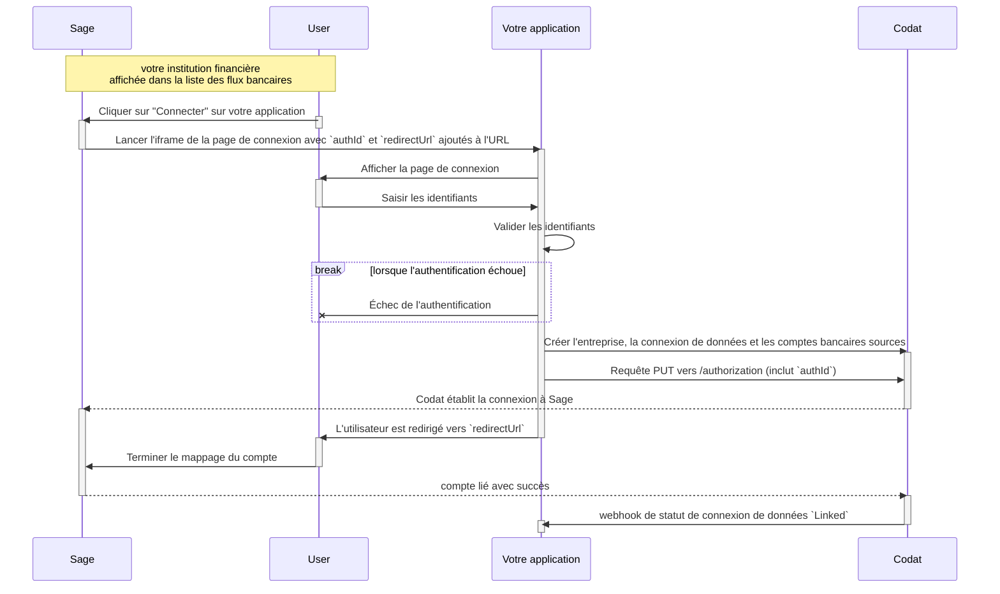

import Tabs from "@theme/Tabs";
import TabItem from "@theme/TabItem";
import Loom from "@components/Loom";

<Loom source="https://www.loom.com/embed/48972835b6e74d199448b794f41b9997" />

<br />

Notre intégration [Sage Bank Feeds](/integrations/bank-feeds/sage-bank-feeds/) nécessite une interface utilisateur d'autorisation pour authentifier un utilisateur PME avant de créer des comptes sources dans Codat.

## Processus

Le processus de mappage d'un compte source avec Sage Bank Feeds commence dans Sage. De là, les utilisateurs sont dirigés vers une [page de connexion hébergée](/bank-feeds/integrations/sage/mapping#hosted-login-page) où ils doivent saisir leurs identifiants, et vous devez vérifier leur identité.

Après une authentification réussie, vous devez ensuite créer l'[entreprise, la connexion de données et les comptes sources](/bank-feeds/setup) dans Codat. Une fois que Sage vérifie ces détails, le flux bancaire pour votre entreprise deviendra actif.



## Redirection Sage

Lorsque votre client tente d'établir son flux bancaire depuis Sage, il sera redirigé vers votre page hébergée via un lien construit comme suit :

```http
https://{authorizationRedirectUrl}?authorizationId={authId}&redirectUri={redirectUri}
```

1.  L'`authorizationRedirectUrl` est l'URL de l'application web que vous avez configurée dans le portail Codat pour l'intégration Sage Bank Feeds.
2.  L'`authId` est l'identifiant d'autorisation unique pour l'entreprise, il sera fourni par Sage et sera requis lors de la création de la connexion de données.
3.  Le `redirectUri` est l'URI vers lequel l'utilisateur PME sera redirigé après l'authentification via votre application web, il sera également fourni par Sage.

## Page de connexion hébergée

### Vérification de l'entreprise

Pour garantir une expérience de vérification d'identité fluide pour l'entreprise lorsqu'elle arrive sur votre page de connexion hébergée, votre interface doit accomplir les tâches suivantes :

- **Récupération des paramètres :** Capturer les paramètres `authId` et `redirectUri` que Sage fournit lorsqu'il redirige les utilisateurs vers votre page hébergée.
- **Compatibilité iframe :** Étant donné que votre page apparaîtra dans un iframe au sein de la plateforme Sage, incluez un en-tête "Content-Security-Policy" défini sur `frame-ancestors 'self' https://*.Sagebankdrive.com https://*.Sage.com https://*.intacct.com https://*.Sageone.com` pour vous assurer qu'elle fonctionne correctement dans l'iframe Sage.

- **Vérification de l'utilisateur :** Implémenter un formulaire sur l'interface qui peut valider de manière sécurisée les identifiants saisis, vérifiant ainsi l'identité de votre utilisateur.

- **Redirection post-authentification :** Une fois que l'utilisateur s'est authentifié avec succès, redirigez-le vers le `redirectUri` initialement fourni par Sage.

### Connecter l'entreprise

Une fois que vous avez vérifié qui est l'entreprise, vous devez ensuite créer l'entreprise, la connexion de données et les comptes sources dans Codat. Vous pouvez suivre les mêmes étapes décrites dans [configuration](/bank-feeds/setup).

Pour les flux bancaires Sage, une étape supplémentaire est requise pour autoriser la connexion. Cela implique d'utiliser l'`authId` fourni par Sage, qui peut être inclus dans une requête de mise à jour de la connexion de données.

<Tabs>

<TabItem value="request-url" label="URL de requête">

URL de requête d'autorisation de connexion de données

```http
PUT company/{companyId}/connections/{connectionId}/authorization
```

</TabItem >

<TabItem value="request-body" label="Corps de requête">

Exemple de corps de requête :

```json
{
  "authorizationId": "ae6b6e5d-4634-4087-80e3-b04ecafb0cf7"
}
```

</TabItem >

</Tabs>

Si votre requête répond avec un code de statut de réponse `200`, l'étape suivante consiste à rediriger l'entreprise vers le `redirectUri` donné, en ajoutant l'`authId` comme paramètre de requête.

```
{redirectUri}?state={authId}

// Exemple :

redirect_uri=https://snd01eu.Sagebankdrive.com/api/v1/indirectredirect/11111-22222-33333-88888-9999?state=1122-3344-5566-7788
```

### Établir le flux bancaire

Une fois la connexion configurée avec succès, Sage affichera une boîte de dialogue présentant une liste des comptes bancaires sources disponibles qui peuvent être liés pour initier les flux bancaires.

Par exemple :


Le statut de la connexion de données changera alors en lié, et à ce moment vous pourrez [écrire des transactions bancaires](/bank-feeds/pushing-transactions).

---

## Lire ensuite

- [Écrire des transactions](/bank-feeds/pushing-transactions)
