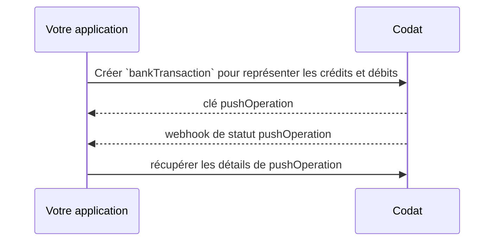

import Tabs from "@theme/Tabs";
import TabItem from "@theme/TabItem";

Une fois qu'une entreprise a mappé son compte source vers un compte cible, vous pouvez commencer à créer des transactions bancaires dans son logiciel de comptabilité en utilisant le [flux bancaire](../terms/bank-feed) établi.

## Générer des transactions

Avant de pouvoir enregistrer les transactions bancaires de votre client dans son logiciel de comptabilité, vous devez générer un objet `transactions` pour chaque transaction qui a été effectuée depuis son compte.

Collectez les données de transaction au sein de votre propre application et mappez-les au schéma [Bank transactions](/bank-feeds-api#/schemas/BankTransactions) de Codat. Ajoutez ceci à [Create bank transactions](/bank-feeds-api#/schemas/CreateBankTransactions), en incluant l'ID `sourceAccount` auquel les transactions doivent être associées au niveau supérieur.

:::caution Signes des transactions
Assurez-vous que les signes du `montant` de la transaction correspondent au `transactionType`. Codat émet un avertissement en cas d'incohérences, comme une transaction `Debit` avec un montant positif.
:::

## Écrire des transactions bancaires

Dans Codat, la création d'une transaction bancaire est un processus en deux étapes (en savoir plus [ici](/using-the-api/push)). Cela nécessite que vous vérifiiez d'abord le modèle de données du type de données que vous souhaitez créer pour vous assurer que toutes les propriétés requises sont incluses dans votre requête.

Ensuite, vous êtes prêt à créer la transaction bancaire. Vous recevrez une clé `pushOperation` en retour. Vous pouvez ensuite l'utiliser pour surveiller le statut de l'opération ou afficher ses résultats.



### Créer des transactions bancaires

Nous recommandons de télécharger régulièrement les transactions tout au long de la journée afin que les soldes des flux bancaires de vos clients soient proches du temps réel. Cette précision accrue aide les entreprises dans leur planification et leurs prévisions.

Utilisez notre point de terminaison [Create bank transactions](/bank-feeds-api#/operations/create-bank-transactions) pour créer des transactions bancaires. En réponse, vous recevrez un objet `pushOperation` avec un statut `Pending`.

:::caution Limite de quantité
Un maximum de 1000 transactions bancaires peut être écrit à la fois.
:::

<Tabs groupId="language">

<TabItem value="nodejs" label="TypeScript">

```javascript
const transactionsResponse = bankFeedsClient.transactions.create({
  createBankTransactions: {
    accountId: sourceAccountResponse.sourceAccount.id,
    transactions: [
      {
        id: "63e2b848-951a-4657-a889-ded00f0e616a",
        amount: 100.0,
        balance: 100.0,
        date: "2023-08-22T10:21:00.000Z",
        description: "Repayment of Credit Card",
        transactionType: BankTransactionType.Credit,
      },
      {
        id: "710ed9f9-feb6-4ab7-9055-05a26d31718c",
        amount: -75.0,
        balance: 25.0,
        date: "2023-08-22T10:22:00.000Z",
        description:
          "Amazon US | $1.25 | PXDFGSDTR | c2dddf4c-eece-4a9b-a392-8c8e65b59e47",
        transactionType: BankTransactionType.Debit,
      },
    ],
  },
  accountId: sourceAccountResponse.sourceAccount.id,
  companyId: companyResponse.company.id,
  connectionId: connectionResponse.connection.id,
});
```

</TabItem>

<TabItem value="python" label="Python">

```python
transactions_request = operations.CreateBankTransactionsRequest(
    create_bank_transactions=shared.CreateBankTransactions(
        account_id=source_account_response.source_account.id,
        transactions=[
            shared.BankTransactions(
                id='63e2b848-951a-4657-a889-ded00f0e616a',
                amount=Decimal('100.0'),
                balance=Decimal('100.0'),
                date_='2023-08-22T10:21:00.000Z',
                description='Repayment of Credit Card',
                transaction_type=shared.BankTransactionType.CREDIT
            ),
            shared.BankTransactions(
                id='710ed9f9-feb6-4ab7-9055-05a26d31718c',
                amount=Decimal('-75.0'),
                balance=Decimal('25.0'),
                date_='2023-08-22T10:22:00.000Z',
                description='Amazon US | $1.25 | PXDFGSDTR | c2dddf4c-eece-4a9b-a392-8c8e65b59e47',
                transaction_type=shared.BankTransactionType.DEBIT
            ),
        ],
    ),
    account_id=source_account_response.source_account.id,
    company_id=company_response.company.id,
    connection_id=connection_response.connection.id
)

transactions_response = bank_feeds_client.transactions.create(transactions_request)
```

</TabItem>

<TabItem value="csharp" label="C#">

```csharp
var transactionsResponse = await bankFeedsClient.Transactions.CreateAsync(new() {
    CreateBankTransactions = new CreateBankTransactions() {
        AccountId = sourceAccountResponse.SourceAccount.Id,
        Transactions = new List<BankTransactions>() {
            new BankTransactions() {
                Id = "63e2b848-951a-4657-a889-ded00f0e616a",
                Amount = 100.0M,
                Balance = 100.0M,
                Date = "2023-08-22T10:21:00.000Z",
                Description = "Repayment of Credit Card",
                TransactionType = BankTransactionType.Credit
            },
            new BankTransactions() {
                Id = "710ed9f9-feb6-4ab7-9055-05a26d31718c",
                Amount = -75.0M,
                Balance = 25.0M,
                Date = "2023-08-22T10:22:00.000Z",
                Description = "Amazon US | $1.25 | PXDFGSDTR | c2dddf4c-eece-4a9b-a392-8c8e65b59e47",
                TransactionType = BankTransactionType.Dedit
            },
        },
    },
    AccountId = sourceAccountResponse.SourceAccount.Id,
    CompanyId = companyResponse.Company.Id,
    ConnectionId = connectionResponse.Connection.Id
});
```

</TabItem>

<TabItem value="go" label="Go">

```go
ctx := context.Background()
transactionsResponse, err := s.Transactions.Create(ctx, operations.CreateBankTransactionsRequest{
    CreateBankTransactions: &shared.CreateBankTransactions{
        AccountID: sourceAccountResponse.SourceAccount.ID,
        Transactions: []shared.BankTransactions{
            shared.BankTransactions{
                ID: bankfeeds.String("63e2b848-951a-4657-a889-ded00f0e616a"),
                Amount: types.MustNewDecimalFromString("100.0"),
                Balance: types.MustNewDecimalFromString("100.0"),
                Date: bankfeeds.String("2023-08-22T10:21:00.000Z"),
                Description: bankfeeds.String("Repayment of Credit Card"),
                TransactionType: BankTransactionTypeCredit
            },
            shared.BankTransactions{
                ID: bankfeeds.String("710ed9f9-feb6-4ab7-9055-05a26d31718c"),
                Amount: types.MustNewDecimalFromString("-75.0"),
                Balance: types.MustNewDecimalFromString("25.0"),
                Date: bankfeeds.String("2023-08-22T10:22:00.000Z"),
                Description: bankfeeds.String("Amazon US | $1.25 | PXDFGSDTR | c2dddf4c-eece-4a9b-a392-8c8e65b59e47"),
                TransactionType: BankTransactionTypeDebit
            },
        },
    },
    AccountID: sourceAccountResponse.SourceAccount.ID,
    CompanyID: companyResponse.Company.ID,
    ConnectionID: connectionResponse.Connection.ID
})
```

</TabItem>

</Tabs>

:::caution Informations de synchronisation des flux bancaires QuickBooks Online

Les transactions écrites dans les flux bancaires QuickBooks Online afficheront un statut `Success` lorsqu'elles seront validées et enregistrées par Codat. Cependant, elles ne seront disponibles dans leur logiciel de comptabilité qu'après la synchronisation entre QBO et Codat.

QBO interroge automatiquement Codat quotidiennement pour les mises à jour, et les utilisateurs peuvent également déclencher manuellement cette synchronisation depuis l'interface QBO.

:::

### Surveiller le statut de la requête

Après avoir soumis votre requête de création de transactions bancaires à notre API, elle aura un statut `Pending`. Utilisez le webhook [PushOperationStatusChanged](/bank-feeds/setup#webhooks) pour suivre quand le statut de votre opération d'écriture passe à `Success` ou `Failed`.

Si la requête est réussie, vous recevrez un webhook comme celui-ci :

```json
{
  "CompanyId": "c2dddf4c-eece-4a9b-a392-8c8e65b59e47",
  "RuleId": "5a6f112d-b0fa-4c0b-9ea4-7dd4075bc43d",
  "Type": "Push Operation Status Changed",
  "AlertId": "a6bb69d5-631c-4732-8e4e-18bea36aea20",
  "Message": "bankTransactions triggered notification for PushOperationStatusChanged at 2023-09-12T18:19:42.742Z",
  "Data": {
    "dataType": "bankTransactions",
    "status": "Success",
    "pushOperationKey": "e881111f-b6a4-4740-b125-340a6c300cd3"
  }
}
```

Si vous souhaitez voir un historique de toutes les opérations d'écriture pour une entreprise spécifique, récupérez-les en appelant le point de terminaison [List create operations](/bank-feeds-api#/operations/list-create-operations).
