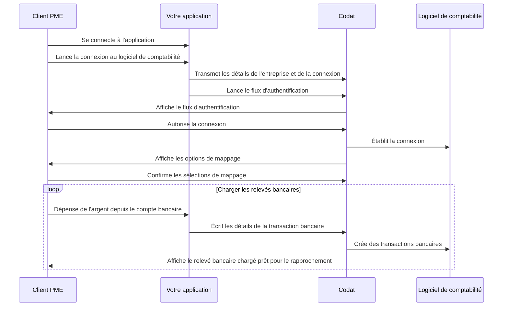

import Tabs from "@theme/Tabs";
import TabItem from "@theme/TabItem";
import { IntegrationsList } from "@components/Integrations";
import {
  bankfeedsExternalMappingIntegrations,
  bankfeedsIntegrations,
} from "@components/Integrations/integrations";

## Aperçu du parcours

Le diagramme ci-dessous représente le flux d'activité global lors de l'utilisation de Bank Feeds, y compris votre client PME et son logiciel de comptabilité. Il suppose que vous utilisez l'interface de mappage de Codat pour permettre à l'utilisateur de sélectionner les comptes utilisés pour écrire les relevés bancaires.

Si vous utilisez l'une des [autres options d'interface utilisateur de mappage](/bank-feeds/mapping/overview), vous pouvez visualiser le flux en changeant simplement l'acteur de l'opération de mappage de `Codat` vers `Votre application` ou `Logiciel de comptabilité`.



Une fois que vous décidez de créer ce flux avec Bank Feeds, vous devez configurer Codat en conséquence. Passons en revue ces exigences en détail.

## Activer Bank Feeds

Contactez votre gestionnaire de compte Codat pour activer Bank Feeds pour votre client.

## Gérer les sources de données

Dans le <a href="https://app.codat.io" target="_blank">portail Codat</a>, accédez à **Paramètres > Intégrations** et cliquez sur **Gérer les intégrations**. Ensuite, cliquez sur **Gérer** à côté de l'intégration spécifique que vous souhaitez activer et configurez-la pour servir de source de données pour la solution.

<IntegrationsList integrations={bankfeedsIntegrations} />

Certaines de ces intégrations nécessitent une configuration supplémentaire spécifique aux flux bancaires. Nous vous guidons à travers celles-ci dans nos instructions spécifiques aux intégrations dans la section _Gérer les intégrations_ de notre documentation Bank Feeds.

## Flux d'autorisation

Dans le cadre de l'utilisation de Bank Feeds, vous devrez faire autoriser à vos clients votre accès à leurs données. Pour ce faire, utilisez [Link](/auth-flow/authorize-embedded-link) - notre flux d'autorisation préconstruit, intégrable, optimisé pour la conversion et personnalisable.

La solution vous permet d'adapter le parcours d'autorisation aux besoins de votre entreprise. Vous pouvez :

- [Personnaliser les paramètres de Link](/auth-flow/customize/customize-link).
- [Configurer l'image de marque de l'entreprise](/auth-flow/customize/branding).
- [Configurer les redirections](/auth-flow/customize/set-up-redirects).

## Webhooks

Codat prend en charge une gamme d'[événements webhook](/using-the-api/webhooks/event-types) pour vous aider à gérer vos pipelines de données. Dans le <a href="https://app.codat.io" target="_blank">portail Codat</a>, accédez à **Paramètres > Webhooks > Configurer le consommateur** et cliquez sur **Ajouter un point de terminaison** pour configurer un point de terminaison pour écouter le type d'événement suivant et tirer le meilleur parti de Bank Feeds :

- [PushOperationStatusChanged](/using-the-api/webhooks/event-types)

  Utilisez ce webhook pour suivre l'achèvement de l'opération de création de transactions bancaires dans la plateforme cible. Lorsque vous recevez une notification de ce webhook, vérifiez la valeur `status` dans le corps. Un statut `Success` signifie que le tableau `transactions` a été écrit avec succès dans le logiciel de comptabilité. En cas d'erreurs, résolvez le problème et renvoyez la charge utile.

## Bibliothèques client

### Frontend

Notre [SDK Bank Feeds](/bank-feeds/create-account) à faible code vous permet de créer une expérience utilisateur fluide et à forte conversion intégrée directement dans votre application frontend.

##### NPM

```sh
npm add @codat/sdk-bank-feeds-types
```

##### Yarn

```sh
yarn add @codat/sdk-bank-feeds-types
```

[En savoir plus...](/bank-feeds/bank-feeds-sdk)

### Backend

Pour vos services backend, utilisez notre [bibliothèque API Bank Feeds](/get-started/libraries) complète pour démarrer et simplifier votre développement. Installez simplement la bibliothèque dans l'un des langages pris en charge et transmettez votre clé API encodée en `base64` au constructeur.

<Tabs groupId="language">

<TabItem value="nodejs" label="TypeScript">

#### Installer

##### NPM

```sh
npm add @codat/bank-feeds
```

##### Yarn

```sh
yarn add @codat/bank-feeds
```

#### Initialiser

```javascript
import { CodatBankFeeds } from "@codat/bank-feeds";

const bankFeedsClient = new CodatBankFeeds({
  authHeader: "Basic BASE_64_ENCODED(API_KEY)",
});
```

</TabItem>

<TabItem value="python" label="Python">

#### Installer

```sh
pip install codat-bankfeeds
```

#### Initialiser

```python
from codat_bankfeeds import CodatBankFeeds
from codat_bankfeeds.models import shared

bank_feeds_client = CodatBankFeeds(
    security=shared.Security(
        auth_header="Basic BASE_64_ENCODED(API_KEY)",
    ),
)
```

</TabItem>

<TabItem value="csharp" label="C#">

#### Installer

```sh
dotnet add package Codat.BankFeeds
```

#### Initialiser

```csharp
using Codat.BankFeeds;
using Codat.BankFeeds.Models.Shared;

var bankFeedsClient = new CodatBankFeeds(
    security: new Security() {
        AuthHeader = "Basic BASE_64_ENCODED(API_KEY)",
    }
);
```

</TabItem>

<TabItem value="go" label="Go">

#### Installer

```sh
go get github.com/codatio/client-sdk-go/bank-feeds
```

#### Initialiser

```go
import (
	"context"
	bankfeeds "github.com/codatio/client-sdk-go/bank-feeds/v4"
	"github.com/codatio/client-sdk-go/bank-feeds/v4/pkg/models/shared"
	"log"
)

func main() {
  bankfeedsClient := bankfeeds.New(
      bankfeeds.WithSecurity(shared.Security{
        AuthHeader: "Basic BASE_64_ENCODED(API_KEY)",
      }),
    )
}

```

</TabItem>

</Tabs>

:::tip Récapitulatif

Vous avez activé Bank Feeds, configuré les intégrations pertinentes, configuré les paramètres du flux d'authentification et noté le webhook recommandé. Cela complète la configuration initiale de la solution.

Ensuite, vous créerez une [entreprise](../terms/company) Codat, sa [connexion](../terms/connection) et un compte bancaire source pour construire l'infrastructure de base nécessaire pour établir un flux bancaire.

:::

---

## Lire ensuite

- [Créer les éléments clés](/bank-feeds/create-account) de l'infrastructure Codat requise pour établir un flux bancaire.
