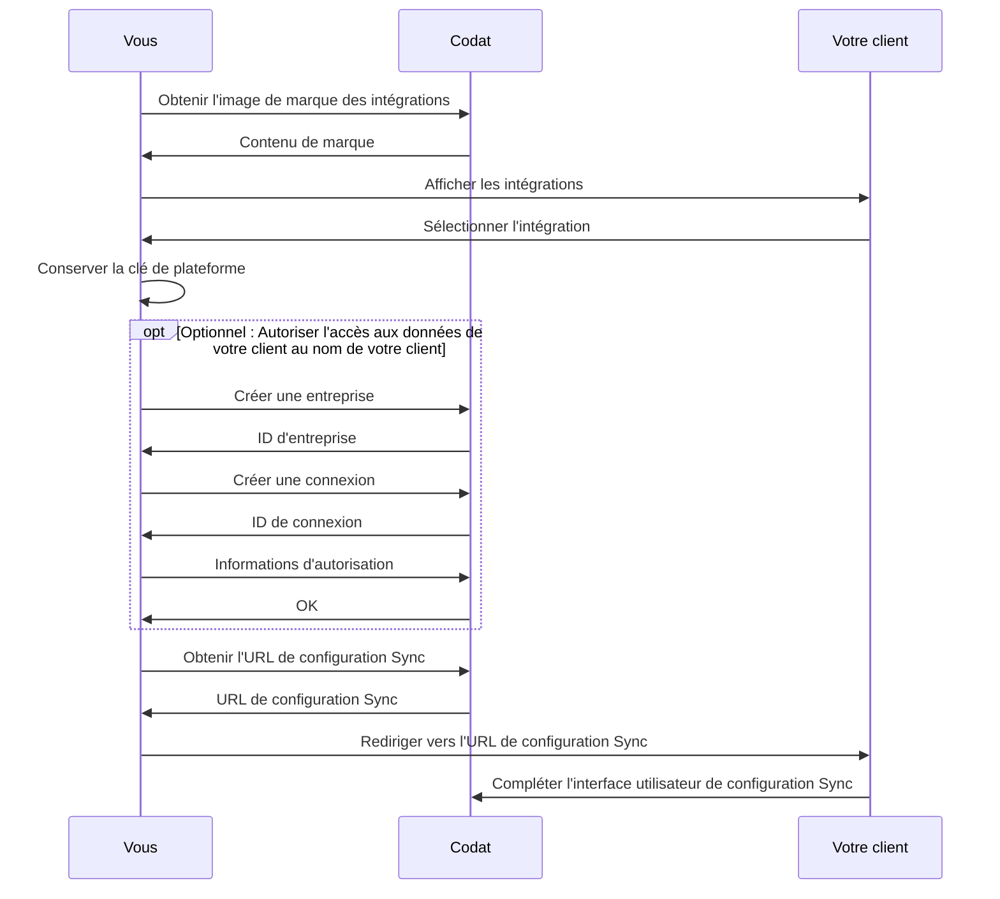

Une fois que vous avez compris et effectué la configuration initiale de notre produit Sync for Commerce, vous pouvez utiliser ses fonctionnalités avancées pour améliorer l'expérience de vos commerçants lors de la synchronisation des données de ventes.

## Redirection personnalisée

Lorsque votre utilisateur termine la configuration de ses paramètres de synchronisation des données de ventes dans l'interface utilisateur de configuration Sync, il verra un message de succès pour indiquer la fin du parcours. Au lieu de cela, vous pouvez rediriger le commerçant vers une URL personnalisée de votre choix.

Ajoutez un paramètre de requête `redirectUrl` et l'URL absolue comme valeur lors de l'appel de l'API pour demander une URL de configuration Sync :

```http
GET config/sync/commerce/lqai/{platformKey}/start?merchantIdentifier={companyId}&redirectUrl=app.codat.io
```

L'URL résultante du flux Sync inclura l'URL de redirection comme indiqué dans cet exemple :

```json
{
  "url": "https://sync-flow.codat.io/06de067c-1d6c-416a-8e61-676e6c135e68/lqai/gbol/start?merchantIdentifier=CoPay&otp=615853&redirectUrl=app.codat.io"
}
```

## Autoriser l'accès au nom de votre client

Lors de la configuration de Sync for Commerce, Codat déploiera un connecteur vers votre API qui nous permet d'accéder aux données de vos commerçants dans vos systèmes. Par défaut, nous utilisons la méthode d'authentification de votre API (par exemple, OAuth 2.0) pour demander à vos clients de nous accorder l'accès à ces données.

Puisque l'utilisateur commence son parcours de configuration au sein de votre système, vous pourriez juger cette étape inutile. Au lieu de cela, vous pouvez choisir d'accorder à Codat l'accès aux données de vos commerçants en leur nom. Le flux Sync résultant est représenté sur le diagramme ci-dessous.



Pour autoriser au nom de vos clients, créez un enregistrement de votre client dans Codat et fournissez les détails d'autorisation associés nécessaires pour accéder à leurs données. Ensuite, vous devez les rediriger vers l'URL de configuration Sync, comme expliqué à l'étape [3. Gérer la sélection d'intégration](/commerce/setup#3-handle-the-integration-selection) de notre guide de configuration.

Si vous souhaitez autoriser l'accès au nom de votre client, veuillez en discuter avec votre ingénieur Solutions avant de déployer le connecteur de Codat vers votre API.

### Créer une entreprise

Utilisez notre endpoint [Create company](/sync-for-commerce-api#/operations/create-company) pour créer un enregistrement de votre client dans Codat.

```http
POST /companies
```

La propriété `name` dans le corps de la requête doit être votre identifiant unique de client. Vous pouvez également renseigner le nom du client comme description.

```json
{
  "name": "12345678"    // Identifiant unique pour votre client
  "description": ""     // Optionnellement inclure le nom du client
}
```

En réponse, nous fournirons un `companyId`, retourné par ce endpoint comme `id`. Conservez-le car il sera nécessaire dans les étapes suivantes.

```json
{
  "id": "0498e921-9b53-4396-a412-4f2f5983b0a2",
  "name": "string",
  "platform": "string",
  "redirect": "https://link.codat.io/company/27628208-459c-46a2-a705-5641ce25f739",
  "lastSync": "2022-01-01T12:00:00.000Z",
  "created": "2022-01-01T12:00:00.000Z",
  "createdByUserName": "string",
  "dataConnections": []
}
```

### Créer une connexion

Une fois que vous avez créé une entreprise pour représenter votre client, vous devez créer une connexion qui représente la connectivité à votre système pour ce client. Pour ce faire, utilisez notre endpoint [Create connections](/sync-for-commerce-api#/operations/create-connection) :

```http
POST /companies/{companyId}/connections
```

La propriété `platformKey` dans le corps de la requête est la clé qui identifie le connecteur de Codat vers votre API, comme expliqué à l'étape [3. Gérer la sélection d'intégration](/commerce/setup#3-handle-the-integration-selection) de notre guide de configuration. Votre ingénieur Solutions peut vous fournir cette valeur.

```json title="Exemple de corps de requête"
{
  "platformKey": "dfxm" // Identifie le connecteur Codat lié à votre API
}
```

En réponse, nous fournirons un `connectionId`, retourné par ce endpoint comme `id`. Conservez-le car il sera nécessaire dans les étapes suivantes.

```json
{
  "id": "ee2eb431-c0fa-4dc9-93fa-d29781c12bcd",
  "integrationId": "bf083d72-62c7-493e-aec9-81b4dbba7e2c",
  "integrationKey": "dfxm",
  "sourceId": "bdd831ce-eebd-4896-89a7-20e5ee8989ee",
  "platformName": "Accounting Package",
  "linkUrl": "https://link-api.codat.io/companies/86bd88cb-44ab-4dfb-b32f-87b19b14287f/connections/ee2eb431-c0fa-4dc9-93fa-d29781c12bcd/start",
  "status": "pendingAuth",
  "lastSync": "2022-10-27T10:22:43.6464237Z",
  "created": "2022-10-27T09:53:29Z",
  "sourceType": "Accounting"
}
```

### Transmettre les informations d'autorisation à Codat

Maintenant que vous avez créé une entreprise et une connexion, vous pouvez transmettre les informations d'autorisation requises pour accéder aux données de votre client à Codat via notre API. Pour ce faire, utilisez notre endpoint [Update authorization](/sync-for-commerce-api#/operations/update-connection-authorization) :

```http
PUT /companies/{companyId}/connections/{connectionId}/authorization
```

Vous devez confirmer le corps de la requête avec votre ingénieur Solutions dans le cadre du déploiement du connecteur Codat vers votre API.

En réponse, nous retournerons un objet `connection` mis à jour, identique à celui retourné à l'étape précédente :

```json
{
  "id": "ee2eb431-c0fa-4dc9-93fa-d29781c12bcd",
  "integrationId": "bf083d72-62c7-493e-aec9-81b4dbba7e2c",
  "integrationKey": "dfxm",
  "sourceId": "bdd831ce-eebd-4896-89a7-20e5ee8989ee",
  "platformName": "Accounting Package",
  "linkUrl": "https://link-api.codat.io/companies/86bd88cb-44ab-4dfb-b32f-87b19b14287f/connections/ee2eb431-c0fa-4dc9-93fa-d29781c12bcd/start",
  "status": "Linked",
  "lastSync": "2022-10-27T10:22:43.6464237Z",
  "created": "2022-10-27T09:53:29Z",
  "sourceType": "Accounting"
}
```

Notez que le `status` a changé pour `Linked`, indiquant que les informations d'autorisation que nous avons reçues ont permis à Codat de se connecter aux données de vos clients.

Ensuite, vous pouvez obtenir l'URL de configuration Sync, comme indiqué à l'étape [3. Gérer la sélection d'intégration](/commerce/setup#3-handle-the-integration-selection) de notre guide de configuration. Utilisez la valeur `companyId` retournée lors de la création de l'entreprise comme valeur du paramètre `merchantIdentifier`.

Maintenant, Codat ne demandera pas à votre utilisateur de s'authentifier avec votre système dans le cadre de l'interface utilisateur de configuration Sync.

### Liste d'applications marketplace

Cette configuration suppose que vos clients initieront le processus de configuration pour leur synchronisation de données de ventes au sein de votre système. Dans certains cas, il est également possible pour l'utilisateur d'initier ce parcours depuis le marketplace d'applications de leur système comptable ou de commerce.

Nous sommes en mesure de prendre en charge cela pour certains logiciels de comptabilité et de commerce sélectionnés. Veuillez consulter votre ingénieur Solutions pour plus d'informations sur cette fonctionnalité.

---

## Lire ensuite

- [Configuration du commerçant](/commerce/merchant-configuration)
