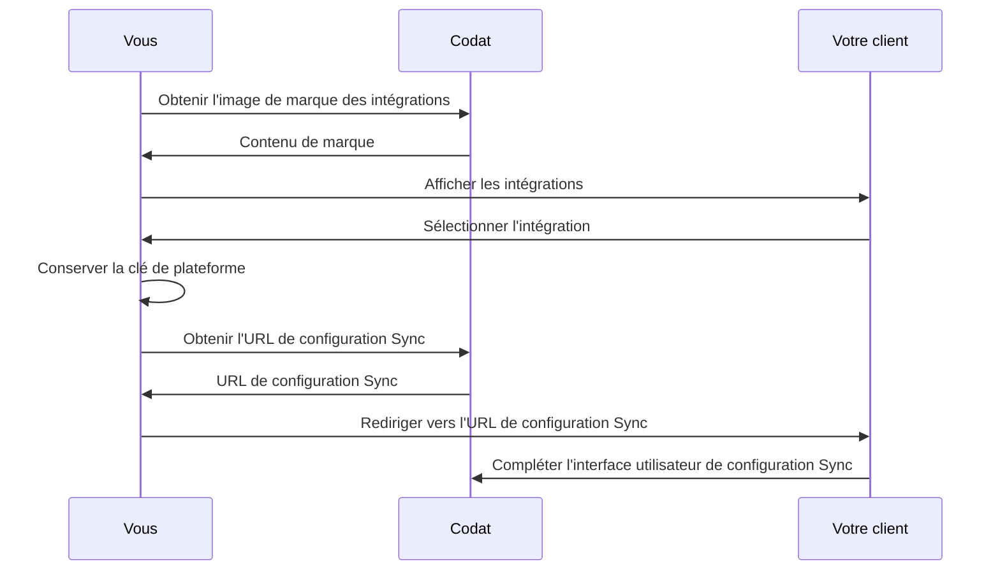

import Tabs from "@theme/Tabs";
import TabItem from "@theme/TabItem";

Sync for Commerce peut être implémenté au sein d'un logiciel de commerce (point de vente, paiements ou commerce électronique) d'où proviennent les données de ventes et au sein d'un logiciel de comptabilité vers lequel les données de ventes sont synchronisées.

Suivez les directives ci-dessous pour effectuer la configuration initiale de Sync for Commerce et permettre à vos clients de sélectionner les systèmes qu'ils souhaitent connecter et de démarrer le processus de configuration Sync.

Avant de commencer, vérifiez comment [utiliser l'API de Codat](/using-the-api/overview), car vous devrez avoir accès à l'API pour terminer la configuration.

:::info Connecteur Codat

Pour terminer la configuration, Codat déploiera un connecteur simple vers votre API qui nous permet de nous connecter aux données de vos clients. Votre ingénieur Solutions travaillera avec vous pour que cela se réalise. Cependant, vous pouvez compléter la plupart des étapes ci-dessous avant que le connecteur Codat ne soit déployé.

:::

## Aperçu

Vous devrez implémenter une interface utilisateur simple au sein de votre logiciel qui présente à vos utilisateurs une liste de plateformes sources avec lesquelles ils peuvent synchroniser leurs données. Il peut s'agir de logiciels de commerce ou de logiciels de comptabilité.

Cette interface ne devrait être disponible qu'aux utilisateurs authentifiés - ceux qui sont connectés à votre système. Une fois que l'utilisateur a sélectionné un système à connecter, vous devez les rediriger vers l'interface utilisateur de configuration Sync de Codat. Ce flux initial est présenté sur le diagramme ci-dessous.



## Intégrations disponibles

Vous pouvez voir les logiciels de comptabilité et de commerce que Sync for Commerce prend en charge dans les tableaux ci-dessous. Pour votre commodité, nous avons également inclus la `platformKey`. C'est un identifiant unique pour chaque intégration que Codat prend en charge, et vous l'utiliserez dans les étapes de configuration suivantes.

<Tabs>

  <TabItem value="acctg" label="Logiciel de comptabilité">

Sync for Commerce prend actuellement en charge les logiciels de comptabilité suivants :

| Logiciel de comptabilité          | Clé de plateforme |
| --------------------------------- | ----------------- |
| Exact (NL)                        | qudb              |
| Exact (UK)                        | pbbf              |
| FreeAgent                         | fbrh              |
| MYOB                              | pdvj              |
| Sage Accounting (à venir bientôt) | tgff              |
| QuickBooks Online                 | qhyg              |
| Xero                              | gbol              |

  </TabItem>

  <TabItem value="cmmrc" label="Logiciel de commerce">

Sync for Commerce prend actuellement en charge les logiciels de commerce suivants :

| Logiciel de commerce | Clé de plateforme |
| -------------------- | ----------------- |
| Clover               | fqly              |
| Lightspeed K         | ldgh              |
| Shopify              | fztf              |
| Zettle by PayPal     | ugxp              |

  </TabItem>
</Tabs>

## 1. Obtenir l'image de marque des intégrations

Pour remplir votre écran de sélection de plateforme avec les logos d'intégration, vous pouvez récupérer l'image de marque pour chaque intégration (identifiée par `platformKey`). Utilisez notre endpoint [Get branding for an integration](/sync-for-commerce-api#/operations/get-integration-branding) :

```http
GET /config/integrations/{platformKey}/branding
```

```json title="Exemple de réponse d'une requête de marque Xero"
{
  "logo": {
    "full": {
      "image": {
        "src": "https://static.codat.io/public/officialLogos/Full/Xero_Full.png",
        "alt": "xero full icon"
      }
    },
    "square": {
      "image": {
        "src": "https://static.codat.io/public/officialLogos/Full/Xero_Square.png",
        "alt": "xero square icon"
      }
    }
  },
  "button": {},
  "sourceId": "8a156a5a-39cb-4f9d-856e-76ef9b9a9607"
}
```

## 2. Afficher les intégrations

En utilisant l'image de marque que vous avez obtenue précédemment, affichez chacune des intégrations pertinentes dans votre interface utilisateur. Assurez-vous d'exclure l'intégration représentant le connecteur que Codat a déployé vers votre API.

Vos utilisateurs utiliseront ensuite l'interface utilisateur pour identifier le bon système qu'ils souhaitent connecter.

Selon la technologie que vous utilisez, le code d'affichage de l'intégration variera. En utilisant React, cela pourrait ressembler à ceci :

```shell
<div>
   {
     integrations.map((integration, i) => (
       <div
         key={i}
         onClick={selectIntegration(integration.key)}
       >
         

         <h3>{integration.name}</h3>

         <div>Liez votre compte {integration.name}</div>
       </div>
     )
   }
</div>
```

Assurez-vous de conserver la `platformKey` de l'intégration que votre commerçant a sélectionnée. Dans l'exemple ci-dessus, la valeur transmise à la fonction `onClick` qui la conserve.

## 3. Gérer la sélection d'intégration

Une fois que l'utilisateur sélectionne le système qu'il souhaite connecter, vous êtes prêt à le transférer vers l'interface utilisateur de configuration Sync de Codat. Ici, votre client autorisera l'accès au système qu'il a sélectionné et configurera ses paramètres de synchronisation de données de ventes.

Pour ce faire, redirigez votre utilisateur vers l'URL de configuration Sync. Cette URL est unique à chacun de vos clients et est sécurisée avec un code d'accès à usage unique et limité dans le temps. Demandez cette URL à notre API chaque fois que vous souhaitez amener l'utilisateur à l'interface utilisateur de configuration. Utilisez notre endpoint [Retrieve Sync flow URL](/sync-for-commerce-api#/operations/get-sync-flow-url) :

```http
GET /config/sync/commerce/{commerceKey}/{accoutingKey}/start?merchantIdentifier={yourMerchantIdentifier}
```

Vous devrez remplir les valeurs de paramètres comme suit :

<Tabs>
<TabItem value="acctg" label="Logiciel de comptabilité">

- `commerceKey` : la `platformKey` du logiciel de commerce sélectionné par l'utilisateur dans votre interface utilisateur
- `accountingKey` : fait référence au connecteur Codat. Votre ingénieur Solutions vous fournira cela

</TabItem>

<TabItem value="cmmrc" label="Logiciel de commerce">

- `commerceKey` : la `platformKey` du logiciel de commerce sélectionné par l'utilisateur dans votre interface utilisateur
- `accountingKey` : fait référence au connecteur Codat. Votre ingénieur Solutions vous fournira cela
- `yourMerchantIdentifier` : votre identifiant unique pour votre client

</TabItem>
</Tabs>

En réponse, vous recevrez une URL. Redirigez l'utilisateur vers cette URL pour compléter le transfert à Codat.

```json
{
  "url": "https://sync-flow.codat.io/ef075d52-0378-4718-879b-0bb0cadb20e3/partnercommerce/xero/start?merchantIdentifier=demo merchant&otp=422149"
}
```

:::tip Sécurité de l'URL

L'URL de redirection est unique à chacun de vos clients et est sécurisée avec un code d'accès à usage unique qui expire après 30 secondes. Il s'agit d'une mesure de sécurité qui empêche les tiers non autorisés d'accéder aux informations de configuration Sync d'un commerçant.

Si le code d'accès a expiré lorsque l'utilisateur est redirigé, il verra une erreur `HTTP 401`. Dans ce cas, demandez simplement l'URL à nouveau pour obtenir un nouveau lien et code d'accès.
:::

---

## Lire ensuite

- [Fonctionnalités avancées du produit](/commerce/advanced-setup)
