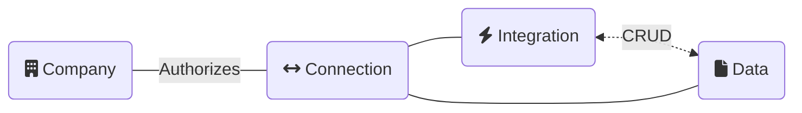

- [Entreprises](/core-concepts/companies) - Une entreprise représente votre client PME.
- [Connexions](/core-concepts/connections) - Une connexion représente un accès autorisé aux données de l'entreprise via une intégration.
- [Intégrations](/core-concepts/integrations) - Une intégration construite par Codat avec un fournisseur de données.
- [Types de données](/core-concepts/data-type-settings) - Les types de données que vous pouvez écrire et lire - par exemple une facture.
- [Statut des données](/core-concepts/status) - L'état de la synchronisation des données.

---

## Lire ensuite

- Voir comment ces concepts de base fonctionnent dans la [référence de l'API de plateforme](/platform-api)
- Concept suivant : [Entreprises](/core-concepts/companies)
