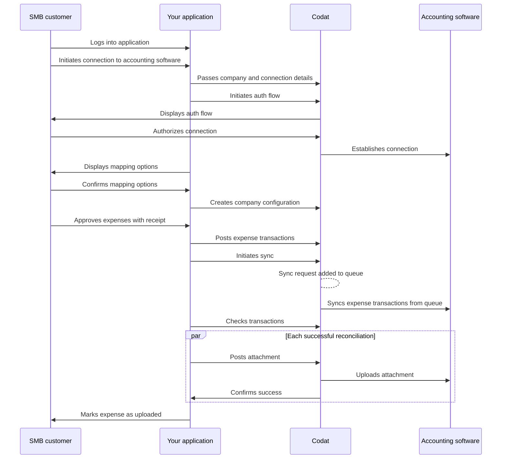

import { IntegrationsList } from "@components/Integrations";
import { integrationsFilterExpenses } from "@components/Integrations/integrations";
import Tabs from "@theme/Tabs";
import TabItem from "@theme/TabItem";

## Aperçu du parcours

Le diagramme ci-dessous représente le processus de synchronisation de bout en bout pour l'écriture des dépenses de votre application vers le logiciel de comptabilité de votre client PME. Une fois que vous décidez de construire avec Expenses, vous devez configurer Codat en conséquence. Examinons ces exigences en détail.

## Activer Expenses

1. Ouvrez le <a href="https://app.codat.io" target="_blank">Portail Codat</a> et connectez-vous.
2. Cliquez sur **Settings > Organizational settings > Products**.
3. Dans la liste des produits, trouvez _Expenses_ et cliquez sur **Enable**. Ensuite, suivez l'invite à l'écran.

## Configurer Expenses

### Types de données

Par défaut, les types de données requis pour Expenses seront activés automatiquement lorsque Expenses est activé pour votre instance Codat. Si vous devez gérer les types de données, accédez à **Settings > Integrations > Data types** dans le <a href="https://app.codat.io" target="_blank">Portail Codat</a>.

Activez les [types de données](/core-concepts/data-type-settings#override-the-default-sync-settings) requis pour Expenses avec les paramètres suivants :

| Nom du type de données | `dataType`           | Cas d'utilisation                                                                                                                                                                  | Récupérer à la première liaison ? | Fréquence de synchronisation |
| :--------------------- | :------------------- | :--------------------------------------------------------------------------------------------------------------------------------------------------------------------------------- | :-------------------------------- | :--------------------------- |
| Accounts               | `chartOfAccounts`    | Comptes utilisés dans le grand livre général pour enregistrer et catégoriser les dépenses.                                                                                         | ✅                                | Quotidienne                  |
| Bank accounts          | `bankAccounts`       | Un compte bancaire est un compte principal à partir duquel les dépenses seront payées.                                                                                             | ✅                                | Quotidienne                  |
| Company                | `company`            | Les informations de l'entreprise contiennent des informations utiles, telles que le nom de l'entreprise liée et sa devise de base et ses adresses enregistrées.                    | ✅                                | Quotidienne                  |
| Customers              | `customers`          | Les clients peuvent être utilisés pour enregistrer et associer des transactions de revenus, telles que la réclamation d'une récompense de remise en argent.                        | ✅                                | Quotidienne                  |
| Suppliers              | `suppliers`          | Toutes les dépenses sont contre un seul fournisseur représentant le fournisseur de dépenses, empêchant le logiciel de comptabilité d'une entreprise d'être submergé de commerçants en double. | ✅                                | Quotidienne                  |
| Tax rates              | `taxRates`           | Les taux de taxe permettent aux entreprises de suivre les dépenses selon le code de taxe pertinent, les aidant à rendre la dépense facturable ou à suivre les taxes qui peuvent être réclamées. | ✅                                | Quotidienne                  |
| Tracking categories    | `trackingCategories` | Les catégories de suivi fournissent un moyen supplémentaire de catégoriser et d'étiqueter une dépense (par exemple, emplacements, départements).                                   | ✅                                | Quotidienne                  |

#### Types de données supplémentaires

Vous pouvez également choisir d'activer des types de données supplémentaires qui peuvent améliorer votre expérience Expenses. Avec ceux-ci, vous pouvez choisir la [fréquence de synchronisation](/core-concepts/data-type-settings#choose-a-synchronization-frequency) et la première récupération de liaison en fonction de vos besoins. Nous recommandons de la définir sur une synchronisation quotidienne ou mensuelle.

  
Types de données supplémentaires

| Nom du type de données | `dataType`       | Amélioration de la solution                                                                                                                                                                          |
| :--------------------- | :--------------- | :--------------------------------------------------------------------------------------------------------------------------------------------------------------------------------------------------- |
| Direct costs           | `directCosts`    | Expenses utilise le coût direct pour représenter la transaction de dépense dans le logiciel de comptabilité.                                                                                         |
| Direct incomes         | `directIncomes`  | Les revenus directs sont utilisés pour représenter tout type de transaction génératrice de revenus, comme les récompenses de remise en argent.                                                       |
| Journal entries        | `journalEntries` | Les écritures de journal sont utilisées lorsqu'un logiciel de comptabilité ne prend pas en charge une représentation des coûts directs. Elles sont également utilisées pour représenter les transferts, comme le rechargement ou le remboursement d'une carte de dépenses. |
| Transfers              | `transfers`      | Un enregistrement d'une transaction de dépense entre deux comptes bancaires, comme le rechargement ou le remboursement de la carte de dépenses.                                                      |

### Gérer les sources de données

Dans le <a href="https://app.codat.io" target="_blank">Portail Codat</a>, accédez à **Settings > Integrations** et cliquez sur **Manage integrations**. Ensuite, cliquez sur **Manage** à côté de l'intégration spécifique que vous souhaitez activer et configurez-la pour servir de source de données pour la solution.

Vous pouvez également voir des instructions de configuration détaillées en cliquant sur la tuile pertinente :

<IntegrationsList filter={integrationsFilterExpenses} />

### Flux d'autorisation

Dans le cadre de l'utilisation d'Expenses, vous devrez demander à vos clients d'autoriser votre accès à leurs données. Pour ce faire, utilisez [Link](/auth-flow/authorize-embedded-link) - notre flux d'autorisation pré-construit, intégrable, optimisé pour la conversion et en marque blanche.

La solution vous permet d'adapter le parcours d'autorisation à vos besoins commerciaux. Vous pouvez :

- [Personnaliser les paramètres de Link](/auth-flow/customize/customize-link).
- [Configurer la marque de l'entreprise](/auth-flow/customize/branding).
- [Configurer les redirections](/auth-flow/customize/set-up-redirects).

### Webhooks

Codat prend en charge une gamme de [types d'événements](/using-the-api/webhooks/event-types) pour vous aider à gérer vos pipelines de données. Dans le <a href="https://app.codat.io" target="_blank">Portail Codat</a>, accédez à **Settings > Webhooks > Configure consumer** et cliquez sur **Add endpoint** pour configurer les consommateurs de webhook suivants et tirer le meilleur parti d'Expenses :

- [NewCompanySynchronized](/using-the-api/webhooks/event-types)

  Utilisez cet événement pour suivre l'achèvement de toutes les synchronisations de types de données activées pour une entreprise nouvellement connectée. Lorsque vous recevez une notification du consommateur de webhook, vous pouvez passer aux étapes suivantes du processus de gestion des dépenses.

- [SyncFailed](/using-the-api/webhooks/event-types)

  Utilisez cet événement pour suivre les échecs qui pourraient se produire pendant le processus de synchronisation. Lorsque vous recevez une notification du consommateur de webhook, vous devez examiner les détails de l'erreur et retraiter les transactions ayant échoué.

- [SyncCompleted](/using-the-api/webhooks/event-types)

  Utilisez cet événement pour suivre que les transactions de dépenses ont été synchronisées avec succès. Lorsque vous recevez une notification du consommateur de webhook, vous pouvez passer aux étapes suivantes du processus de gestion des dépenses - par exemple, vérifier les transactions ou informer votre client PME de l'achèvement.

### Bibliothèques clientes

Utilisez notre [bibliothèque Expenses complète](/get-started/libraries) pour lancer et simplifier votre construction. Installez simplement la bibliothèque dans l'un des langages pris en charge et passez votre clé API encodée en base64 au constructeur.

:::tip Récapitulatif

Vous avez activé Expenses, configuré les intégrations pertinentes, configuré les paramètres de flux d'authentification et noté les types d'événements recommandés. Cela complète la configuration initiale de la solution.

Ensuite, vous créerez une entreprise et ses connexions pour construire l'infrastructure de base requise pour gérer les dépenses avec Codat.

:::

---

## À lire ensuite

- Consultez nos [bibliothèques clientes](/get-started/libraries) pour lancer votre construction Expenses.
- [Configurer le client](/expenses/configure-customer) pour continuer à construire votre processus de gestion des dépenses.
