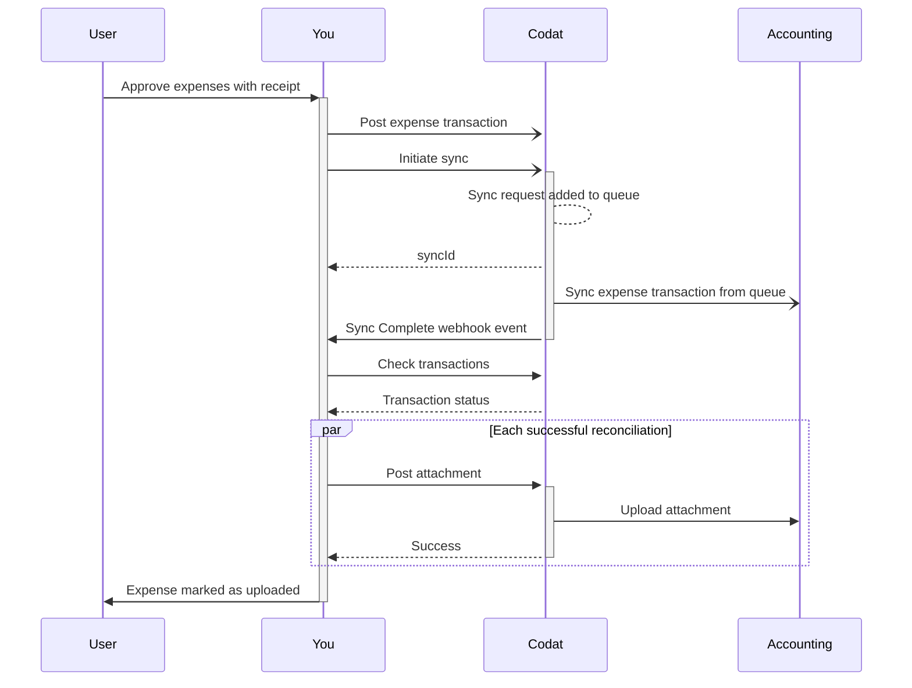

import Tabs from "@theme/Tabs";
import TabItem from "@theme/TabItem";

## Aperçu

Une dépense est une transaction qui représente l'achat effectué par votre client et le contexte de cet achat. Elle comprend généralement les détails suivants :

- Type de transaction, par exemple s'il s'agit d'un paiement ou d'un remboursement
- Compte du grand livre général auquel la transaction doit être rapprochée
- Taux de taxe associés
- Catégories de suivi applicables

Avec Expenses, vous devez d'abord créer les transactions de dépenses ou de transfert et écrire cet ensemble de données dans Codat. Nous décrirons les options disponibles sur cette page.

Ensuite, vous devez [synchroniser les dépenses](/expenses/sync-process/syncing-expenses) pour les refléter dans le logiciel de comptabilité de votre client. Enfin, une fois ces transactions synchronisées, vous pouvez [téléverser des pièces jointes](/expenses/sync-process/uploading-receipts) pour associer des reçus à la transaction.

Ce processus est résumé dans le diagramme ci-dessous.



## Créer des dépenses

Pour créer une nouvelle transaction de dépense dans Codat, utilisez le endpoint [Create expense transaction](/sync-for-expenses-api#/operations/create-expense-transaction).

Dans la requête, assurez-vous que l'`id` de la transaction est unique car il sert de clé d'idempotence. Codat valide l'`id` pour s'assurer qu'il est unique pour une entreprise, empêchant la création de transactions en double dans le logiciel de comptabilité de votre PME.

```json title="Expense transaction request body"
[
  {
    "id": "08ca1f02-0374-11ed-b939-0242ac120002",
    "type": "Payment",
    "issueDate": "2023-12-13T00:00:00+00:00",
    "currency": "GBP",
    "currencyRate": 1,
    "contactRef": {
      "id": "an-id-to-a-suppliers-record",
      "type": "Supplier"
    },
    "bankAccountRef": {
      "id": "an-id-to-a-bank-or-credit-card-account"
    },
    "merchantName": "Amazon UK",
    "lines": [
      {
        "netAmount": 100,
        "taxAmount": 20,
        "taxRateRef": {
          "id": "an-id-to-a-taxRates-record"
        },
        "accountRef": {
          "id": "id-of-the-expense-nominal-account"
        },
        "trackingRefs": [
          {
            "id": "an-id-to-a-trackingCategories-record",
            "dataType": "trackingCategories"
          }
        ],
        "invoiceTo": {
          "id": "an-id-to-a-customers-record",
          "type": "Customer"
        }
      }
    ],
    "notes": "Amazon UK | Online Purchase | Order 123XX45",
    "postAsDraft": false
  }
]
```

Ensuite, vous devez effectuer une synchronisation des dépenses pour refléter cette dépense dans le logiciel de comptabilité du client. Nous couvrons cela en détail dans [Sync expenses](/expenses/sync-process/syncing-expenses).

### Transactions en brouillon

Certains logiciels de comptabilité permettent de créer des transactions de dépenses à l'état de brouillon au lieu de les comptabiliser directement dans le grand livre. Cela signifie que l'utilisateur peut examiner la dépense dans le logiciel de comptabilité avant de la finaliser et de la comptabiliser avant le rapprochement.

Pour créer une dépense en brouillon, définissez la propriété `postAsDraft` de la transaction sur `true`. Pour les plateformes qui ne disposent pas de cette fonctionnalité, la propriété `postAsDraft` doit être ignorée ou définie sur `false`.

:::info Intégrations compatibles

Cette fonctionnalité n'est actuellement disponible que pour Microsoft Dynamics.

:::

### Dépenses facturables

Votre client peut vouloir marquer une dépense comme facturable afin de pouvoir facilement identifier et attribuer les coûts à des clients ou des projets spécifiques. Cela simplifie le processus de facturation des clients pour les dépenses remboursables.

Pour marquer une dépense comme facturable, définissez la propriété `invoiceTo` sur `customer`. La dépense fera alors référence au client dans le poste.

:::info Intégrations compatibles

Cette fonctionnalité n'est actuellement disponible que pour QuickBooks Online et QuickBooks Desktop.

:::

### Transactions de dépenses multidevises

Expenses valide chaque transaction de dépense impliquant des devises étrangères. Nous nous assurons que la combinaison des devises participantes sera acceptée par le logiciel de comptabilité cible comme une dépense valide. Vous pouvez en savoir plus sur les [dépenses en devises étrangères](/expenses/fx-management) et la prise en charge des différents types de transactions par les plateformes.

### Taux de taxe par défaut

Si vous devez supprimer un taux de taxe associé à une dépense, utilisez l'une des valeurs par défaut suivantes qui n'ont aucun impact sur la dépense :

| Plateforme         | Taux de taxe par défaut                                                                                                                           |
| ------------------ | ------------------------------------------------------------------------------------------------------------------------------------------------- |
| Dynamics 365       | Configurez et appliquez un taux de taxe de `0%`                                                                                                   |
| FreeAgent          | `taxRateRef` n'est pas pris en charge                                                                                                             |
| Oracle NetSuite    | Filiales américaines : `-7`<br/> Filiales canadiennes : `114`<br/> Toutes les autres filiales : vérifiez le taux de taxe `UNDEF-{country code}` |
| QuickBooks Online  | `NON`                                                                                                                                             |
| QuickBooks Desktop | null                                                                                                                                              |
| Xero               | `NONE`                                                                                                                                            |
| Zoho Books         | null                                                                                                                                              |

### Types de transactions

Expenses mappe et traite les transactions de dépenses en fonction des types de transactions suivants :

| Type de transaction | Description                                                                                                                             |
| ------------------- | --------------------------------------------------------------------------------------------------------------------------------------- |
| `payment`           | Représente toute dépense effectuée sur le compte et les intérêts sur les achats à crédit.                                               |
| `refund`            | Représente tout remboursement et retour sur une transaction originale.                                                                  |
| `reward`            | Représente les remboursements de récompenses, tels que les remises en argent.                                                           |
| `chargeback`        | De manière similaire à un remboursement, représente un retour d'une transaction ou d'une somme de paiement qui peut avoir été contestée. |

#### Ajustements

Votre client peut vouloir refléter les radiations et les ajustements de transactions, tels que les ajustements de change, dans son logiciel de comptabilité. Les ajustements pour les modifications de change dans les dépenses sont essentiels pour tenir compte des fluctuations des taux de change. Cela garantit que les dépenses engagées en devises étrangères sont reflétées avec précision dans la devise de présentation de l'entreprise.

Ce processus aide à maintenir l'exactitude et la fiabilité des états financiers, ce qui est crucial pour une gestion financière et une présentation efficaces.

Vous pouvez utiliser le endpoint [Create adjustment transactions](/sync-for-expenses-api#/operations/create-adjustment-transaction) pour aider votre client à y parvenir. Les ajustements apparaîtront ensuite dans leur logiciel de comptabilité sous forme d'écriture de journal.

:::info Intégrations compatibles

Cette fonctionnalité n'est actuellement disponible que pour QuickBooks Desktop.

:::

## Mettre à jour des dépenses

:::info Intégrations compatibles

Consultez notre [référence API](/sync-for-expenses-api#/operations/update-expense-transaction) pour une liste à jour des intégrations qui prennent en charge cette fonctionnalité.

:::

Dans certains cas, votre client peut vouloir mettre à jour une transaction de dépense qui a été précédemment synchronisée avec son logiciel de comptabilité. Utilisez notre endpoint [Update expense transactions](/sync-for-expenses-api#/operations/update-expense-transaction) pour modifier les paramètres suivants et refléter le changement dans le logiciel de comptabilité de la PME :

- Montant net de la dépense
- Montant de la taxe de la dépense
- Référence du taux de taxe associée à la dépense
- Référence du compte bancaire de dépense (impossible de mettre à jour pour FreeAgent)
- Objets de catégorie de suivi
- Description et notes

```http title="Update an expense transaction"
PUT  https://api.codat.io/companies/{companyId}/sync/expenses/expense-transactions
```

---

## À lire ensuite

- [Synchroniser les dépenses](/expenses/sync-process/syncing-expenses) pour refléter les dépenses dans le logiciel de comptabilité et surveiller la progression de la synchronisation.
