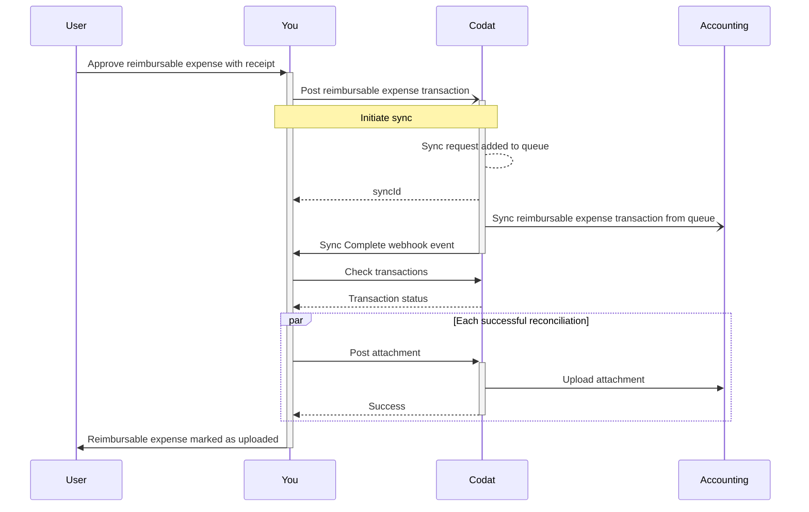

import Tabs from "@theme/Tabs";
import TabItem from "@theme/TabItem";

## Aperçu

Une dépense remboursable est un coût encouru par un employé qui est admissible à être remboursé ou compensé par son employeur ou une autre partie. Dans les systèmes comptables, les dépenses remboursables sont représentées comme des factures qui sont inscrites contre l'employé en tant que fournisseur (`recordRef`).

:::info Intégrations compatibles

Consultez nos [types de dépenses pris en charge](/expenses/overview#supported-integrations) pour une liste à jour des intégrations qui prennent en charge cette fonctionnalité.

:::

Avec la solution Expenses, vous devez d'abord créer les transactions de dépenses remboursables.

Cela lancera la [synchronisation](/expenses/sync-process/syncing-expenses) pour les refléter dans le logiciel de comptabilité de votre client. Enfin, une fois ces transactions synchronisées, vous pouvez [téléverser des pièces jointes](/expenses/sync-process/uploading-receipts) pour associer des reçus à la transaction.

Ce processus est résumé dans le diagramme ci-dessous.



## Créer des dépenses remboursables

Pour créer une nouvelle transaction de dépense remboursable dans Codat, utilisez le endpoint [Create reimbursable expense transaction](/sync-for-expenses-api#/operations/create-reimbursable-expense-transaction).

Dans l'URL de la requête, assurez-vous que l'`id` de la transaction est unique car il sert de clé d'idempotence. Codat valide l'`id` pour s'assurer qu'il est unique pour une entreprise, empêchant la création de transactions en double dans le logiciel de comptabilité de votre PME.

```json title="Reimbursable expense request body"
[
   {
      "id":"81539597-e681-40c9-a4dd-ec2fffcde572",
      "reference":"101",
      "contactRef":{
         "id":"341"
      },
      "issueDate":"2022-04-29T00:00:00",
      "dueDate":"2022-04-29T00:00:00",
      "currency":"GBP",
      "notes":"Reimbursable Expense Demo",
      "lines":[
         {
            "netAmount":50,
            "taxAmount":10,
            "taxRateRef":{
               "id":"3_Bills"
            },
            "accountRef":{
               "id":"19"
            },
            "description":"Subscriptions",
            "trackingRefs":[
               {
                  "id":"CLASS_5100000000000040021",
                  "dataType":"trackingCategories"
               },
               {
                  "id":"DEPARTMENT_5",
                  "dataType":"trackingCategories"
               }
            ]
               "invoiceTo":{
               "id":"an-id-to-a-customers-record",
               "dataType":"customers"
            }
         }
      ]
   }
]
```

### Dépenses remboursables facturables

Votre client peut vouloir marquer une dépense comme facturable afin de pouvoir facilement identifier et attribuer les coûts à des clients ou des projets spécifiques. Cela simplifie le processus de facturation des clients pour les dépenses remboursables.

Pour marquer une dépense comme facturable, définissez la propriété `invoiceTo` sur `customer`. La dépense fera alors référence au client dans le poste.

:::info Intégrations compatibles

Cette fonctionnalité n'est actuellement disponible que pour QuickBooks Online et QuickBooks Desktop.

:::

### Transactions multidevises

Expenses valide chaque transaction de dépense remboursable impliquant des devises étrangères. Nous nous assurons que la combinaison des devises participantes sera acceptée par le logiciel de comptabilité cible comme une dépense valide. Vous pouvez en savoir plus sur les [dépenses en devises étrangères](/expenses/fx-management) et la prise en charge des différents types de transactions par les plateformes.

Pour les dépenses remboursables, la devise de la dépense est la devise du fournisseur (donc la devise dans laquelle l'employé sera remboursé). Si l'employé doit être remboursé dans une devise différente, il doit être configuré comme un nouveau fournisseur pour chaque devise requise.

### Taux de taxe par défaut

Si vous devez supprimer un taux de taxe associé à une dépense remboursable, utilisez l'une des valeurs par défaut suivantes qui n'ont aucun impact sur la dépense :

| Plateforme         | Taux de taxe par défaut                                                                                                                           |
| ------------------ | ------------------------------------------------------------------------------------------------------------------------------------------------- |
| FreeAgent          | `taxRateRef` n'est pas pris en charge                                                                                                             |
| Oracle NetSuite    | Filiales américaines : `-7`<br/> Filiales canadiennes : `114`<br/> Toutes les autres filiales : vérifiez le taux de taxe `UNDEF-{country code}` |
| QuickBooks Online  | `NON`                                                                                                                                             |
| QuickBooks Desktop | null                                                                                                                                              |
| Zoho Books         | null                                                                                                                                              |

## Mettre à jour des dépenses remboursables

Dans certains cas, votre client peut vouloir mettre à jour une transaction de dépense remboursable qui a été précédemment synchronisée avec son logiciel de comptabilité. Utilisez notre endpoint [Update reimbursable expense transactions](/sync-for-expenses-api#/operations/update-reimbursable-expense-transaction) pour modifier les paramètres suivants et refléter le changement dans le logiciel de comptabilité de la PME :

- Montant net de la dépense
- Montant de la taxe de la dépense
- Référence du taux de taxe associée à la dépense
- Référence du compte bancaire de dépense
- Objets de catégorie de suivi
- Description et notes

```http title="Update an expense transaction"
PUT  https://api.codat.io/companies/{companyId}/sync/expenses/reimburseable-expense-transactions
```

---

## À lire ensuite

- [Synchroniser les dépenses](/expenses/sync-process/syncing-expenses) pour refléter les dépenses dans le logiciel de comptabilité et surveiller la progression de la synchronisation.
