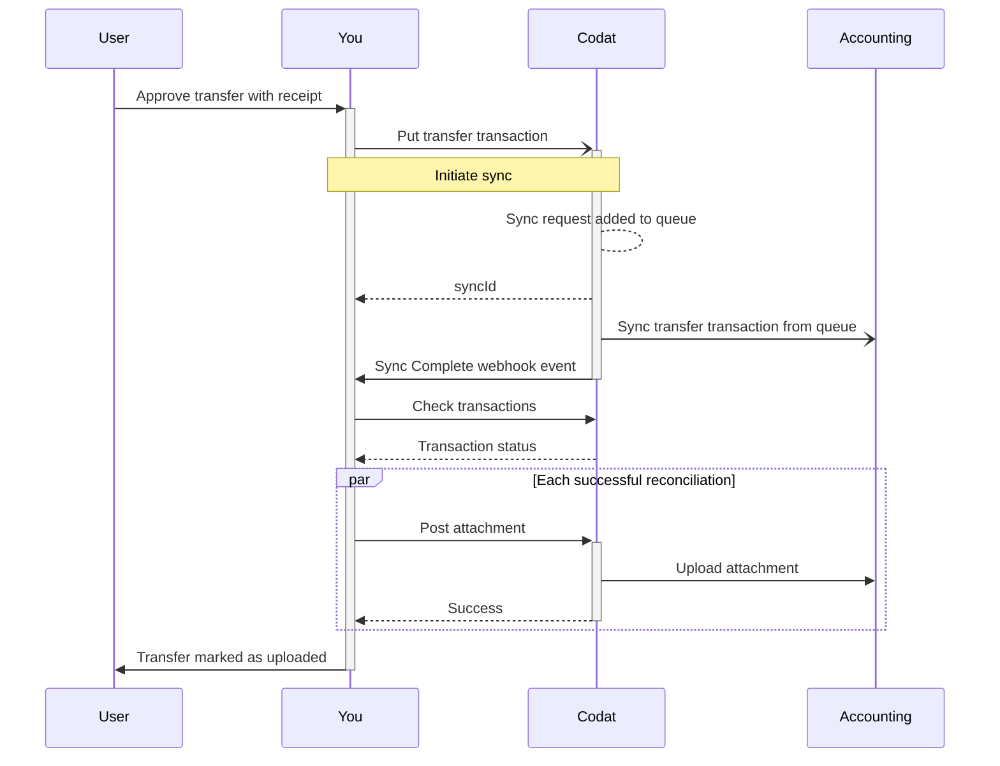

import Tabs from "@theme/Tabs";
import TabItem from "@theme/TabItem";

## Aperçu

Les transferts sont utilisés pour enregistrer le mouvement d'argent entre deux comptes bancaires. Ils représentent des transactions telles que les rechargements de comptes de carte de débit, les remboursements d'un compte de carte de crédit ou un transfert de solde vers une autre carte de crédit.

Avec Expenses, vous devez d'abord créer les transactions de transfert. La création de la transaction lancera la [synchronisation](/expenses/sync-process/syncing-expenses) pour ensuite les refléter dans le logiciel de comptabilité de votre client. Enfin, une fois ces transactions synchronisées, vous pouvez [téléverser des pièces jointes](/expenses/sync-process/uploading-receipts) pour associer des reçus à la transaction. Les pièces jointes ne seront associées qu'au compte `from`.

Ce processus est résumé dans le diagramme ci-dessous.



## Créer des transferts

:::info Intégrations compatibles

Consultez notre [référence API](/sync-for-expenses-api#/operations/create-transfer-transaction) pour une liste à jour des intégrations qui prennent en charge cette fonctionnalité.

:::

Pour créer une nouvelle transaction de transfert dans Codat, utilisez le endpoint [Create transfer transaction](/sync-for-expenses-api#/operations/create-transfer-transaction). Vous pouvez également utiliser ce endpoint pour mettre à jour un transfert existant.

Dans l'URL de la requête, assurez-vous que l'`id` de la transaction est unique car il sert de clé d'idempotence. Codat valide l'`id` pour s'assurer qu'il est unique pour une entreprise, empêchant la création de transactions en double dans le logiciel de comptabilité de votre PME.

```json title="Transfer transaction request body"
{
  "Description": "Sample transfer description",
  "Date": "2024-02-14T00:00:00Z",
  "From": {
    "AccountRef": {
      "Id": "a6980b6f-29dc-4c28-9596-f6c75e29f3b6"
    },
    "Amount": 1000.0
  },
  "To": {
    "AccountRef": {
      "Id": "a352b2f9-d47c-46ee-9561-731c6acff930"
    },
    "Amount": 1000.0
  }
}
```

:::tip Taux de change
Nous déduisons le `currencyRate` de la transaction de transfert à partir des valeurs 'from.Amount' et 'to.Amount'.
:::

### Mettre à jour des transferts

:::info Intégrations compatibles

Consultez notre [référence API](/sync-for-expenses-api#/operations/create-transfer-transaction) pour une liste à jour des intégrations qui prennent en charge cette fonctionnalité.

:::

Dans certains cas, votre client peut vouloir mettre à jour une transaction de transfert qui a été précédemment synchronisée avec son logiciel de comptabilité. Utilisez le même endpoint [Create transfer transaction](/sync-for-expenses-api#/operations/create-transfer-transaction) pour modifier les paramètres suivants et refléter le changement dans le logiciel de comptabilité de la PME :

- Montant From
- Montant To
- Date

### Transactions de transfert multidevises

Expenses valide chaque transaction de transfert impliquant des devises étrangères. Nous nous assurons que la combinaison des devises participantes sera acceptée par le logiciel de comptabilité cible comme une dépense valide. Vous pouvez en savoir plus sur les [transferts en devises étrangères](/expenses/fx-management#transfers) et la prise en charge des différents types de dépenses par les plateformes.

---

## À lire ensuite

- [Synchroniser les dépenses](/expenses/sync-process/syncing-expenses) pour refléter les dépenses dans le logiciel de comptabilité et surveiller la progression de la synchronisation.
