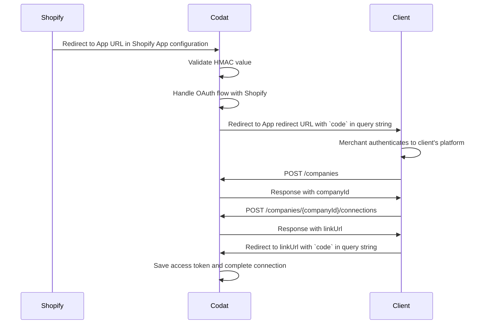

Configurez l'intégration Shopify pour récupérer les données commerce de clients qui vendent leurs produits sur le logiciel eCommerce de Shopify.

Cet article explique comment configurer l'intégration Shopify en utilisant l'approche _applications publiques_.

Vous apprendrez comment...

- [Créer une application Shopify publique](/integrations/commerce/shopify/commerce-shopify-public-apps#create-a-public-shopify-app)
- [Soumettre votre application à Shopify pour approbation](/integrations/commerce/shopify/commerce-shopify-public-apps#submit-your-app-to-shopify-for-approval)
- [Créer une application pour l'autorisation des marchands](/integrations/commerce/shopify/commerce-shopify-public-apps#build-an-app-for-merchant-authorization)
- [Ajouter les identifiants de votre application à l'intégration Shopify](/integrations/commerce/shopify/commerce-shopify-public-apps#add-your-apps-credentials-to-the-shopify-integration)
- [Activer l'intégration Shopify](/integrations/commerce/shopify/commerce-shopify-public-apps#enable-the-shopify-integration)
- [Vérifier les paramètres de synchronisation commerce](/integrations/commerce/shopify/commerce-shopify-public-apps#check-the-commerce-sync-settings)

## Avant de commencer

Avant de configurer l'intégration, assurez-vous de :

- Comprendre [comment fonctionnent les applications publiques](/integrations/commerce/shopify/commerce-shopify#about-public-apps).
- Avoir [créé un endpoint](/integrations/commerce/shopify/commerce-shopify-public-apps#build-an-app-for-merchant-authorization) qui peut être utilisé pour identifier un marchand sur votre système.

## Créer une application Shopify publique

Lorsque l'application est créée, vous pouvez consulter les identifiants sécurisés de l'application.

1. Connectez-vous au site [Shopify Partners](https://developers.shopify.com/) en utilisant vos identifiants de compte partenaire Shopify.

   :::note Compte partenaire Shopify
   [Créez un compte partenaire](https://accounts.shopify.com/signup?rid=c272bffe-3e6f-4583-b6f2-f6bd71b340e5) si vous n'en avez pas déjà un.
   :::

2. Dans le panneau latéral, cliquez sur **Applications**.
3. Sur la page **Applications**, cliquez sur **Créer une application**.
4. Dans la boîte **Utiliser Shopify Partners**, cliquez sur **Créer une application manuellement**.
5. Sur la page **Créer une application manuellement**, entrez les informations demandées :
   - **Nom de l'application :** entrez un nom pour votre application. N'utilisez pas _Shopify_ dans le nom de l'application.
   - **URL de l'application :** entrez `https://commerceintegration.codat.io/publicApp/{your-client-id}`
   - **URL(s) de redirection autorisée(s) :** entrez `https://commerceintegration.codat.io/oauth/callback`
6. Cliquez sur **Créer une application**. Votre application est créée et la page de l'application s'affiche.
7. Dans le panneau latéral, cliquez sur **Configuration de l'application** pour afficher les paramètres de configuration de l'application.
8. Optionnel : si vous prévoyez d'utiliser le type de données `commerce-customers` de Codat, effectuez les actions suivantes sur la page **Configuration de l'application** :
   1. Dans la boîte **Accès aux données client protégées**, cliquez sur **Demander l'accès**.
   2. Entrez les détails demandés dans la boîte de dialogue, puis soumettez votre demande à Shopify.

   Cela est requis car ce type de données demande des données client incluant les champs nom, adresse, téléphone ou courriel.

9. Optionnel : si vous devez accéder à plus de 60 jours de commandes, effectuez les actions suivantes sur la page **Configuration de l'application** :
   1. Dans la boîte **Portée de lecture de toutes les commandes**, cliquez sur **Demander l'accès**.
   2. Entrez les détails demandés dans la boîte de dialogue, puis soumettez votre demande à Shopify.
10. Dans la section **Webhooks obligatoires RGPD**, entrez les URL webhook Codat suivantes :

- **Endpoint de demande de données client :** `https://commerceintegration.codat.io/webhooks/{your-client-id}/customer/request`
- **Endpoint d'effacement de données client :** `https://commerceintegration.codat.io/webhooks/{your-client-id}/customer/redact`
- **Endpoint d'effacement de données de boutique :** `https://commerceintegration.codat.io/webhooks/{your-client-id}/shop/redact`

11. Cliquez sur le bouton **Enregistrer** qui apparaît en haut de la page.

Votre **Clé API** et **Clé secrète API** de l'application sont affichées dans la section **Identifiants de l'application** de la page Configuration de l'application. Vous en aurez besoin lorsque vous [ajouterez les identifiants de votre application à l'intégration](/integrations/commerce/shopify/commerce-shopify-public-apps#add-your-apps-credentials-to-the-shopify-integration).

Si vous prévoyez de facturer votre application, vous devrez intégrer l'[API de facturation de Shopify](https://shopify.dev/docs/apps/billing).

## Soumettre votre application à Shopify pour approbation

Votre application publique doit être [approuvée par Shopify](https://shopify.dev/apps/store/requirements) avant de pouvoir utiliser l'intégration avec une boutique de production. Le processus d'examen et d'approbation peut prendre jusqu'à deux semaines.

Dans le site Shopify Partners :

1. Cliquez sur le nom de votre application.
2. Dans le panneau latéral, cliquez sur **Distribution**.
3. Sur la page **Distribution**, cliquez sur **Choisir Shopify App Store**, puis confirmez votre sélection dans la boîte de dialogue qui apparaît.

4. Cliquez sur **Créer une liste**.
5. Sélectionnez votre compte partenaire Shopify à l'invite d'authentification. La page **Liste d'applications** pour votre application s'ouvre.
6. Cliquez sur **Visibilité de l'application**.
7. Dans la boîte de dialogue **Gérer la visibilité de l'application**, sélectionnez **Non répertoriée**, sauf si vous souhaitez que votre application soit visible dans le Shopify App Store public, puis cliquez sur **Enregistrer**.

   :::note Différences entre les applications répertoriées et non répertoriées

   Vous pouvez rendre votre application Shopify _répertoriée_ (entièrement visible dans le Shopify App Store) ou _non répertoriée_ (elle n'apparaîtra pas dans les moteurs de recherche ou les résultats du Shopify App Store). Les deux types d'applications ont une URL publique du Shopify App Store.

   :::

8. Cliquez sur **Commencer la liste**. La page **Liste anglaise** s'affiche.
9. Entrez toutes les informations de liste requises et enregistrez le formulaire.
10. Sur la page **Liste d'applications**, cliquez sur le bouton **Soumettre l'application** en haut à droite. Le bouton n'est pas disponible tant que vous n'avez pas complété toutes les informations de liste requises.

Votre application est alors envoyée à Shopify pour examen et approbation.

De plus, si vous avez besoin d'accéder à plus de 60 jours de commandes des boutiques Shopify, vous devez soumettre une demande _Lire toutes les commandes_, comme indiqué dans [Créer une application publique Shopify](/integrations/commerce/shopify/commerce-shopify-public-apps#create-a-shopify-public-app). Vous recevrez un courriel de Shopify lorsque votre demande aura été traitée. Cela peut prendre jusqu'à sept jours ouvrables.

Codat ne peut pas garantir que Shopify approuvera votre application publique ou accordera l'accès à plus de 60 jours de données de commandes.

## Créer une application pour l'autorisation des marchands

Lorsqu'un marchand ajoute votre application à sa boutique, nous devons pouvoir l'identifier. Pour ce faire, nous le redirigerons vers le endpoint **URL de redirection de l'application** que vous avez saisi dans les [paramètres d'intégration](/integrations/commerce/shopify/commerce-shopify-public-apps#add-your-apps-credentials-to-the-shopify-integration) à la fin du flux d'authentification.

Nous générerons et inclurons un paramètre de chaîne de requête `code` dans la redirection initiale pour maintenir le contexte. Permettez à l'utilisateur de s'authentifier sur la page de redirection, puis créez (ou utilisez une existante) une entreprise Codat et une connexion de données. La réponse de connexion de données contiendra une `linkURL`. Ajoutez le `code` à la chaîne de requête de l'URL et redirigez l'utilisateur pour terminer son flux d'authentification avec nous.

## Ajouter les identifiants de votre application à l'intégration Shopify

Dans le portail Codat, ajoutez les identifiants sécurisés de votre application Shopify à l'intégration.

1. Dans la barre de navigation, sélectionnez **Paramètres > Intégrations > Commerce**.

2. Cliquez sur **Configurer** à côté de l'intégration **Shopify**.

   La page **Paramètres d'intégration** s'affiche.

3. Entrez les identifiants de votre application depuis Shopify (pour les trouver, consultez [Créer une application Shopify publique](/integrations/commerce/shopify/commerce-shopify-public-apps#create-a-shopify-public-app)).
   - Pour **ID client**, entrez la **Clé API** de Shopify.
   - Pour **Secret client**, entrez la **Clé secrète API** de Shopify.
   - Pour **URL de redirection de l'application**, entrez l'emplacement de votre [endpoint d'authentification](/integrations/commerce/shopify/commerce-shopify-public-apps#build-an-app-for-merchant-authorization).

4. Si vous avez demandé l'accès à plus de 60 jours de commandes et que votre accès a été approuvé, activez **A demandé à lire toutes les commandes**. Sinon, laissez ce paramètre désactivé.

   

5. Sous **Accès aux données d'entreprise**, configurez la fréquence de synchronisation autorisée pour l'intégration. Sélectionnez **Autoriser la synchronisation de données ponctuelle…** ou **Autoriser la synchronisation continue des données**.

6. Cliquez sur **Enregistrer**.

## Activer l'intégration Shopify

1. Dans le portail Codat, accédez à la page <a className="external" href="https://app.codat.io/settings/integrations/commerce" target="blank">**Intégrations Commerce**</a>.
2. Localisez **Shopify** et cliquez sur le bouton bascule pour activer l'intégration.

Vous pouvez également cliquer sur **Gérer** pour afficher la page des paramètres de l'intégration, puis activer l'intégration à partir de là.

## Vérifier les paramètres de synchronisation commerce

Tous les types de données commerce doivent être activés avant de pouvoir lire les transactions commerce de Shopify vers Codat. Suivez les étapes dans [Paramètres de synchronisation commerce](/integrations/commerce/commerce-sync-settings). Vous n'avez besoin de le faire qu'une seule fois.

## Étapes suivantes

[Testez votre intégration Shopify](test-shopify) avant d'envoyer les URL Link aux marchands.
