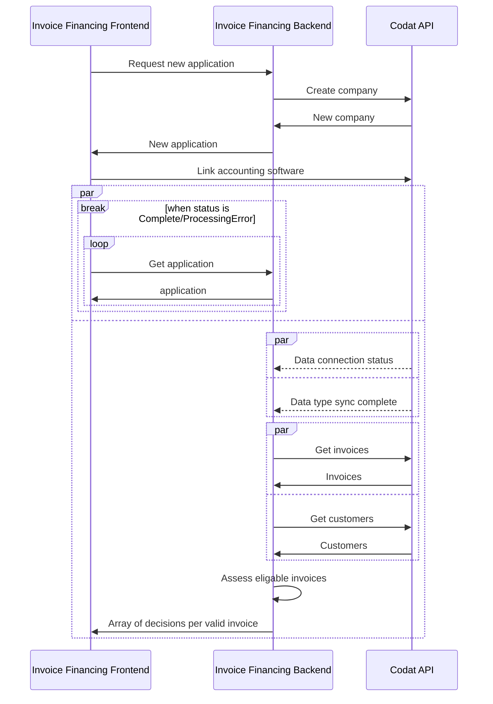

import Tabs from "@theme/Tabs";
import TabItem from "@theme/TabItem";

### 🚀 Dans cette section, vous allez...

- Examiner le flux du processus de base suivi par l'application de démonstration,
- Créer une nouvelle demande de financement de factures,
- Créer une entreprise Codat et la connecter au Sandbox Codat,
- Récupérer des données financières pour évaluer les niveaux de risque associés aux clients et aux factures, et
- Recevoir une décision sur la demande de prêt.

:::note Flux du processus de financement de factures

Ce diagramme montre les étapes du processus de financement de factures tel qu'effectué par l'application de démonstration. Il vous aide à visualiser la relation et l'échange d'informations entre les différents composants de l'application.



:::

### Démarrer une nouvelle demande de prêt

:::note Interface de demande de prêt

Nous utilisons [Swagger](http://localhost:7278/swagger/index.html) pour agir comme une couche de présentation pour interagir avec les endpoints de démonstration. N'oubliez pas de cliquer sur **Try it out** et **Execute** lorsque vous travaillez avec Swagger.
:::

Appelez l'endpoint `POST /applications/start` pour déclencher la création d'une nouvelle demande de prêt de financement de factures. En arrière-plan, l'application crée une entreprise en utilisant l'endpoint `POST /companies` de Codat en utilisant l'`id` de la demande comme nom d'entreprise.

Codat retourne les `id`s de l'entreprise et de la demande dans la réponse de l'endpoint avec un `linkUrl`. Dans la démonstration, nous utiliserons ces éléments pour connecter une source de données.

```json title="Exemple de réponse POST /applications/start"
{
  "id": "1c727866-6923-4f81-aa7b-c7fd8c533586",
  "codatCompanyId": "a9e28b79-6a98-4190-948d-3bd4d60e7c0a",
  "status": "Started",
  "linkUrl": "https://link.codat.io/company/a9e28b79-6a98-4190-948d-3bd4d60e7c0a"
}
```

### Partager les données financières

Ensuite, vous devez fournir à Codat l'accès à un logiciel de comptabilité afin que nous puissions récupérer les données nécessaires pour évaluer le risque de la demande de prêt. Ouvrez le `linkUrl` retourné dans la réponse de `POST /applications/start` dans votre navigateur. Suivez le flux construit en utilisant [Link](/auth-flow/overview), notre flux d'autorisation intégré hébergé ou embarqué.

Sélectionnez le **Codat Sandbox** comme source de données comptables.

- Choisissez le type d'entreprise **Invoice Financing US Company**.
- Vous n'avez pas besoin d'entrer d'identifiants pour autoriser cette connexion.
- Vous devriez également sauter l'étape de téléversement des documents commerciaux.

Nous récupérons les factures impayées du demandeur, les clients associés à ces factures impayées, et les factures historiques (payées) de chaque client à utiliser dans la prise de décision. Vous pouvez [en savoir plus](/lending/guides/invoice-finance/inv-fin-decision) sur les requêtes que nous avons utilisées pour effectuer la récupération spécifique.


### Recevoir la décision sur le prêt

L'application de démonstration dispose maintenant de tous les composants nécessaires pour évaluer le risque associé à chaque client, et le risque associé à chaque facture. Ces évaluations déterminent la décision sur chaque facture impayée incluse dans la demande de prêt.

Interrogez l'endpoint `GET applications/{applicationId}` dans [Swagger](http://localhost:7278/swagger/index.html) à tout moment pour vérifier le statut de votre demande. Une fois que l'application a traité toutes les factures pertinentes, elle retournera automatiquement une réponse avec une offre pour chaque facture approuvée pour financement.

Vous pouvez [en savoir plus](/lending/guides/invoice-finance/inv-fin-decision) sur les évaluations de risque effectuées par l'application, et plus de détails sur la logique de décision. Les seuils utilisés avec la logique sont définis dans le fichier `appsettings.json`.

### 💪 Prêt pour plus?

Essayez ces suggestions pour tirer le meilleur parti de votre expérience avec l'application de démonstration :

- **Jouez avec les seuils**
  Dans le fichier `appsettings.json` du répertoire `Codat.Demos.InvoiceFinancing.Api\`, définissez vos propres seuils d'exemple pour les points de données utilisés pour l'évaluation des risques et voyez comment cela affecte la décision de la demande.

- **Financez un prêt basé sur des factures en utilisant différents ensembles de données**
  Démarrez une autre demande de prêt, et choisissez un type d'entreprise Sandbox différent pour obtenir un ensemble différent de données financières à utiliser dans la prise de décision.

- **Utilisez les données réelles d'une entreprise**
  Allez plus loin avec la démonstration et utilisez de vraies identifiants pour accéder aux données financières existantes dans un logiciel de comptabilité. Configurez l'[intégration](/integrations/accounting/overview) que vous prévoyez d'utiliser, et connectez-vous à celle-ci tout en suivant le flux d'authentification. Ensuite, examinez comment l'application prend une décision basée sur les données réelles de votre entreprise.

- **Inspectez la logique de financement de factures**
  Nous fournissons [des informations détaillées](/lending/guides/invoice-finance/inv-fin-decision) sur la logique d'évaluation des risques que nous avons incluse dans notre application de démonstration, et comment exactement les données financières sont récupérées et analysées.

### Récapitulatif

Vous avez maintenant exécuté avec succès l'application de démonstration, couvrant toutes les étapes clés d'un processus de financement de factures. Vous avez démarré et complété une demande, connecté et récupéré des données comptables, et reçu une décision sur votre demande.

---

### À lire ensuite

- Examinez la logique de récupération et de décision de l'application [en détail](/lending/guides/invoice-finance/inv-fin-decision)
