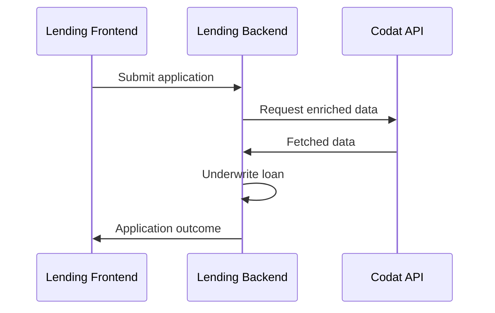

import Tabs from "@theme/Tabs";
import TabItem from "@theme/TabItem";

### 🚀 Dans cette section, vous allez...

- Examiner le processus de base suivi par l'application de démonstration,
- Créer une nouvelle demande de prêt,
- Créer une entreprise Codat et la connecter au Codat Sandbox,
- Récupérer des données financières pour évaluer la santé financière du demandeur,
- Catégoriser les comptes qui ont été omis par Lending, et
- Recevoir une décision sur le prêt.

:::note Flux du processus de démonstration de qualification de prêt

Ce diagramme montre les étapes du processus de qualification de prêt telles qu'exécutées par l'application de démonstration. Il vous aide à visualiser la relation et l'échange d'informations entre les différents composants de l'application.



Vous pouvez également consulter le [diagramme](https://github.com/codatio/demo-loan-qualification#implementing-the-solution) technique détaillé du flux suivi par l'application de démonstration.
:::

### Démarrer une nouvelle demande de prêt

🙏🏽 Cette étape est normalement effectuée par l'emprunteur.

:::note Interface de souscription

Nous utilisons [Swagger](http://localhost:5069/swagger/index.html) comme couche de présentation pour interagir avec les endpoints de démonstration. Il y a trois endpoints qui prennent en charge la création et le traitement du formulaire de demande, et trois endpoints pour interagir avec les règles de webhook que vous avez précédemment configurées. N'oubliez pas de cliquer sur **Try it out** et **Execute** lorsque vous travaillez avec Swagger.
:::

Appelez l'endpoint `/applications/start` pour déclencher la création d'une nouvelle demande de prêt. En arrière-plan, l'application crée une entreprise en utilisant l'endpoint `POST /companies` de Codat avec l'`id` de la demande comme nom d'entreprise.

Codat retourne les `id` de l'entreprise et de la demande dans la réponse de l'endpoint, ainsi qu'une `linkUrl`. Dans la démonstration, nous utiliserons ces éléments pour remplir les détails de la demande et connecter une source de données ensuite.

```json title="Exemple de réponse de l'endpoint"
{
  "id": "1c727866-6923-4f81-aa7b-c7fd8c533586",
  "codatCompanyId": "a9e28b79-6a98-4190-948d-3bd4d60e7c0a",
  "status": "Started",
  "linkUrl": "https://link.codat.io/company/a9e28b79-6a98-4190-948d-3bd4d60e7c0a"
}
```

### Fournir les détails de la demande

🙏🏽 Cette étape est normalement effectuée par l'emprunteur.

Une fois que vous recevez l'identifiant de la demande, complétez le formulaire de demande en utilisant l'endpoint `/applications/{applicationId}/form`. Dans notre démonstration, nous demandons le nom complet du demandeur, le nom de l'entreprise, ainsi que le montant, la durée et l'objectif du prêt. Si les détails fournis sont valides, ils sont enregistrés avec l'`id` de la demande avec un accusé de réception.

```json title="Exemple de formulaire de demande"
{
  "id": "applicationId",
  "companyName": "Example Company",
  "fullName": "John Smith",
  "loanAmount": 25000.0, // must be greater than zero
  "loanTerm": 36, // must be at least 12 months
  "loanPurpose": "Growth marketing campaign"
}
```

### Partager les données financières

🙏🏽 Cette étape est normalement effectuée par l'emprunteur.

Ensuite, vous devez fournir à Codat l'accès à un logiciel de comptabilité afin que nous puissions récupérer les données nécessaires à la souscription de la demande. Ouvrez la `linkUrl` retournée par la réponse de la nouvelle demande dans votre navigateur. Suivez le flux construit avec [Link](/auth-flow/overview), notre flux d'autorisation intégrée hébergé ou embarqué.

Sélectionnez le **Codat Sandbox** comme source de données comptables.

- Vous pouvez choisir n'importe quel type d'entreprise qui correspond le mieux à votre cas d'utilisation.
- Vous n'avez pas besoin d'entrer d'identifiants pour autoriser cette connexion.
- Vous devriez également sauter l'étape de téléversement des documents d'entreprise.


### Vérifier les comptes catégorisés

💰 Cette étape est normalement effectuée par le prêteur.

L'application de démonstration utilise la fonctionnalité de catégorisation de [Lending](/lending/overview). Lors de la récupération des données financières, la solution Lending de Codat analyse la liste complète des comptes d'une entreprise et attribue une catégorie à chaque compte. Bien qu'elle soit capable de catégoriser automatiquement la plupart des comptes source, ce n'est pas toujours possible, et une intervention manuelle peut être nécessaire.

Dans notre démonstration, tous les comptes sont catégorisés avec succès. Cependant, votre souscripteur peut vouloir examiner les catégories suggérées avant de poursuivre l'évaluation. Cela peut être fait sur la [page Entreprises](https://app.codat.io/companies) du Portal. Cliquez sur l'entreprise pour laquelle vous effectuez la qualification de prêt, et naviguez vers **Lending > Categorize accounts**.


Cela vous amène à la page **Account categorization** qui affiche les comptes catégorisés. Vérifiez que vous êtes satisfait des suggestions de Codat ou remplacez une suggestion en sélectionnant la case à cocher du compte et en cliquant sur **Recategorize**.


### Prendre la décision sur le prêt

🙏🏽💰 La prise de décision est normalement effectuée par le prêteur, mais l'emprunteur peut consulter le statut d'une demande à tout moment.

L'application de démonstration dispose maintenant de tous les composants nécessaires pour produire une décision de qualification de prêt. La décision est automatiquement prise par le service [LoanUnderwriter](https://github.com/codatio/demo-loan-qualification/blob/main/Codat.Demos.Underwriting.Api/Services/LoanUnderwriter.cs) en fonction de seuils que le demandeur doit atteindre. Nous mettons ensuite à jour la demande de prêt avec un statut pertinent pour indiquer la décision prise sur le prêt ou toute erreur survenue dans le processus. Vous pouvez interroger l'endpoint `GET applications/{applicationId}` dans [Swagger](http://localhost:5069/swagger/index.html) à tout moment pour vérifier le statut de votre prêt.

### 💪 Prêt pour aller plus loin?

Essayez ces suggestions pour tirer le meilleur parti de votre expérience avec l'application de démonstration :

- **Voir Lending dans le Portal**
  Naviguez vers **Products > Lending** dans le [Portal](https://app.codat.io/) pour voir une représentation visuelle des données financières lues par nos endpoints, y compris `balanceSheet` et `profitAndLoss`.
- **Jouer avec les seuils**
  Dans le fichier `appsettings.json` du répertoire `Codat.Demos.Underwriting.Api\`, définissez vos propres seuils d'exemple pour les points de données utilisés par le service de qualification de prêt de l'application et voyez comment cela affecte la décision de la demande.

- **Souscrire avec différents jeux de données**
  Démarrez une autre demande de prêt et choisissez un type d'entreprise Sandbox différent pour obtenir un ensemble différent de données financières à utiliser dans la prise de décision.

- **Utiliser les données réelles d'une entreprise**
  Allez plus loin avec la démonstration et utilisez de véritables identifiants pour accéder aux données financières existantes dans un logiciel de comptabilité. Configurez l'[intégration](/integrations/accounting/overview) que vous prévoyez d'utiliser, et connectez-vous en suivant le flux d'autorisation. Ensuite, examinez comment l'application prend une décision basée sur les données réelles de votre entreprise.

- **Inspecter la logique de qualification de prêt**
  Nous fournissons des [informations détaillées](/lending/guides/loan-qualification/uw-decision) sur la logique de qualification de prêt incluse dans notre application de démonstration, et comment exactement les données financières sont récupérées.

### Récapitulatif

Vous avez maintenant exécuté avec succès l'application de démonstration, couvrant toutes les étapes clés du processus de qualification de prêt. Vous avez démarré et complété une demande, connecté et récupéré des données comptables, et reçu une décision sur votre demande de prêt.
