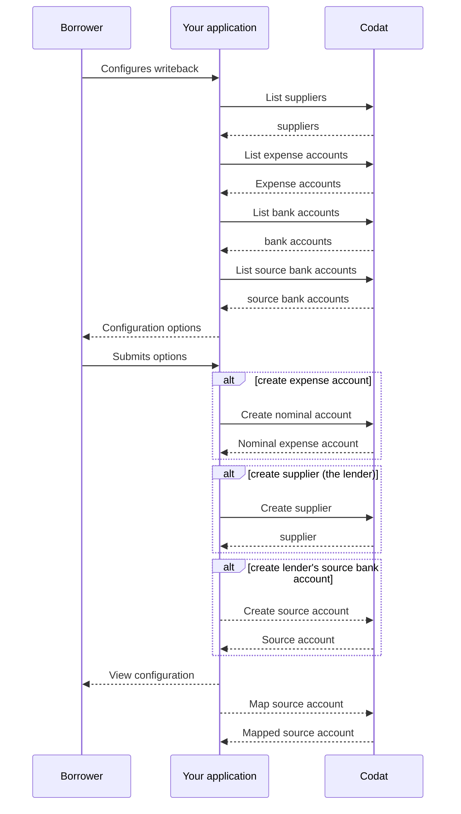

import Tabs from "@theme/Tabs";
import TabItem from "@theme/TabItem";
import WritebackMapping from "@components/Prototypes/WritebackMapping";

Une fois le prêt de votre client PME approuvé, fournissez-lui une interface utilisateur qui lui permet d'activer optionnellement la réécriture de prêt et de configurer les comptes de réécriture de prêt afin que les écritures comptables soient correctement reflétées dans son logiciel de comptabilité. Il créera ou sélectionnera des éléments existants, puis mappera les éléments suivants :

- **Compte bancaire de la PME**, le compte commercial de l'emprunteur où le prêt est déposé.
- **Compte de dépenses**, un compte pour enregistrer les frais et intérêts encourus.
- **Fiche fournisseur**, un enregistrement pour vous identifier, vous le prêteur, dans les transactions futures.

Votre solution nécessite également un **compte bancaire du prêteur** - un compte virtuel qui contient les transactions du prêteur.
Ce compte, aussi connu comme compte conteneur, de compensation ou de décaissement, est utilisé pour gérer et suivre les fonds liés aux activités de prêt.

:::info Laissez vos clients prendre le contrôle

Dans certains cas, le comptable de la PME voudra gérer ses comptes lui-même. Pour ce faire, assurez-vous d'offrir à vos clients l'option de désactiver la réécriture de prêt pour un rapprochement manuel.

:::

Par exemple, votre interface utilisateur pourrait ressembler à ceci :

<WritebackMapping />

Examinons ce processus en détail. Sur le diagramme ci-dessous, vous pouvez voir la séquence de configuration couvrant l'affichage et la sélection d'un compte bancaire, d'un compte de dépenses et d'une fiche fournisseur. Des étapes alternatives sont également fournies dans le cas où un nouveau compte et un nouveau fournisseur doivent être créés.



### Compte bancaire

Le processus de réécriture de prêt utilise deux comptes bancaires :

- Un compte bancaire commercial de l'emprunteur où l'argent prêté est déposé.
- Un compte bancaire du prêteur, qui est un compte virtuel dans le logiciel de comptabilité servant de conteneur pour les transactions du prêteur.
  L'emprunteur peut choisir un compte bancaire source existant ou demander d'en créer un nouveau. Cela se fait lors de la [configuration du compte bancaire source de flux bancaires](#bank-feed-source-account).

Premièrement, votre client doit choisir l'un de ses comptes bancaires commerciaux existants. Ce compte sera utilisé pour déposer le prêt. Appelez notre endpoint [List bank accounts](/lending-api#/operations/list-accounting-bank-accounts) pour récupérer les comptes bancaires existants du client.

<Tabs groupId="language">
<TabItem value="nodejs" label="TypeScript">

```javascript
codatLending.accountingBankData.accounts.list({
    companyId: companyId,
    connectionId: connectionId
}).then((res: ListAccountingBankAccountsResponse) => {
if (res.statusCode == 200) {
    // handle response
}
});
```

</TabItem>

<TabItem value="python" label="Python">

```python
bank_accounts_list_request = operations.ListAccountingBankAccountsRequest(
    company_id=company_id,
    connection_id=connection_id
)

bank_accounts_list_response = codat_lending.accounting_bank_data.accounts.list(bank_accounts_list_request)
```

</TabItem>

<TabItem value="csharp" label="C#">

```csharp
var bankAccountsListResponse = await codatLending.AccountingBankData.Accounts.ListAsync(new ListAccountingBankAccountsRequest() {
    CompanyId = companyId,
    ConnectionId = connectionId
});
```

</TabItem>

<TabItem value="go" label="Go">

```go
ctx := context.Background()
bankAccountsListResponse, err := codatLending.AccountingBankData.Accounts.List(
    ctx,
    operations.ListAccountingBankAccountsRequest{
        CompanyID: companyID,
        ConnectionID: connectionID,
    })
```

</TabItem>

<TabItem value="http" label="HTTP">

```http
GET https://api.codat.io/companies/{companyId}/connections/{connectionId}/data/bankAccounts
```

</TabItem>

</Tabs>

Affichez la réponse au client et permettez-lui de sélectionner le compte. Stockez le compte bancaire retourné comme `borrowersBankAccount` et utilisez-le pour accéder aux propriétés du compte bancaire de l'emprunteur dans les opérations futures.

### Fournisseur

Afin de créer une transaction de type _spend money_, Codat exige que vous, le prêteur, soyez représenté comme un [fournisseur](../../../terms/supplier) dans le système comptable de votre PME.

Permettez à votre client de vérifier si votre enregistrement existe déjà dans ses comptes. Utilisez notre endpoint [List suppliers](/lending-api#/operations/list-accounting-suppliers) pour récupérer la liste des fournisseurs existants.

<Tabs groupId="language">
<TabItem value="nodejs" label="TypeScript">

```javascript
codatLending.accountsPayable.suppliers.list({
    companyId: companyId,
}).then((res: ListAccountingSuppliersResponse) => {
if (res.statusCode == 200) {
    // handle response
}
});
```

</TabItem>

<TabItem value="python" label="Python">

```python
suppliers_list_request = operations.ListAccountingSuppliersRequest(
    company_id=company_id,
)

suppliers_list_response = codat_lending.accounts_payable.suppliers.list(suppliers_list_request)
```

</TabItem>

<TabItem value="csharp" label="C#">

```csharp
var suppliersListResponse = await codatLending.AccountsPayable.Suppliers.ListAsync(new ListAccountingSuppliersRequest() {
    CompanyId = companyId
});
```

</TabItem>

<TabItem value="go" label="Go">

```go
ctx := context.Background()
suppliersListResponse, err := codatLending.AccountsPayable.Suppliers.List(ctx, operations.ListAccountingSuppliersRequest{
    CompanyID: companyID
})
```

</TabItem>

<TabItem value="http" label="HTTP">

```http
GET https://api.codat.io/companies/{companyId}/data/suppliers
```

</TabItem>

</Tabs>

Affichez la réponse au client et permettez-lui de trouver et de sélectionner votre enregistrement de prêteur dans sa liste de fournisseurs. Stockez l'`id` du fournisseur comme `supplier` et utilisez-le dans les transactions futures.

Si c'est la première fois que vous prêtez à ce client PME, vous devrez peut-être vous créer en tant que nouveau fournisseur dans son logiciel de comptabilité.

1. Utilisez notre endpoint [Get create/update supplier model](/lending-api#/operations/get-create-update-suppliers-model) pour obtenir les données attendues pour le payload de la requête de création du fournisseur. Les données requises peuvent varier selon la plateforme.
2. Utilisez ce payload pour appeler l'endpoint [Create supplier](/lending-api#/operations/create-supplier) afin de créer le nouvel enregistrement de fournisseur dans le logiciel de comptabilité.

<Tabs groupId="language">
<TabItem value="nodejs" label="TypeScript">

```javascript
codatLending.loanWriteback.suppliers.create({
    accountingSupplier: {
        addresses: [
        {
            line1: "Stoney Business Park",
            city: "London",
            country: "UK",
            postalCode: "SE14 1PE",
            type: AccountingAddressType.Billing,
        },
        ],
        contactName: "David",
        defaultCurrency: "GBP",
        emailAddress: "david@example.com",
        phone: "+44 25691 154789",
        registrationNumber: "0115633",
        status: SupplierStatus.Active,
        supplierName: "Bank of Dave",
    },
    companyId: companyId,
    connectionId: connectionId,
    }).then((res: CreateSupplierResponse) => {
    if (res.statusCode == 200) {
        // handle response
    }
});
```

</TabItem>

<TabItem value="python" label="Python">

```python
supplier_create_request = operations.CreateSupplierRequest(
    accounting_supplier=shared.AccountingSupplier(
        addresses=[
            shared.AccountingAddress(
                line1='Stoney Business Park',
                city='London',
                country='UK',
                postal_code='SE14 1PE',
                type=shared.AccountingAddressType.BILLING,
            ),
        ],
        contact_name='David',
        default_currency='GBP',
        email_address='david@example.com',
        phone='+44 25691 154789',
        registration_number='0115633',
        status=shared.SupplierStatus.ACTIVE,
        supplier_name='Bank of Dave',
    ),
    company_id=company_id,
    connection_id=connection_id,
)

supplier_create_response = codat_lending.loan_writeback.suppliers.create(supplier_create_request)
```

</TabItem>

<TabItem value="csharp" label="C#">

```csharp
var suppliersCreateResponse = await codatLending.LoanWriteback.Suppliers.CreateAsync(new CreateSupplierRequest() {
    AccountingSupplier = new AccountingSupplier() {
        Addresses = new List<AccountingAddress>() {
            new AccountingAddress() {
                Line1 = "Stoney Business Park",
                City = "London",
                Country = "UK",
                PostalCode = "SE14 1PE",
                Type = CodatLending.Models.Shared.AccountingAddressType.Billing,
            },
        },
        ContactName = "David",
        DefaultCurrency = "GBP",
        EmailAddress = "david@example.com",
        Phone = "+44 25691 154789",
        RegistrationNumber = "0115633",
        Status = CodatLending.Models.Shared.SupplierStatus.Active,
        SupplierName = "Bank of Dave",
    },
    CompanyId = companyId,
    ConnectionId = connectionId,
});
```

</TabItem>

<TabItem value="go" label="Go">

```go
ctx := context.Background()
suppliersCreateResponse, err := codatLending.LoanWriteback.Suppliers.Create(ctx, operations.CreateSupplierRequest{
    AccountingSupplier: &shared.AccountingSupplier{
        Addresses: []shared.AccountingAddress{
            shared.AccountingAddress{
                Line1: lending.String("nulla"),
                City: lending.String("London"),
                Country: lending.String("UK"),
                PostalCode: lending.String("SE14 1PE"),
                Type: shared.AccountingAddressTypeBilling,
            },
        },
        ContactName: lending.String("David"),
        DefaultCurrency: lending.String("GBP"),
        EmailAddress: lending.String("david@example.com"),
        Phone: lending.String("+44 25691 154789"),
        RegistrationNumber: lending.String("0115633"),
        Status: shared.SupplierStatusActive,
        SupplierName: lending.String("Bank of Dave"),
    },
    CompanyID: companyID,
    ConnectionID: connectionID,
})
```

</TabItem>

<TabItem value="http" label="HTTP">

```http
POST https://api.codat.io/companies/{companyId}/connections/{connectionId}/push/suppliers
```

#### Corps de la requête

```json
{
  "contactName": "David",
  "defaultCurrency": "GBP",
  "emailAddress": "david@example.com",
  "phone": "+44 25691 154789",
  "registrationNumber": "0115633",
  "status": "Active",
  "supplierName": "Bank of Dave",
  "addresses": [
    {
      "line1": "Stoney Business Park",
      "city": "London",
      "country": "UK",
      "postalCode": "SE14 1PE",
      "type": "Billing"
    }
  ]
}
```

</TabItem>

</Tabs>

De même, stockez le `supplier` et utilisez-le dans les transactions futures.

### Compte de dépenses

Ensuite, utilisez notre endpoint [List accounts](/lending-api#/operations/list-accounting-accounts) filtré par `type=Expense` pour récupérer les comptes de dépenses existants du client. Permettez-lui de choisir celui qui sera utilisé pour enregistrer les frais et les intérêts.

<Tabs groupId="language">
<TabItem value="nodejs" label="TypeScript">

```javascript
codatLending.financialStatements.accounts.list({
    companyId: companyId,
    query: "type=Expense",
}).then((res: ListAccountingAccountsResponse) => {
if (res.statusCode == 200) {
    // handle response
}
});
```

</TabItem>

<TabItem value="python" label="Python">

```python
accounts_list_request = operations.ListAccountingAccountsRequest(
    company_id=company_id,
    query='type=Expense',
)

accounts_list_response = codat_lending.financial_statements.accounts.list(accounts_list_request)
```

</TabItem>

<TabItem value="csharp" label="C#">

```csharp
var accountsListResponse = await codatLending.FinancialStatements.Accounts.ListAsync(new ListAccountingAccountsRequest() {
    CompanyId = companyId,
    Query = "type=Expense",
});
```

</TabItem>

<TabItem value="go" label="Go">

```go
ctx := context.Background()
accountsListResponse, err := codatLending.FinancialStatements.Accounts.List(ctx, operations.ListAccountingAccountsRequest{
    CompanyID: companyId,
    Query: lending.String("type=Expense"),
})
```

</TabItem>

<TabItem value="http" label="HTTP">

```http
GET https://api.codat.io/companies/{companyId}/data/accounts?query=type%3e0Expense
```

</TabItem>

</Tabs>

Affichez la réponse au client et permettez-lui de sélectionner le compte de dépenses désiré. Stockez le compte comme `expenseAccount` et utilisez-le comme compte de dépenses dans les opérations futures.

Si le client souhaite créer un nouveau compte de dépenses nominal à cet effet, utilisez notre endpoint [Get create account model](/lending-api#/operations/get-create-chartOfAccounts-model) pour déterminer le payload requis pour la création du compte.

Ensuite, appelez l'endpoint [Create account](/lending-api#/operations/create-account) pour créer le nouveau compte.

<Tabs groupId="language">
<TabItem value="nodejs" label="TypeScript">

```javascript
codatLending.loanWriteback.accounts.create({
accountingAccount: {
    currency: "USD",
    currentBalance: 0,
    description: "Invoices the business has issued but has not yet collected payment on.",
    fullyQualifiedCategory: "Asset.Current",
    fullyQualifiedName: "Cash On Hand",
    name: "Accounts Receivable",
    nominalCode: "610",
    status: AccountStatus.Active,
    type: AccountType.Asset,

},
companyId: companyId,
connectionId: connectionId,
}).then((res: CreateAccountResponse) => {
if (res.statusCode == 200) {
    // handle response
}
});
```

</TabItem>

<TabItem value="python" label="Python">

```python
accounts_create_request = operations.CreateAccountRequest(
    accounting_account=shared.AccountingAccount(
        currency='USD',
        current_balance=Decimal('0'),
        description='Invoices the business has issued but has not yet collected payment on.',
        fully_qualified_category='Asset.Current',
        fully_qualified_name='Cash On Hand',
        name='Accounts Receivable',
        nominal_code='610',
        status=shared.AccountStatus.ACTIVE,
        type=shared.AccountType.ASSET,
    ),
    company_id=company_id,
    connection_id=connection_id,
)

accounts_create_response = codat_lending.loan_writeback.accounts.create(accounts_create_request)
```

</TabItem>

<TabItem value="csharp" label="C#">

```csharp
var accountsCreateResponse = await codatLending.LoanWriteback.Accounts.CreateAsync(new CreateAccountRequest() {
    AccountingAccount = new AccountingAccount() {
        Currency = "USD",
        CurrentBalance = 0M,
        Description = "Invoices the business has issued but has not yet collected payment on.",
        FullyQualifiedCategory = "Asset.Current",
        FullyQualifiedName = "Cash On Hand",
        Name = "Accounts Receivable",
        NominalCode = "610",
        Status = CodatLending.Models.Shared.AccountStatus.Active,
        Type = CodatLending.Models.Shared.AccountType.Asset
    },
    CompanyId = companyId,
    ConnectionId = connectionId,
});
```

</TabItem>

<TabItem value="go" label="Go">

```go
ctx := context.Background()
accountsCreateResponse, err := codatLending.LoanWriteback.Accounts.Create(ctx, operations.CreateAccountRequest{
    AccountingAccount: &shared.AccountingAccount{
        Currency: lending.String("USD"),
        CurrentBalance: types.MustNewDecimalFromString("0"),
        Description: lending.String("Invoices the business has issued but has not yet collected payment on."),
        FullyQualifiedCategory: lending.String("Asset.Current"),
        FullyQualifiedName: lending.String("Cash On Hand"),
        Name: lending.String("Accounts Receivable"),
        NominalCode: lending.String("610"),
        Status: shared.AccountStatusActive.ToPointer(),
        Type: shared.AccountTypeAsset.ToPointer(),
    },
    CompanyID: companyID,
    ConnectionID: connectionID
})
```

</TabItem>

<TabItem value="http" label="HTTP">

```http
POST https://api.codat.io/companies/{companyId}/connections/{connectionId}/push/accounts
```

#### Corps de la requête

```json
{
  "currency": "USD",
  "currentBalance": 0,
  "description": "Invoices the business has issued but has not yet collected payment on.",
  "fullyQualifiedCategory": "Asset.Current",
  "fullyQualifiedName": "Cash On Hand",
  "name": "Accounts Receivable",
  "nominalCode": "610",
  "status": "Active",
  "type": "Asset"
}
```

</TabItem>

</Tabs>

En réponse, vous recevrez les détails de création du compte que vous pouvez afficher à votre client. De même, stockez le compte comme `expenseAccount` pour l'utiliser dans les transactions futures.

### Compte source de flux bancaires

Enfin, créez et mappez un compte source pour activer le flux de transactions bancaires que la PME peut rapprocher dans son logiciel de comptabilité. Ce processus en deux étapes établit le compte bancaire du prêteur, défini comme `lendersBankAccountId`, dans votre solution.

Si votre emprunteur souhaite utiliser un compte source de flux bancaires existant pour représenter le prêteur, il est attendu que vous ayez complété le mappage pour ce scénario en utilisant [Bank Feeds](/bank-feeds/mapping/api-mapping).

#### Créer un compte source

Utilisez l'endpoint [Create source account](/lending-api#/operations/create-source-account) pour créer une représentation du compte bancaire du prêteur dans le domaine de Codat. Le compte doit être dans la devise convenue pour le prêt. Assurez-vous qu'il a un solde de zéro et spécifiez un identifiant et un numéro de compte de votre choix. Pour les comptes bancaires en GBP, le `sortCode` est également un champ requis.

<Tabs>

<TabItem value="nodejs" label="TypeScript">

```javascript
const sourceAccountResponse = bankFeedsClient.sourceAccounts.create({
  sourceAccount: {
    id: "bank-of-dave-lenders-account",
    accountName: "Bank of Dave - loan account",
    accountType: "loan",
    accountNumber: "66260701",
    currency: loanCurrency,
    balance: 0.0,
  },
  companyId: companyId,
  connectionId: connectionId,
});

const lendersBankAccountId = sourceAccountResponse.oneOf.sourceAccountV2.id;
```

</TabItem>

<TabItem value="python" label="Python">

```python
source_account_request = operations.CreateSourceAccountRequest(
    id="bank-of-dave-lenders-account",
    accountName="Bank of Dave - loan account",
    accountType=AccountType.LOAN,
    accountNumber="66260701",
    currency=loan_currency,
    balance=0.00
  ),
  company_id=company_id,
  connection_id=connection_id
)

source_account_response = codatLending.source_accounts.create(req)

lenders_bank_account_id = source_account_response.oneOf.sourceAccountV2.id
```

</TabItem>

<TabItem value="csharp" label="C#">

```csharp
var sourceAccountResponse = await codatLending.SourceAccounts.CreateAsync(new() {
    SourceAccount = new SourceAccount() {
      Id = "bank-of-dave-lenders-account",
      AccountName = "Bank of Dave - loan account",
      AccountType = AccountType.Loan,
      AccountNumber = "66260701",
      Currency = loanCurrency,
      Balance = 0.00
    },
    CompanyId = companyId,
    ConnectionId = connectionId
});

var lendersBankAccountId = sourceAccountResponse.OneOf.SourceAccountV2.Id;
```

</TabItem>

<TabItem value="go" label="Go">

```go
ctx := context.Background()
sourceAccountResponse, err := codatLending.LoanWriteback.SourceAccounts.Create(ctx, operations.CreateSourceAccountRequest{
    SourceAccount: &shared.SourceAccount{
      ID: lending.String("bank-of-dave-lenders-account"),
      AccountName: lending.String("Bank of Dave - loan account"),
      AccountType: shared.AccountTypeLoan,
      AccountNumber: lending.String("66260701"),
      Currency: lending.String(loanCurrency),
      Balance: 0.00
    },
    CompanyID: companyID,
    ConnectionID: connectionID
})

lendersBankAccountId := sourceAccountResponse.OneOf.SourceAccountV2.ID;
```

</TabItem>

<TabItem value="java" label="Java">

```java
CreateSourceAccountRequest req = CreateSourceAccountRequest.builder()
    .requestBody(CreateSourceAccountRequestBody.of(SourceAccountV2.builder()
        .id("bank-of-dave-lenders-account")
        .accountName("Bank of Dave - loan account")
        .accountType(AccountType.LOAN)
        .accountNumber("66260701")
        .currency(loanCurrency)
        .balance(new BigDecimal("0.00"))
        .build()))
    .companyId(companyId)
    .connectionId(connectionId)
    .build();

CreateSourceAccountResponse sourceAccountResponse = codatLending.loanWriteback()
    .sourceAccounts()
    .create()
    .request(req)
    .call();

String lendersBankAccountId = sourceAccountResponse.oneOf.sourceAccountV2.id;
```

</TabItem>

</Tabs>

#### Mapper le compte source

Pour compléter la configuration, créez une représentation du compte source dans le logiciel de comptabilité. Utilisez l'endpoint [Create bank feed account mapping](/lending-api#/operations/create-bank-account-mapping) pour y parvenir, en mappant le compte source sans assigner de compte cible. Lors de l'implémentation pour Xero, cela créera automatiquement un compte cible lors de la prochaine opération (par exemple, lorsque vous appelez l'endpoint [List bank feed account mappings](https://docs.codat.io/lending-api#/operations/get-bank-account-mapping)).

<Tabs>

<TabItem value="nodejs" label="TypeScript">

```javascript
const mappingResponse =
  await codatLending.loanWriteback.sourceAccounts.createMapping({
    companyId: companyId,
    connectionId: connectionId,
    bankFeedBankAccountMapping: {
      sourceAccountId: lendersBankAccountId,
    },
  });
```

</TabItem>

<TabItem value="python" label="Python">

```python
mapping_response = codat_lending.loan_writeback.source_accounts.create_mapping(request={
    "company_id": company_id,
    "connection_id": connection_id,
    "bank_feed_bank_account_mapping": {
        "source_account_id": lenders_bank_account_id,
    },
})
```

</TabItem>

<TabItem value="csharp" label="C#">

```csharp
var mappingResponse = await codatLending.LoanWriteback.SourceAccounts.CreateMappingAsync(new() {
    CompanyId = companyId,
    ConnectionId = connectionId,
    BankFeedBankAccountMapping = new BankFeedBankAccountMapping() {
        SourceAccountId = lendersBankAccountId,
    },
});
```

</TabItem>

<TabItem value="go" label="Go">

```go
ctx := context.Background()
mappingResponse, err := codatLending.LoanWriteback.SourceAccounts.CreateMapping(
    ctx,
    operations.CreateBankAccountMappingRequest{
        CompanyID: companyID,
        ConnectionID: connectionID,
        BankFeedBankAccountMapping: &shared.BankFeedBankAccountMapping{
            SourceAccountID: lendersBankAccountID,
        }
    }
)
```

</TabItem>

<TabItem value="java" label="Java">

```java
CreateBankAccountMappingRequest req = CreateBankAccountMappingRequest.builder()
    .companyId(companyId)
    .connectionId(connectionId)
    .bankFeedBankAccountMapping(BankFeedBankAccountMapping.builder()
        .sourceAccountId(sourceAccountResponse.oneOf().sourceAccountV2().Id)
        .build())
    .build();

CreateBankAccountMappingResponse res = codatLending.loanWriteback().sourceAccounts().createMapping()
    .request(req)
    .call();
```

</TabItem>

</Tabs>

---

## Lire la suite

- Apprenez comment [déposer](/lending/guides/loan-writeback/deposit) les fonds prêtés dans le logiciel de comptabilité de votre PME.
