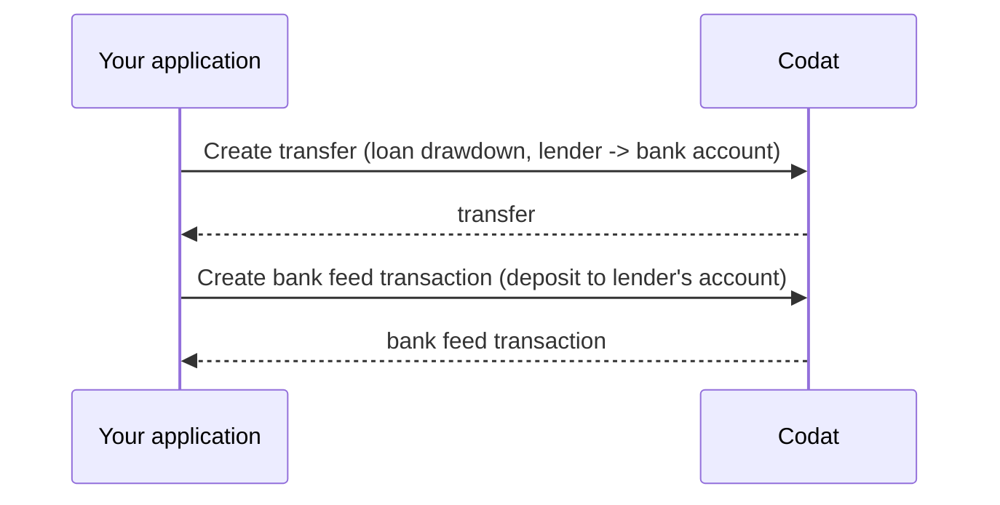

import Tabs from "@theme/Tabs";
import TabItem from "@theme/TabItem";

Une fois que vous recevez les informations de configuration, vous êtes prêt à déposer les fonds dans le compte bancaire de l'emprunteur. Cela est connu sous le nom de _décaissement de prêt_ dans le prêt général, et d'_avance_ dans le financement de factures. Vous devrez :

1. [Créer un transfert](/lending/guides/loan-writeback/deposit#create-transfer) du compte bancaire du prêteur vers le compte bancaire de l'emprunteur.

2. [Créer une transaction de flux bancaire](/lending/guides/loan-writeback/deposit#create-bank-feed-transaction) pour représenter le transfert de compte dans le compte bancaire du prêteur.



Pour effectuer ces opérations, vous aurez besoin des propriétés suivantes :

- `lendersBankAccountId` du prêteur ([`lendersBankAccountId`](/lending-api#/AccountingBankAccount))
- `borrowersBankAccount.id` et `currency` de la PME ([`borrowersBankAccount.id`](/lending-api#/AccountingBankAccount))
- `depositDate` - la date à laquelle le financement a été déposé dans le compte bancaire de l'emprunteur
- `depositAmount` - le montant du financement ou l'avance fournie à la PME

### Créer un transfert

Pour enregistrer le transfert d'argent du compte bancaire du prêteur vers le compte bancaire de l'emprunteur :

1. Utilisez l'endpoint [Get create transfer model](/lending-api#/operations/get-create-transfers-model) pour déterminer les paramètres de la requête de transfert.

2. Appelez l'endpoint [Create transfer](/lending-api#/operations/create-transfer) pour effectuer le transfert d'argent. Notez que vous effectuez un transfert _de_ `lendersBankAccountId` _vers_ `borrowersBankAccount.id`.

<Tabs groupId="language">
<TabItem value="nodejs" label="TypeScript">

```javascript
codatLending.loanWriteback.transfers.create({
    accountingTransfer: {
        date: depositDate,
        from: {
            accountRef: {
                id: lendersBankAccountId,
            },
            amount: depositAmount,
            currency: borrowersBankAccount.currency,
        },
        to: {
            accountRef: {
                id: borrowersBankAccount.id,
            },
            amount: depositAmount,
            currency: borrowersBankAccount.currency,
        },
    },
    companyId: companyId,
    connectionId: connectionId,
    }).then((res: CreateTransferResponse) => {
    if (res.statusCode == 200) {
        // handle response
    }
});
```

</TabItem>

<TabItem value="python" label="Python">

```python
transfers_create_request = operations.CreateTransferRequest(
    accounting_transfer=shared.AccountingTransfer(
        date_=deposit_date,
        from_=shared.TransferAccount(
            account_ref=shared.AccountRef(
                id=lenders_bank_account_id,
            ),
            amount=Decimal(deposit_amount),
            currency=borrowers_bank_account.currency,
        ),
        to=shared.TransferAccount(
            account_ref=shared.AccountRef(
                id=borrowers_bank_account_id,
            ),
            amount=Decimal(deposit_amount),
            currency=borrowers_bank_account.currency,
        ),
    ),
    company_id=company_id,
    connection_id=connection_id,
)

transfers_create_response = codat_lending.loan_writeback.transfers.create(transfers_create_request)
```

</TabItem>

<TabItem value="csharp" label="C#">

```csharp
var transfersCreateResponse = await codatLending.LoanWriteback.Transfers.CreateAsync(new CreateTransferRequest() {
    AccountingTransfer = new AccountingTransfer() {
        Date = depositDate,
        From = new TransferAccount() {
            AccountRef = new AccountRef() {
                Id = lendersBankAccountId,
            },
            Amount = depositAmount,
            Currency = borrowersBankAccount.currency,
        },
        To = new TransferAccount() {
            AccountRef = new AccountRef() {
                Id = borrowersBankAccountId,
            },
            Amount = depositAmount,
            Currency = borrowersBankAccount.currency,
        },
    },
    CompanyId = companyId,
    ConnectionId = connectionId,
});
```

</TabItem>

<TabItem value="go" label="Go">

```go
ctx := context.Background()
transfersCreateResponse, err := codatLending.LoanWriteback.Transfers.Create(ctx, operations.CreateTransferRequest{
    AccountingTransfer: &shared.AccountingTransfer{
        Date: lending.String(depositDate),
        From: &shared.TransferAccount{
            AccountRef: &shared.AccountRef{
                ID: lending.String(lendersBankAccountID),
            },
            Amount: types.MustNewDecimalFromString(depositAmount),
            Currency: lending.String(borrowersBankAccount.currency),
        },
        To: &shared.TransferAccount{
            AccountRef: &shared.AccountRef{
                ID: lending.String(borrowersBankAccountID),
            },
            Amount: types.MustNewDecimalFromString(depositAmount),
            Currency: lending.String(borrowersBankAccount.currency),
        },
    },
    CompanyID: companyID,
    ConnectionID: connectionID,
})
```

</TabItem>

<TabItem value="http" label="HTTP">

```http
POST https://api.codat.io/companies/{companyId}/connections/{connectionId}/push/transfers
```

#### Corps de la requête

```json
{
    "date": depositDate,
    "from": {
        "accountRef": {
            "id": lendersBankAccountId,
        },
        "account": depositAmount,
        "currency": borrowersBankAccount.currency,
    },
    "to": {
        "accountRef": {
            "id": borrowersBankAccount.id,
        },
        "account": depositAmount,
        "currency": borrowersBankAccount.currency,
    }
}
```

</TabItem>

</Tabs>

### Créer une transaction de flux bancaire

Pour enregistrer le dépôt du prêt dans le compte bancaire du prêteur :

1. Obtenez le [modèle de création de transactions de compte bancaire](/lending-api#/operations/get-create-bank-transactions-model) pour déterminer les paramètres requis pour la création de la transaction.

2. [Créez des transactions de compte bancaire](/lending-api#/operations/create-bank-transactions) pour déposer le montant dans le compte bancaire du prêteur.

Nous avons fourni des exemples de payloads de création de transactions bancaires dans les extraits ci-dessous :

<Tabs groupId="language">
<TabItem value="nodejs" label="TypeScript">

```javascript
codatLending.loanWriteback.bankTransactions.create({
    accountingCreateBankTransactions: {
        accountId: lendersBankAccountId,
        transactions: [
        {
            id: transactionId, // Unique identifier for this bank transaction
            amount: -depositAmount,
            date: depositDate,
            description: description, // Include a reference to the transfer, the loan and you, the lender
        },
        ],
    },
    accountId: lendersBankAccount.Id,
    companyId: companyId,
    connectionId: connectionId,
}).then((res: CreateBankTransactionsResponse) => {
if (res.statusCode == 200) {
    // handle response
}
});
```

</TabItem>

<TabItem value="python" label="Python">

```python
bank_transactions_create_request = operations.CreateBankTransactionsRequest(
    accounting_create_bank_transactions=shared.AccountingCreateBankTransactions(
        account_id=lenders_bank_account_id,
        transactions=[
            shared.CreateBankAccountTransaction(
                id=transaction_id, # Unique identifier for this bank transaction
                amount=Decimal(-deposit_amount),
                date_=deposit_Date,
                description=description, # Include a reference to the transfer, the loan and you, the lender
            ),
        ],
    ),
    account_id=lenders_bank_account.id,
    company_id=company_id,
    connection_id=connection_id,
)

bank_transactions_create_response = codat_lending.loan_writeback.bank_transactions.create(bank_transactions_create_request)
```

</TabItem>

<TabItem value="csharp" label="C#">

```csharp
var bankTransactionsCreateResponse = await codatLending.LoanWriteback.BankTransactions.CreateAsync(new CreateBankTransactionsRequest() {
    AccountingCreateBankTransactions = new AccountingCreateBankTransactions() {
        AccountId = lendersBankAccountId,
        Transactions = new List<CreateBankAccountTransaction>() {
            new CreateBankAccountTransaction() {
                Id = transactionId, // Unique identifier for this bank transaction
                Amount = -depositAmount,
                Date = depositDate,
                Description = description, // Include a reference to the transfer, the loan and you, the lender
            },
        },
    },
    AccountId = lendersBankAccount.Id,
    CompanyId = companyId,
    ConnectionId = connectionId
});
```

</TabItem>

<TabItem value="go" label="Go">

```go
ctx := context.Background()
bankTransactionsCreateRequest, err := codatLending.LoanWriteback.BankTransactions.Create(ctx, operations.CreateBankTransactionsRequest{
    AccountingCreateBankTransactions: &shared.AccountingCreateBankTransactions{
        AccountID: lending.String(lendersBankAccount.ID),
        Transactions: []shared.CreateBankAccountTransaction{
            shared.CreateBankAccountTransaction{
                ID: lending.String(transactionID), // Unique identifier for this bank transaction
                Amount: types.MustNewDecimalFromString(-depositAmount),
                Date: lending.String(depositDate),
                Description: lending.String(description), // Include a reference to the transfer, the loan and you, the lender
            },
        },
    },
    AccountID: lendersBankAccount.ID,
    CompanyID: companyID,
    ConnectionID: connectionID,
})
```

</TabItem>

<TabItem value="http" label="HTTP">

```http
POST https://api.codat.io/companies/{companyId}/connections/{connectionId}/push/bankAccounts/{accountId}/bankTransactions
```

#### Corps de la requête

```json
{
  "accountId": lendersBankAccountId,
  "transactions": [{
    "id": transactionId, // Unique identifier for this bank transaction
    "amount": -depositAmount,
    "date": depositDate,
    "description": description // Include a reference to the transfer, the loan and you, the lender
  }]
}
```

</TabItem>

</Tabs>

---

## Lire la suite

- [Enregistrer le remboursement d'un prêt](/lending/guides/loan-writeback/record-general-loan).
