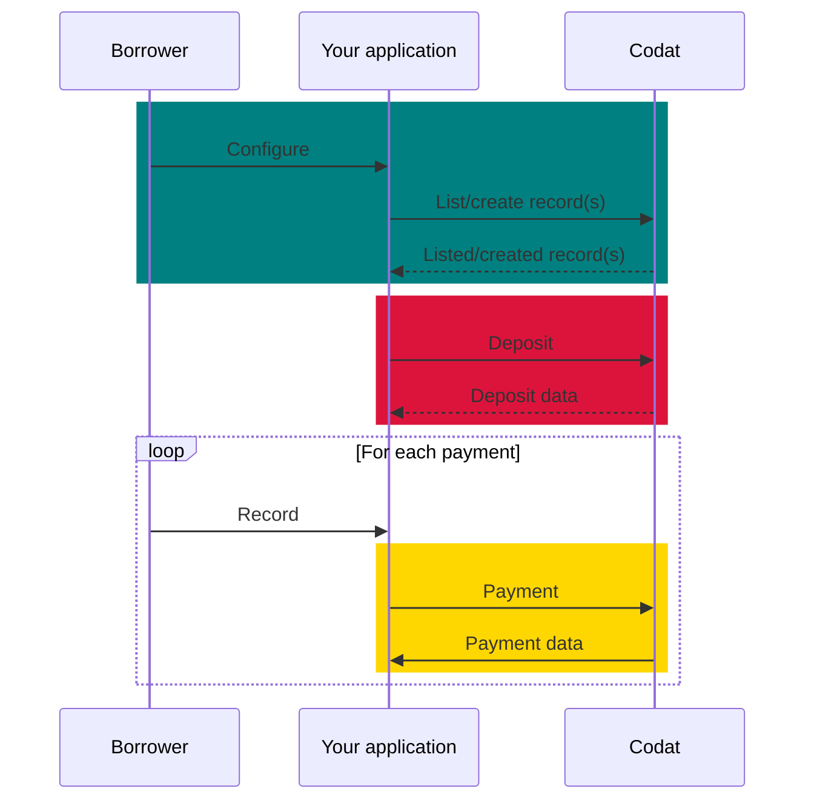
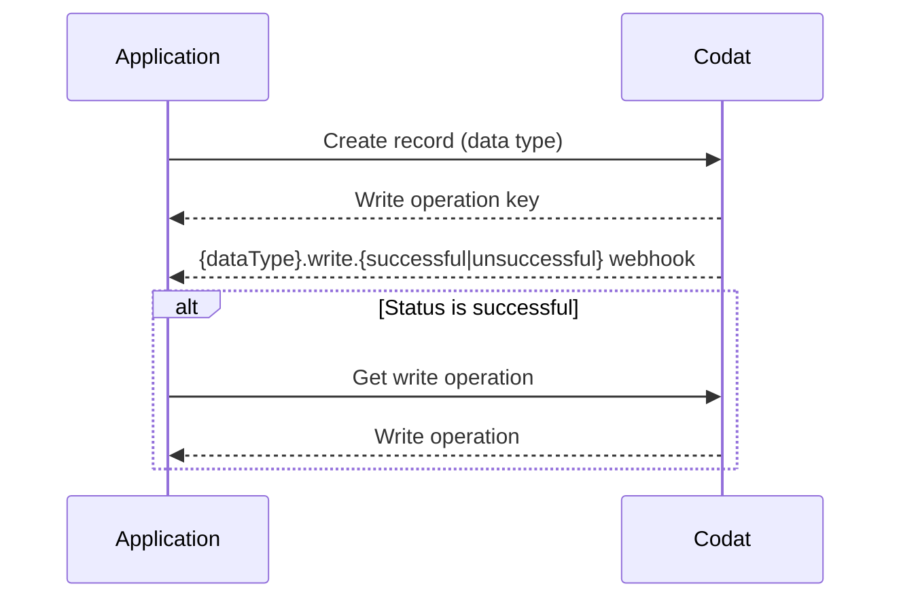

import Tabs from "@theme/Tabs";
import TabItem from "@theme/TabItem";

## Aperçu

Ce guide vous accompagne à travers les étapes nécessaires pour implémenter et exécuter la procédure de réécriture de prêt dans votre entreprise de prêt en utilisant Codat. Vous apprendrez comment configurer Codat et l'utiliser pour créer des transactions qui représentent le dépôt et le remboursement du prêt dans le logiciel de comptabilité de vos clients.

Cette solution couvre la procédure de réécriture de prêt pour le prêt général, comme les prêts à terme, et le financement sélectif de factures.

:::tip Gagnez du temps avec notre SDK

Déployez votre solution de réécriture de prêt plus rapidement en utilisant notre SDK Lending pour intégrer directement avec notre API. L'espace de noms loan writeback inclut toutes les méthodes dont vous avez besoin pour développer votre solution de réécriture de prêt.

Consultez nos SDK pour [TypeScript](https://github.com/codatio/client-sdk-typescript/tree/main/lending#loanwriteback), [Python](https://github.com/codatio/client-sdk-python/tree/main/lending#loan_writeback), [C#](https://github.com/codatio/client-sdk-csharp/tree/main/lending#loanwriteback), [Go](https://github.com/codatio/client-sdk-go/tree/main/lending#loanwriteback) et [Java](https://github.com/codatio/client-sdk-java/tree/main/lending#loanwriteback).

:::

### Qu'est-ce que la réécriture de prêt?

La réécriture de prêt (aussi connue sous le nom de lending writeback) est le processus de mise à jour continue d'un logiciel de comptabilité avec les informations relatives à un prêt. Elle aide à maintenir une position précise du prêt pendant tout le cycle de prêt en enregistrant le passif du prêt, les intérêts, frais ou remboursements, et en facilitant le rapprochement des comptes bancaires.

:::warning Autorisation des flux bancaires

Pour certains logiciels de comptabilité, vous devez obtenir une approbation pour intégrer les flux bancaires avant d'implémenter la réécriture de prêt.

:::

### Pourquoi l'utiliser?

Un comptable peut comptabiliser un prêt de nombreuses façons dans un logiciel de comptabilité. Par exemple, certains comptables peuvent enregistrer un prêt par erreur comme un revenu direct ou même une facture de vente.

Cela a pour résultat que les prêts sont incorrectement enregistrés comme des revenus et les remboursements comme des coûts d'exploitation. À la fin de la période de déclaration, cela peut rendre difficile pour le comptable de clôturer ses livres.

En implémentant la fonctionnalité de réécriture de prêt dans votre application, vous pouvez vous assurer que la comptabilité des prêts est effectuée régulièrement, correctement et rapidement afin de toujours voir un état à jour des comptes de l'emprunteur.

De manière critique, la fonctionnalité de réécriture de prêt aide les prêteurs à identifier clairement les prêts dans le logiciel de comptabilité d'une PME. En conséquence, le prêteur voit une image plus précise de l'historique de remboursement de la dette de la PME, ce qui conduit à une meilleure souscription.

:::info Réécriture de prêt obligatoire

Certains logiciels de comptabilité **exigent** que les prêteurs mettent continuellement à jour leurs livres avec l'argent prêté aux PME. Par exemple, **Xero** oblige les prêteurs passant par le processus de [certification App Partner](/integrations/accounting/xero/xero-app-partner-program) à gérer le processus de réécriture.

:::

### Quel est le processus?

Le processus de réécriture de prêt implique l'enregistrement des retraits, remboursements et intérêts du prêt dans le logiciel de comptabilité de la PME. Il peut être divisé en trois étapes, comme montré sur le diagramme ci-dessous :

1. **Configurer** la réécriture de prêt pour votre client PME.

2. **Déposer** le prêt et le refléter dans le logiciel de comptabilité de la PME.

3. **Enregistrer** les paiements qui vous sont dus, en tant que prêteur, dans le logiciel de comptabilité de votre PME.

Le processus est identique pour les scénarios de prêt général et de financement de factures.

### Exemples

Pour obtenir un contexte supplémentaire sur le résultat de la réécriture de prêt, examinez les exemples pour les deux cas d'utilisation de prêt. Les exemples fournissent une vue des transactions de [flux bancaires](/bank-feeds/overview) et des transactions comptables créées pendant le processus.

<Tabs>
<TabItem value="general-lending" label="General lending">

Le prêteur accepte de fournir un prêt de 10 000 £ à une PME et facture des frais de 200 £, en demandant le remboursement en parts égales sur 2 mois.

Le prêteur dépose 10 000 £ dans le compte bancaire désigné de la PME. Le mois suivant, l'emprunteur rembourse la première moitié du prêt et rembourse le prêt en totalité le mois d'après.

Dans l'exemple, vous pouvez également voir que chaque transaction de flux bancaire correspond à une transaction de compte bancaire dans le logiciel de comptabilité. Cela aide l'emprunteur à rapprocher les deux comptes bancaires.

</TabItem>

<TabItem value="invoice-finance" label="Selective invoice finance">

Le prêteur accepte de fournir à la PME une avance de 800 £ pour une facture de 1 000 £ avec des frais de 50 £. Le prêteur dépose 800 £ dans le compte bancaire de la PME et le client de la PME paie la facture dans le délai de paiement.

Lorsque la PME reçoit le paiement du client, les fonds sont transférés du compte bancaire de l'emprunteur vers le compte bancaire du prêteur, réglant le prêt et les frais associés. Les frais du prêteur sont ensuite déduits de ce paiement.

En conséquence, les transactions du compte du prêteur s'équilibrent à zéro, et l'avance et le montant restant demeurent dans le compte de l'emprunteur.

<!-- This is wrong and we need to find and amend the original -->
<!--  -->

</TabItem>
</Tabs>

## Prérequis

- Si vous implémentez la réécriture de prêt pour Xero, _Xero Bank Feeds API_ doit être activée pour votre application enregistrée. Xero le fait généralement pendant le processus de certification des applications de prêteurs afin que vous puissiez tester votre solution avant de compléter la certification.

- Vérifiez que vous avez [créé une entreprise Codat](/configure/portal/companies#add-a-new-company) qui représente votre client PME et que vous l'avez liée à un logiciel de comptabilité. Si vous utilisez déjà Codat pour le prêt, il est probable que vous ayez précédemment créé quelques entreprises.

  Vous devriez également créer et connecter une entreprise de test à utiliser pendant la construction de votre solution.

- En tant que prêteur, utilisez la solution [Bank Feeds](/bank-feeds/overview) de Codat pour représenter votre compte bancaire dans le domaine de Codat. Gardez l'`id` du [compte bancaire source](/bank-feeds-api#/operations/create-source-account) car vous l'utiliserez lors de l'enregistrement des dépôts et des remboursements.

- Familiarisez-vous avec l'approche asynchrone de Codat pour l'[écriture de données](/using-the-api/push), qui exploite les [webhooks](/using-the-api/webhooks/overview). Ce processus peut être résumé comme suit :

---

## Lire la suite

- Apprenez comment [configurer](/lending/guides/loan-writeback/configure) la réécriture de prêt, de la création des éléments clés dans le domaine de Codat à la possibilité pour votre client de les mapper.
