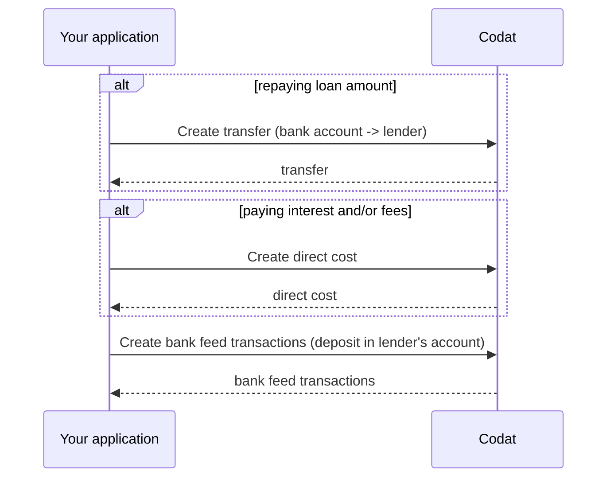

import Tabs from "@theme/Tabs";
import TabItem from "@theme/TabItem";

Le processus de réécriture de prêt est le même pour le prêt général et le financement de factures. La distinction clé réside dans la méthode de remboursement : le prêt général implique généralement des paiements récurrents, tandis que le financement de factures est remboursé lorsque le client de la PME paie la facture.

Sur cette page, nous nous concentrons sur le prêt général et fournissons des détails supplémentaires sur l'automatisation du processus pour les fournisseurs de financement de factures.

## Enregistrer le remboursement

Pour refléter les remboursements de prêt de manière programmatique, effectuez ces étapes chaque fois qu'un remboursement est effectué :

1. [Créer un transfert](/lending/guides/loan-writeback/record-general-loan#create-transfer) du compte bancaire de l'emprunteur vers celui du prêteur pour chaque remboursement.

2. [Créer un coût direct](/lending/guides/loan-writeback/record-general-loan#create-direct-cost) pour enregistrer les intérêts ou les frais.

3. [Créer des transactions de flux bancaires](/lending/guides/loan-writeback/record-general-loan#create-bank-feed-transactions) pour représenter le transfert et le coût direct dans le compte bancaire du prêteur.

Par exemple, si l'emprunteur a contracté un prêt de 1 000 £ avec des frais de 20 %, le montant total dû s'élève à 1 200 £. Avec un plan de remboursement en versements égaux sur 3 mois, l'emprunteur rembourse 400 £ chaque mois.

Cela signifie que vous devez créer un transfert de 320 £ pour représenter le paiement, un coût direct de 80 £ pour enregistrer les frais, et une transaction bancaire de 400 £ pour réduire le passif envers le prêteur.

:::info Remboursez selon vos conditions

Notre exemple montre comment enregistrer les remboursements de prêt avec des paiements mensuels couvrant à la fois le décaissement et les frais. Pour séparer les remboursements des paiements de frais ou d'intérêts, incluez un transfert du compte de l'emprunteur vers le compte du prêteur qui est égal au montant des frais ou des intérêts. Ensuite, créez le coût direct associé pour enregistrer les frais et/ou les intérêts.

:::



Pour effectuer ces opérations, vous aurez besoin des propriétés suivantes :

- `supplier.id` du prêteur ([`supplier.id`](/lending-api#/schemas/AccountingSupplier)) et [`lendersBankAccountId`](/lending-api#/AccountingBankAccount)
- `expenseAccount.id` de la PME ([`expenseAccount.id`](/lending-api#/schemas/AccountingAccount)), [`borrowersBankAccount.id`](/lending-api#/AccountingBankAccount) et `currency`
- `repaymentDate` - la date du remboursement
- `repaymentAmount` - le montant remboursant le capital du prêt
- `interestAndFeesAmount` - le montant payant les intérêts et les frais
- `totalRepaymentAmount`, où `totalRepaymentAmount = repaymentAmount + interestAndFeesAmount`

### Créer un transfert

Utilisez l'endpoint [Create transfer](/lending-api#/operations/create-transfer) à nouveau, cette fois pour enregistrer le montant total du remboursement. Notez que vous effectuez un transfert _de_ `borrowersBankAccount.id` _vers_ `lendersBankAccountId`.

<Tabs groupId="language">
<TabItem value="nodejs" label="TypeScript">

```javascript
codatLending.loanWriteback.transfers.create({
    accountingTransfer: {
        date: repaymentDate,
        from: {
            accountRef: {
                id: borrowersBankAccount.id,
            },
            amount: totalRepaymentAmount,
            currency: borrowersBankAccount.currency,
        },
        to: {
            accountRef: {
                id: lendersBankAccountId,
            },
            amount: totalRepaymentAmount,
            currency: borrowersBankAccount.currency,
        },
    },
    companyId: companyId,
    connectionId: connectionId,
    }).then((res: CreateTransferResponse) => {
    if (res.statusCode == 200) {
        // handle response
    }
});
```

</TabItem>

<TabItem value="python" label="Python">

```python
transfers_create_request = operations.CreateTransferRequest(
    accounting_transfer=shared.AccountingTransfer(
        date_=repaymentDate,
        from_=shared.TransferAccount(
            account_ref=shared.AccountRef(
                id=borrowers_bank_account.id,
            ),
            amount=Decimal(total_repayment_amount),
            currency=borrowers_bank_account.currency,
        ),
        to=shared.TransferAccount(
            account_ref=shared.AccountRef(
                id=lenders_bank_account_id,
            ),
            amount=Decimal(total_repayment_amount),
            currency=borrowers_bank_account.currency,
        ),
    ),
    company_id=company_id,
    connection_id=connection_id,
)

transfers_create_response = codat_lending.loan_writeback.transfers.create(transfers_create_request)
```

</TabItem>

<TabItem value="csharp" label="C#">

```csharp
var transfersCreateResponse = await codatLending.LoanWriteback.Transfers.CreateAsync(new CreateTransferRequest() {
    AccountingTransfer = new AccountingTransfer() {
        Date = repaymentDate,
        From = new TransferAccount() {
            AccountRef = new AccountRef() {
                Id = borrowersBankAccount.Id,
            },
            Amount = totalRepaymentAmount,
            Currency = borrowersBankAccount.Currency,
        },
        To = new TransferAccount() {
            AccountRef = new AccountRef() {
                Id = lendersBankAccountId,
            },
            Amount = totalRepaymentAmount,
            Currency = borrowersBankAccount.Currency,
        },
    },
    CompanyId = companyId,
    ConnectionId = connectionId,
});
```

</TabItem>

<TabItem value="go" label="Go">

```go
ctx := context.Background()
transfersCreateResponse, err := codatLending.LoanWriteback.Transfers.Create(ctx, operations.CreateTransferRequest{
    AccountingTransfer: &shared.AccountingTransfer{
        Date: lending.String(repaymentDate),
        From: &shared.TransferAccount{
            AccountRef: &shared.AccountRef{
                ID: lending.String(borrowersBankAccount.ID),
            },
            Amount: types.MustNewDecimalFromString(totalRepaymentAmount),
            Currency: lending.String(borrowersBankAccount.Currency),
        },
        To: &shared.TransferAccount{
            AccountRef: &shared.AccountRef{
                ID: lending.String(lendersBankAccountID),
            },
            Amount: types.MustNewDecimalFromString(totalRepaymentAmount),
            Currency: lending.String(borrowersBankAccount.Currency),
        },
    },
    CompanyID: companyID,
    ConnectionID: connectionID,
})
```

</TabItem>

<TabItem value="java" label="Java">

```java
CreateTransferRequest req = CreateTransferRequest.builder()
    .companyId(companyId)
    .connectionId(connectionId)
    .accountingTransfer(AccountingTransfer.builder()
        .date(repaymentDate)
        .from(TransferAccount.builder()
            .accountRef(AccountRef.builder()
                .id(borrowersBankAccount.id)
                .build()
            )
            .amount(totalRepaymentAmount)
            .currency(borrowersBankAccount.currency)
            .build())
        .to(TransferAccount.builder()
            .accountRef(AccountRef.builder()
                .id(lendersBankAccountId)
                .build()
            )
            .amount(totalRepaymentAmount)
            .currency(borrowersBankAccount.currency)
            .build())
        .build())
    .build();

CreateTransferResponse res = codatLending.loanWriteback().transfers().create()
    .request(req)
    .call();
```

</TabItem>

<TabItem value="http" label="HTTP">

```http
POST https://api.codat.io/companies/{companyId}/connections/{connectionId}/push/transfers
```

#### Corps de la requête

```json
{
    "date": repaymentDate,
    "from": {
        "accountRef": {
            "id": borrowersBankAccount.id,
        },
        "account": totalRepaymentAmount,
        "currency": borrowersBankAccount.currency,
    },
    "to": {
        "accountRef": {
            "id": lendersBankAccountId,
        },
        "account": totalRepaymentAmount,
        "currency": borrowersBankAccount.currency,
    }
}
```

</TabItem>

</Tabs>

### Créer un coût direct

Vérifiez le [modèle de création de coût direct](/lending-api#/operations/get-create-directCosts-model), puis utilisez l'endpoint [Create direct cost](/lending-api#/operations/create-direct-cost) pour capturer le montant des frais ou des intérêts encourus par l'emprunteur.

<Tabs groupId="language">
<TabItem value="nodejs" label="TypeScript">

```javascript
codatLending.loanWriteback.directCosts.create({
    accountingDirectCost: {
        contactRef: {
            dataType: "suppliers",
            id: supplier.id,
        },
        currency: borrowersBankAccount.currency,
        issueDate: repaymentDate,
        lineItems: [
        {
            accountRef: {
                id: expenseAccount.id,
            },
            description: "Fees and/or interest",
            quantity: 1,
            taxAmount: 0,
            unitAmount: interestAndFeesAmount,
        },
        ],
        paymentAllocations: [
        {
            allocation: {
                totalAmount: interestAndFeesAmount,
            },
            payment: {
                accountRef: {
                    id: lendersBankAccountId,
                },
            },
        },
        ],
        taxAmount: 0.0,
        totalAmount: interestAndFeesAmount,
    },
    companyId: companyId,
    connectionId: connectionId,
    }).then((res: CreateDirectCostResponse) => {
    if (res.statusCode == 200) {
        // handle response
    }
});
```

</TabItem>

<TabItem value="python" label="Python">

```python
direct_costs_create_request = operations.CreateDirectCostRequest(
    accounting_direct_cost=shared.AccountingDirectCost(
        contact_ref=shared.ContactRef(
            data_type='suppliers',
            id=supplier.id,
        ),
        currency=borrowersBankAccount.currency,
        issue_date=repaymentDate,
        line_items=[
            shared.DirectCostLineItem(
                account_ref=shared.AccountRef(
                    id=expense_account.id,
                ),
                description='Fees and/or interest',
                quantity=Decimal('1'),
                tax_amount=Decimal('0'),
                unit_amount=Decimal(interest_and_fees_amount),
            ),
        ],
        payment_allocations=[
            shared.AccountingPaymentAllocation(
                allocation=shared.AccountingPaymentAllocationAllocation(
                    total_amount=Decimal(interest_and_fees_amount),
                ),
                payment=shared.PaymentAllocationPayment(
                    account_ref=shared.AccountRef(
                        id=lenders_bank_account_id,
                    ),
                ),
            ),
        ],
        tax_amount=Decimal('0'),
        total_amount=Decimal(interest_and_fees_amount),
    ),
    company_id=company_id,
    connection_id=connection_id,
)

direct_costs_create_response = codat_lending.loan_writeback.direct_costs.create(direct_costs_create_request)
```

</TabItem>

<TabItem value="csharp" label="C#">

```csharp
var redirectCostsCreateResponse = await codatLending.LoanWriteback.DirectCosts.CreateAsync(new CreateDirectCostRequest() {
    AccountingDirectCost = new AccountingDirectCost() {
        ContactRef = new ContactRef() {
            DataType = "suppliers",
            Id = supplier.id,
        },
        Currency = borrowersBankAccount.Currency,
        IssueDate = repaymentDate,
        LineItems = new List<DirectCostLineItem>() {
            new DirectCostLineItem() {
                AccountRef = new AccountRef() {
                    Id = expenseAccount.Id,
                },
                Description = "Fees and/or interest",
                Quantity = 1M,
                TaxAmount = 0M,
                UnitAmount = interestAndFeesAmount,
            },
        },
        PaymentAllocations = new List<AccountingPaymentAllocation>() {
            new AccountingPaymentAllocation() {
                Allocation = new AccountingPaymentAllocationAllocation() {
                    TotalAmount = interestAndFeesAmount,
                },
                Payment = new PaymentAllocationPayment() {
                    AccountRef = new AccountRef() {
                        Id = lendersBankAccountId,
                    },
                },
            },
        },
        TaxAmount = 0M,
        TotalAmount = interestAndFeesAmount,
    },
    CompanyId = companyId,
    ConnectionId = connectionId,
});
```

</TabItem>

<TabItem value="go" label="Go">

```go
ctx := context.Background()
res, err := codatLending.LoanWriteback.DirectCosts.Create(ctx, operations.CreateDirectCostRequest{
    AccountingDirectCost: &shared.AccountingDirectCost{
        ContactRef: &shared.ContactRef{
            DataType: lending.String("suppliers"),
            ID: supplier.ID,
        },
        Currency: borrowersBankAccount.Currency,
        IssueDate: repaymentDate,
        LineItems: []shared.DirectCostLineItem{
            shared.DirectCostLineItem{
                AccountRef: &shared.AccountRef{
                    ID: lending.String(expenseAccount.ID),
                },
                Description: lending.String("Fees and/or interest"),
                Quantity: types.MustNewDecimalFromString("1"),
                TaxAmount: types.MustNewDecimalFromString("0"),
                UnitAmount: types.MustNewDecimalFromString(interestAndFeesAmount),
            },
        },
        PaymentAllocations: []shared.AccountingPaymentAllocation{
            shared.AccountingPaymentAllocation{
                Allocation: shared.AccountingPaymentAllocationAllocation{
                    TotalAmount: types.MustNewDecimalFromString(interestAndFeesAmount),
                },
                Payment: shared.PaymentAllocationPayment{
                    AccountRef: &shared.AccountRef{
                        ID: lending.String(lendersBankAccountID),
                    },
                },
            },
        },
        TaxAmount: types.MustNewDecimalFromString("0"),
        TotalAmount: types.MustNewDecimalFromString(interestAndFeesAmount),
    },
    CompanyID: companyID,
    ConnectionID: connectionID,
})
```

</TabItem>

<TabItem value="java" label="Java">

```java
CreateDirectCostRequest req = CreateDirectCostRequest.builder()
    .companyId(companyId)
    .connectionId(connectionId)
    .directCostPrototype(DirectCostPrototype.builder()
        contactRef(ContactRef.builder()
            .dataType("suppliers")
            .id(supplier.Id)
            .build()
        )
        .currency(borrowersBankAccount.currency)
        .issueDate(repaymentDate)
        .lineItems(List.of(
            DirectCostLineItem.builder()
                .accountRef(AccountRef.builder()
                    .id(expenseAccount.Id)
                    .build()
                )
                .description("Fees and/or interest")
                .quantity(new BigDecimal("1"))

                .taxAmount(new BigDecimal("0"))
                .unitAmount(new BigDecimal(interestAndFeesAmount))
                .build()
            )
        )
        .paymentAllocations(List.of(
            AccountingPaymentAllocation.builder()
                .allocation(Allocation.builder()
                    .totalAmount(new BigDecimal(interestAndFeesAmount))
                    .build()
                )
                .payment(PaymentAllocationPayment.builder()
                    .accountRef(AccountRef.builder()
                        .id(expenseAccount.Id)
                        .build()
                    )
                    .build()
                )
                .build()
            )
        )
        .taxAmount(new BigDecimal("0"))
        .totalAmount(new BigDecimal(interestAndFeesAmount))
        .build())
    .build();

CreateDirectCostResponse res = codatLending.loanWriteback().directCosts().create()
    .request(req)
    .call();
```

</TabItem>

<TabItem value="http" label="HTTP">

```http
POST https://api.codat.io/companies/{companyId}/connections/{connectionId}/push/directCosts
```

#### Corps de la requête

```json
{
	"issueDate": repaymentDate,
	"currency": borrowersBankAccount.currency,
	"taxAmount": 0.0,
	"totalAmount": interestAndFeesAmount,
	"contactRef": {
		"id": supplier.id,
		"dataType": "suppliers"
	},
	"paymentAllocations": [{
		"payment": {
			"accountRef": {
				"id": lendersBankAccountId
			}
		},
		"allocation": {
			"totalAmount": interestAndFeesAmount
		}
	}],
	"lineItems": [{
		"description": Fees and/or interest,
		"quantity": 1,
		"unitAmount": interestAndFeesAmount,
		"taxAmount": 0,
		"accountRef": {
			"id": expenseAccount.id
		}
	}]
}
```

</TabItem>

</Tabs>

### Créer des transactions de flux bancaires

Utilisez l'endpoint [Create bank account transactions](/lending-api#/operations/create-bank-transactions) pour déposer le montant total (incluant le remboursement, les frais et les intérêts) dans le compte bancaire du prêteur.

<Tabs groupId="language">
<TabItem value="nodejs" label="TypeScript">

```javascript
codatLending.loanWriteback.bankTransactions.create({
    accountingCreateBankTransactions: {
        accountId: lendersBankAccount.id,
        transactions: [
        {
            id: transactionId, // Unique identifier for this bank transaction
            amount: totalRepaymentAmount,
            date: repaymentDate,
            description: description, // Include a reference to the direct cost, the loan and you, the lender
        },
        ],
    },
    accountId: lendersBankAccountId,
    companyId: companyId,
    connectionId: connectionId,
}).then((res: CreateBankTransactionsResponse) => {
if (res.statusCode == 200) {
    // handle response
}
});
```

</TabItem>

<TabItem value="python" label="Python">

```python
bank_transactions_create_request = operations.CreateBankTransactionsRequest(
    accounting_create_bank_transactions=shared.AccountingCreateBankTransactions(
        account_id=lenders_bank_account_id,
        transactions=[
            shared.CreateBankAccountTransaction(
                id=transaction_id, # Unique identifier for this bank transaction
                amount=Decimal(total_repayment_amount),
                date_=repayment_date,
                description=description, # Include a reference to the direct cost, the loan and you, the lender
            ),
        ],
    ),
    account_id=lenders_bank_account.id,
    company_id=company_id,
    connection_id=connection_id,
)

bank_transactions_create_response = codat_lending.loan_writeback.bank_transactions.create(bank_transactions_create_request)
```

</TabItem>

<TabItem value="csharp" label="C#">

```csharp
var bankTransactionsCreateResponse = await codatLending.LoanWriteback.BankTransactions.CreateAsync(new CreateBankTransactionsRequest() {
    AccountingCreateBankTransactions = new AccountingCreateBankTransactions() {
        AccountId = lendersBankAccountId,
        Transactions = new List<CreateBankAccountTransaction>() {
            new CreateBankAccountTransaction() {
                Id = transactionId, // Unique identifier for this bank transaction
                Amount = totalRepaymentAmount,
                Date = repaymentDate,
                Description = description, // Include a reference to the direct cost, the loan and you, the lender
            },
        },
    },
    AccountId = lendersBankAccount.Id,
    CompanyId = companyId,
    ConnectionId = connectionId
});
```

</TabItem>

<TabItem value="go" label="Go">

```go
ctx := context.Background()
bankTransactionsCreateRequest, err := codatLending.LoanWriteback.BankTransactions.Create(ctx, operations.CreateBankTransactionsRequest{
    AccountingCreateBankTransactions: &shared.AccountingCreateBankTransactions{
        AccountID: lending.String(lendersBankAccountID),
        Transactions: []shared.CreateBankAccountTransaction{
            shared.CreateBankAccountTransaction{
                ID: lending.String(transactionID), // Unique identifier for this bank transaction
                Amount: types.MustNewDecimalFromString(totalRepaymentAmount),
                Date: lending.String(repaymentDate),
                Description: lending.String(description), // Include a reference to the direct cost, the loan and you, the lender
            },
        },
    },
    AccountID: lendersBankAccountID,
    CompanyID: companyID,
    ConnectionID: connectionID,
})
```

</TabItem>

<TabItem value="java" label="Java">

```java
CreateBankTransactionsRequest req = CreateBankTransactionsRequest.builder()
    .companyId(companyId)
    .connectionId(connectionId)
    .accountId(lendersBankAccountId)
    .accountingCreateBankTransactions(AccountingCreateBankTransactions.builder()
        .accountId(lendersBankAccountId)
        .transactions(List.of(
            CreateBankAccountTransaction.builder()
                .id(transactionID) // Unique identifier for this bank transaction
                .amount(new BigDecimal(totalRepaymentAmount))
                .date(repaymentDate)
                .description(description) // Include a reference to the direct cost, the loan and you, the lender
                .build()))
        .build())
    .build();

CreateBankTransactionsResponse res = codatLending.loanWriteback().bankTransactions().create()
    .request(req)
    .call();

```

</TabItem>

<TabItem value="http" label="HTTP">

```http
POST https://api.codat.io/companies/{companyId}/connections/{connectionId}/push/bankAccounts/{accountId}/bankTransactions
```

#### Corps de la requête

```json
{
  "accountId": lendersBankAccountId,
  "transactions": [{
    "id": transactionId, // Unique identifier for this bank transaction
    "amount": totalRepaymentAmount,
    "date": repaymentDate,
    "description": description // Include a reference to the direct cost, the loan and you, the lender
  }]
}
```

</TabItem>

</Tabs>

À la fin de ce processus en 3 étapes, votre emprunteur aura la réécriture de prêt correctement reflétée dans son logiciel de comptabilité. Cela lui fait gagner du temps sur le rapprochement et garantit que lui (et vous!) avez une clarté sur l'état du prêt.

## Remboursements de financement de factures

Certains fournisseurs de logiciels de comptabilité offrent des notifications par webhook qui vous alertent des changements apportés aux factures dans les comptes de la PME. En vous abonnant à ces notifications, vous pouvez automatiquement déclencher des remboursements une fois que le client paie la PME.

Pour améliorer l'automatisation de vos remboursements, consultez les webhooks pris en charge par [Xero](https://developer.xero.com/documentation/guides/webhooks/overview/) et [Intuit](https://developer.intuit.com/app/developer/qbo/docs/develop/webhooks).

:::tip Récapitulatif
Dans ce guide, vous avez appris :

- Ce qu'est la réécriture de prêt et à quoi elle sert.
- Comment mapper et configurer la solution de réécriture de prêt.
- Comment effectuer les écritures nécessaires en utilisant les endpoints de Codat.
  :::

---

## Lire la suite

- Vous cherchez à implémenter la réécriture de prêt pour Xero? Consultez la [propre documentation](https://developer.xero.com/documentation/guides/how-to-guides/general-lending-integration-guide/) de Xero.
- Examinez les autres fonctionnalités de la solution [Lending](/lending/overview).
