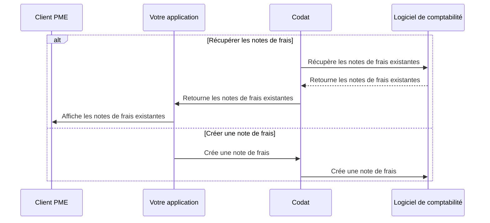

import Tabs from "@theme/Tabs";
import TabItem from "@theme/TabItem";
import RetrieveBills from "../_retrieve-bills.md";
import CreateBills from "../_create-bills.md";
import UploadAttachment from "../_upload-attachment.md";

:::tip Factures ou notes de frais?

Nous faisons la distinction entre les factures où l'entreprise _doit_ de l'argent et celles où l'entreprise _se fait devoir_ de l'argent. Si l'entreprise reçoit une facture et doit de l'argent en conséquence, nous appelons cela une **note de frais**.
:::

## Aperçu

Dans Codat, une note de frais représente une facture de _comptes fournisseurs_ émise à une PME par son fournisseur. Avec Bill Pay asynchrone, vous pouvez :

- Récupérer et mettre à jour les notes de frais existantes de votre client.
- Créer de nouvelles notes de frais dans votre système et les refléter dans le logiciel de comptabilité de votre client.

Nous avons mis en évidence cette séquence alternative d'étapes dans notre diagramme de processus détaillé ci-dessous.

<details>
<summary><b>Diagramme de processus détaillé</b></summary>



</details>

## Récupérer les notes de frais

:::tip Filtrer la liste des notes de frais

Les endpoints de notes de frais de la solution Bill Pay asynchrone fournissent des enregistrements de notes de frais complets et non filtrés. Vous pouvez utiliser des [paramètres de requête](/using-the-api/querying) pour réduire la liste des résultats. Par exemple :

- `supplierRef.supplierName=acme` retourne les notes de frais associées au fournisseur spécifié.
- `dueDate>2023-06-01&&dueDate<2023-06-30` retourne les notes de frais à payer entre le 1er et le 30 juin.
- `amountDue>0` retourne les notes de frais impayées avec des montants dus non nuls.
  :::

<RetrieveBills
  listendpoint="/sync-for-payables-api#/operations/list-suppliers"
  createendpoint="/sync-for-payables-api#/operations/create-supplier"
  downloadendpoint="/sync-for-payables-api#/operations/download-bill-attachment"
/>

## Créer une note de frais

:::tip Données de référence

Les notes de frais doivent toujours correspondre à un fournisseur qui les a émises. Assurez-vous que le fournisseur concerné existe avant de créer une nouvelle note de frais.

Vous devrez peut-être également associer les éléments de ligne de la note de frais à un compte spécifique ou à un taux de taxe. Utilisez les endpoints [List accounts](/sync-for-payables-api#/operations/list-accounts) ou [Create account](/sync-for-payables-api#/operations/create-account) pour gérer les comptes de référence disponibles et [List tax rates](/sync-for-payables-api#/operations/list-tax-rates) pour consulter les taux de taxe disponibles à attribuer.

:::

<CreateBills endpoint="/sync-for-payables-api#/operations/create-bill" />

## Mettre à jour une note de frais

Dans certains cas, votre client PME peut vouloir mettre à jour une note de frais existante - par exemple, pour modifier un taux de taxe, changer un code nominal pour un élément de ligne, ou l'associer à un fournisseur différent. Utilisez notre endpoint [Update bill](/sync-for-payables-api#/operations/update-bill) pour effectuer cette opération.

<Tabs groupId="language">

<TabItem value="nodejs" label="TypeScript">

```javascript
const billUpdateResponse = await payablesClient.bills.update({
  bill: {
    supplierRef: {
      id: supplierCreateResponse.supplier.id,
      supplierName: supplierCreateResponse.supplier.supplierName,
    },
    issueDate: "2023-04-23T00:00:00",
    dueDate: "2023-06-23T00:00:00",
    lineItems: [
      {
        description: "Half day training - Microsoft Paint",
        unitAmount: 1000.0,
        quantity: 1,
        totalAmount: 1000.0,
      },
    ],
    status: BillStatus.Open,
    subTotal: 1000.0,
    taxAmount: 200.0,
    totalAmount: 1200.0,
    amountDue: 1200.0,
  },
  companyId: companyId,
  connectionId: connectionId,
  billId: billId,
});
```

</TabItem>

<TabItem value="python" label="Python">

```python
bill_update_request = operations.UpdateBillRequest(
    bill=shared.Bill(
      supplierRef: shared.SupplierRef(
        id=supplier_create_response.supplier.id,
        supplier_name=supplier_create_response.supplier.supplier_name
      ),
      issueDate="2023-04-23T00:00:00",
      dueDate="2023-06-23T00:00:00",
      lineItems=[
        shared.BillLineItem(
          description="Half day training - Microsoft Paint",
          unitAmount=1000.00,
          quantity=1,
          totalAmount=1000.00,
        )
      ],
      status=shared.BillStatus.OPEN,
      subTotal=1000.00,
      taxAmount=200.00,
      totalAmount=1200.00,
      amountDue=1200.00
    ),
    company_id=company_id,
    connection_id=connection_id,
    bill_id=bill_id,
)

bill_update_response = payables_client.bills.update(bill_update_request)
```

</TabItem>

<TabItem value="csharp" label="C#">

```csharp
var billUpdateResponse = await payablesClient.Bills.UpdateAsync(new UpdateBillRequest() {
    Bill = new Bill() {
      SupplierRef = new SupplierRef(){
        Id = supplierCreateResponse.Supplier.Id,
        SupplierName = supplierCreateResponse.Supplier.SupplierName
      },
      IssueDate = "2023-04-23T00:00:00",
      DueDate = "2023-06-23T00:00:00",
      LineItems = new List<BillLinItem>(){
        new(){
          Description = "Half day training - Microsoft Paint",
          UnitAmount = 1000.00,
          Quantity = 1,
          TotalAmount = 1000.00,
        }
      },
      Status: BillStatus.Open,
      SubTotal: 1000.00,
      TaxAmount: 200.00,
      TotalAmount: 1200.00,
      AmountDue: 1200.00
    },
    CompanyId = companyId,
    ConnectionId = connectionId,
    BillId = billId
});
```

</TabItem>

<TabItem value="go" label="Go">

```go
ctx := context.Background()
billUpdateResponse, err := payablesClient.Bills.Update(ctx, operations.UpdateBillRequest{
    Bill: &shared.Bill{
      SupplierRef: &shared.SupplierRef{
          ID: supplierCreateResponse.Supplier.ID,
          SupplierName: supplierCreateResponse.Supplier.SupplierName
      },
      IssueDate: "2023-04-23T00:00:00",
      DueDate: "2023-06-23T00:00:00",
      LineItems: []shared.BillLineItem{
          shared.BillLineItem{
            Description: "Half day training - Microsoft Paint",
            Quantity: types.MustNewDecimalFromString("1"),
            UnitAmount: types.MustNewDecimalFromString("1000.00"),
            TotalAmount: types.MustNewDecimalFromString("1000.00"),
          }
      },
      Status: shared.BillStatusOpen,
      SubTotal: types.MustNewDecimalFromString("1000.00"),
      TaxAmount: types.MustNewDecimalFromString("200.00"),
      TotalAmount: types.MustNewDecimalFromString("1200.00"),
      AmountDue: types.MustNewDecimalFromString("1200.00"),
    },
    CompanyID: companyID,
    ConnectionID: connectionID,
    BillID: billID,
})
```

</TabItem>

</Tabs>

## Supprimer une note de frais

Dans certains scénarios, votre client PME peut vouloir supprimer une note de frais existante ou un paiement de note de frais - par exemple, s'il a fait une erreur ou ne souhaite plus traiter la note de frais.

Utilisez l'endpoint [Delete bill](/sync-for-payables-api#/operations/delete-bill) pour répondre à ces besoins, et consultez l'OAS pour la couverture d'intégration la plus récente.

<Tabs groupId="language">

<TabItem value="nodejs" label="TypeScript">

```javascript
const billDeleteResponse = await payablesClient.bills.delete({
  companyId: companyId,
  connectionId: connectionId,
  billId: billId,
});
```

</TabItem>

<TabItem value="python" label="Python">

```python
bill_delete_request = operations.DeleteBillRequest(
  company_id=company_id,
  connection_id=connection_id,
  bill_id=bill_id,
)

bill_delete_response = payables_client.bills.delete(bill_delete_request)
```

</TabItem>

<TabItem value="csharp" label="C#">

```csharp
var res = await payablesClient.Bills.DeleteAsync(new() {
    CompanyId = companyId,
    ConnectionId = connectionId,
    BillId = billId,
};);
```

</TabItem>

<TabItem value="go" label="Go">

```go
ctx := context.Background()
billDeleteResponse, err := payablesClient.Bills.Delete(ctx, operations.DeleteBillRequest{
  CompanyID: companyID,
  ConnectionID: connectionID,
  BillID: billID,
})
```

</TabItem>

</Tabs>

<UploadAttachment
  endpoint="/sync-for-payables-api#/operations/upload-bill-attachments"
  schema="/sync-for-payables-api#/schemas/Attachment"
/>

---

## Lire ensuite

- Permettez à vos clients d'[effectuer des paiements](/payables/async/payments) couvrant leurs notes de frais impayées.
