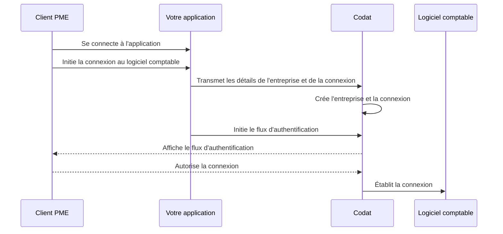

import Tabs from "@theme/Tabs";
import TabItem from "@theme/TabItem";

## Aperçu

Lors de l'implémentation de votre solution Bill Pay, vous devez créer votre client PME en tant qu'**entreprise** dans Codat avant d'enregistrer son logiciel comptable comme connexion. Vous pouvez le faire lorsque le client commence à interagir avec votre application.

Nous avons mis en évidence cette séquence d'étapes dans notre diagramme de processus détaillé ci-dessous.

<details>
<summary><b>Diagramme de processus détaillé</b></summary>



</details>

:::tip Autorisez vos appels API
N'oubliez pas de vous [authentifier](/using-the-api/authentication) lors des appels à notre API. Accédez à **Développeurs > Clés API** dans le portail pour obtenir votre en-tête d'autorisation.
:::

## Créer une entreprise

Dans Bill Pay, une entreprise représente votre client PME qui paie et gère ses factures en utilisant votre application. Pour la créer, utilisez nos points de terminaison [Créer une entreprise (asynchrone)](/sync-for-payables-api#/operations/create-company) ou [Créer une entreprise (synchrone)](/sync-for-payables-v2-api#/operations/create-company).

Les points de terminaison retournent le schéma de l'entreprise contenant l'identifiant que vous utiliserez pour établir une connexion à un logiciel comptable.

<Tabs groupId="language">

<TabItem value="nodejs" label="TypeScript">

```javascript
const companyResponse = payablesClient.companies.create({
  name: companyName,
});

if (companyResponse.statusCode == 200) {
  throw new Error("Could not create company");
}

const companyId = companyResponse.company.id;
console.log(companyId);
```

</TabItem>

<TabItem value="python" label="Python">

```python
company_request = shared.CompanyRequestBody(
    name=company_name,
)

company_response = payables_client.companies.create(company_request)

if company_response.status_code != 200:
  raise Exception('Could not create company')

company_id = company_response.company.id
print(company_id)
```

</TabItem>

<TabItem value="csharp" label="C#">

```csharp
var companyResponse = await payablesClient.Companies.CreateAsync(new() {
    Name = companyName,
});

if(companyResponse.StatusCode != 200){
  throw new Exception("Could not create company");
}

var companyId = companyResponse.Company.Id;
console.log(companyId)
```

</TabItem>

<TabItem value="go" label="Go">

```go
ctx := context.Background()
companyResponse, err := payablesClient.Companies.Create(ctx, &shared.CompanyRequestBody{
  Name: companyName,
	})

if companyResponse.StatusCode == 200 {
  companyID := companyResponse.Company.ID
  fmt.Println("%s", companyID)
}
```

</TabItem>

</Tabs>

## Créer une connexion

Ensuite, utilisez les points de terminaison [Créer une connexion (asynchrone)](/sync-for-payables-api#/operations/create-connection) ou [Créer une connexion (synchrone)](/sync-for-payables-v2-api#/operations/create-connection) pour connecter l'entreprise à une source de données comptables via l'une de nos intégrations.

Cela vous permettra de synchroniser les données avec cette source, en récupérant ou en créant des fournisseurs, des factures et des méthodes de paiement. Dans le corps de la requête, spécifiez un `platformKey` du logiciel comptable auquel vous souhaitez vous connecter.

<Tabs>

<TabItem value="async" label="Bill Pay asynchrone">

| Logiciel comptable  | platformKey |
| ------------------- | ----------- |
| MYOB Business       | `pdvj`      |
| Oracle NetSuite     | `akxx`      |
| QuickBooks Online   | `qhyg`      |
| QuickBooks Desktop  | `pqsw`      |
| Sage Intacct        | `knfz`      |
| Xero                | `gbol`      |

</TabItem>

<TabItem value="sync" label="Bill Pay synchrone">

| Logiciel comptable  | platformKey |
| ------------------- | ----------- |
| FreeAgent           | `fbrh`      |
| Oracle NetSuite     | `akxx`      |
| QuickBooks Online   | `qhyg`      |
| Xero                | `gbol`      |

</TabItem>

</Tabs>

Par exemple, créons une connexion QuickBooks Online (QBO). En réponse, le point de terminaison retourne un objet `dataConnection` avec un statut `PendingAuth` et un `linkUrl`. Dirigez votre client vers le `linkUrl` pour initier notre [flux d'authentification Link](/auth-flow/overview) et lui permettre d'autoriser cette connexion.

<Tabs groupId="language">

<TabItem value="nodejs" label="TypeScript">

```javascript
const connectionResponse = payablesClient.connections.create({
  requestBody: {
    platformKey: "qhyg",
  },
  companyId: companyResponse.company.id,
});

console.log(connectionResponse.connection.linkUrl);
```

</TabItem>

<TabItem value="python" label="Python">

```python
connection_request = operations.CreateConnectionRequest(
    request_body=operations.CreateConnectionRequestBody(
        platform_key='qhyg',
    ),
    company_id=company_response.company.id,
)

connection_response = payables_client.connections.create(connection_request)

console.log(connection_response.connection.link_url)
```

</TabItem>

<TabItem value="csharp" label="C#">

```csharp
var connectionResponse = await payablesClient.Connections.CreateAsync(new() {
    RequestBody = new CreateConnectionRequestBody() {
        PlatformKey = "qhyg",
    },
    CompanyId = companyResponse.Company.Id,
});

Console.WriteLine(connectionResponse.Connection.LinkUrl)
```

</TabItem>

<TabItem value="go" label="Go">

```go
ctx := context.Background()
connectionResponse, err := payablesClient.Connections.Create(ctx, operations.CreateConnectionRequest{
    RequestBody: &operations.CreateConnectionRequestBody{
        PlatformKey: syncforpayables.String("qhyg"),
    },
    CompanyID: companyResponse.Company.ID,
})

fmt.Println(connectionResponse.Connection.LinkUrl)
```

</TabItem>

</Tabs>

## Désautoriser une connexion

Si votre client souhaite révoquer son approbation et couper la connexion à son logiciel comptable, utilisez les points de terminaison [Dissocier la connexion (asynchrone)](/sync-for-payables-api#/operations/Unlink-connection) ou [Dissocier la connexion (synchrone)](/sync-for-payables-v2-api#/operations/Unlink-connection).

Vous pouvez [en savoir plus](/auth-flow/optimize/connection-management) sur les bonnes pratiques de gestion des connexions et découvrir comment vous pouvez fournir cette fonctionnalité dans l'interface de votre application.

<Tabs groupId="language">

<TabItem value="nodejs" label="TypeScript">

```javascript
const unlinkResponse = payablesClient.connections.unlink({
  requestBody: {
    status: DataConnectionStatus.Unlinked,
  },
  companyId: companyResponse.company.id,
  connectionId: connectionResponse.connection.id,
});
```

</TabItem>

<TabItem value="python" label="Python">

```python
unlink_request = operations.UnlinkConnectionRequest(
    request_body=operations.UnlinkConnectionUpdateConnection(
      status=shared.DataConnectionStatus.UNLINKED
    ),
    company_id=company_response.company.id,
    connection_id=connection_response.connection.id,
)

unlink_response = payables_client.connections.unlink(unlink_request)

```

</TabItem>

<TabItem value="csharp" label="C#">

```csharp
var unlinkResponse = await payablesClient.Connections.UnlinkAsync(new() {
    RequestBody = new UnlinkConnectionUpdateConnection() {
      Status = DataConnectionStatus.Unlinked
    },
    CompanyId = companyResponse.Company.Id,
    ConnectionId = connectionResponse.Connection.Id,
});
```

</TabItem>

<TabItem value="go" label="Go">

```go
ctx := context.Background()
unlinkResponse, err := payablesClient.Connections.Unlink(ctx, operations.UnlinkConnectionRequest{
    RequestBody: &operations.UnlinkConnectionUpdateConnection{
      Status: shared.DataConnectionStatusUnlinked
    },
    CompanyID: companyResponse.Company.ID,
    ConnectionID: connectionResponse.Connection.ID,
})
```

</TabItem>

</Tabs>

:::tip Récapitulatif

Vous avez créé la structure des objets clés requis par la solution Bill Pay de Codat : une entreprise et sa connexion à une source de données comptables.

Ensuite, vous pouvez choisir de gérer les fournisseurs, les factures ou les méthodes de paiement de votre client avant de payer les factures.

:::

---

## À lire ensuite

- Gérer les fournisseurs de votre client [de manière asynchrone](/payables/async/suppliers) ou [de manière synchrone](/payables/sync/suppliers)
- Gérer les factures de votre client [de manière asynchrone](/payables/async/suppliers) ou [de manière synchrone](/payables/sync/suppliers)
- Payer les factures de votre client [de manière asynchrone](/payables/async/payments) ou [de manière synchrone](/payables/sync/pay-bill)
