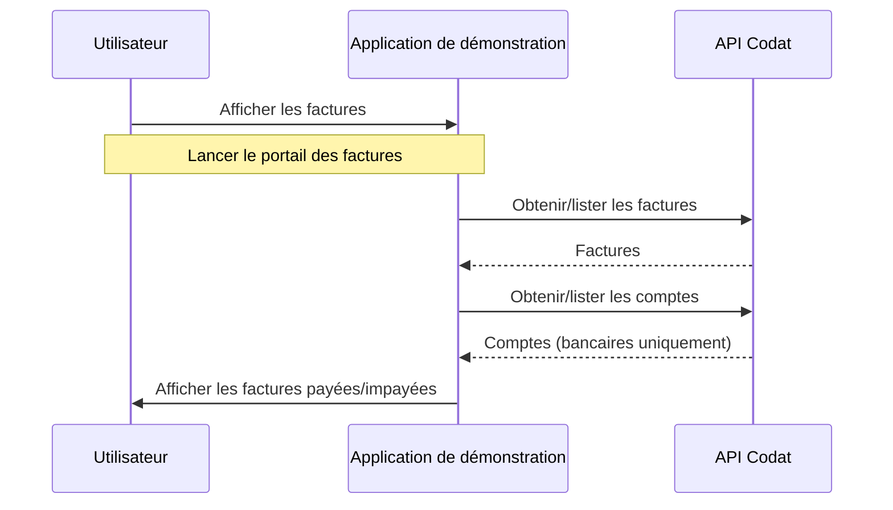
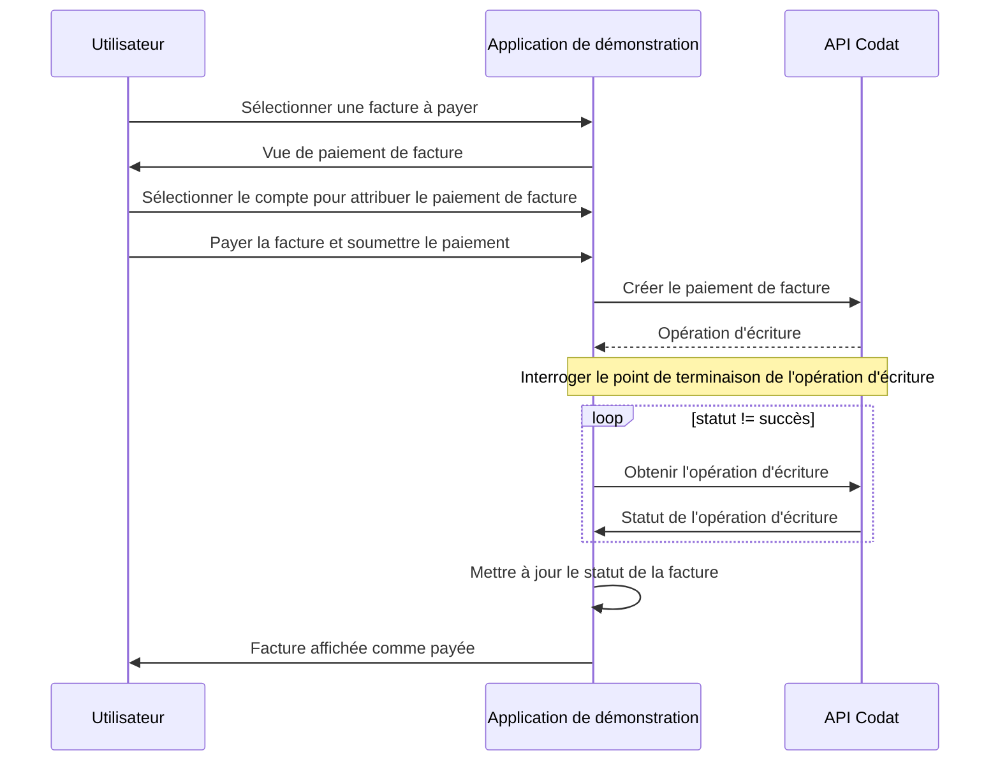

import Tabs from "@theme/Tabs";
import TabItem from "@theme/TabItem";

Vous êtes maintenant prêt à explorer plus en profondeur les fonctionnalités de l'application de démonstration de paiement de factures. Les diagrammes de flux utilisateur décrivent les fonctionnalités de l'application de démonstration à un niveau élevé, tandis que les exemples d'appels API montrent l'échange de données avec l'API Codat.

## Comprendre le flux d'authentification

La fonctionnalité de création d'entreprise et le flux d'autorisation ont été construits à l'aide de l'[API Platform](/platform-api#/) et de [Hosted Link](/auth-flow/authorize-hosted-link). Pour une expérience utilisateur fluide, nous avons personnalisé le flux Hosted Link avec la même image de marque et les mêmes couleurs que l'interface de l'application de démonstration - consultez [Personnaliser Link](/auth-flow/customize/customize-link) pour plus de détails.

Ses principales fonctionnalités sont :

- Créer une entreprise pour représenter l'utilisateur en utilisant le point de terminaison [Créer une entreprise](/sync-for-payables-api#/operations/create-company). Cela retourne un identifiant d'entreprise unique et une URL Link.
- Rediriger l'utilisateur vers son logiciel comptable choisi via l'URL Link. Cela ouvre la fenêtre de connexion OAuth pour le logiciel comptable, où l'utilisateur peut s'authentifier et autoriser l'accès à ses données comptables.
- Créer une connexion de données au logiciel comptable en utilisant le point de terminaison [Créer une connexion](/sync-for-payables-api#/operations/create-connection).
- Lorsque l'entreprise est connectée avec succès, rediriger l'utilisateur vers l'URL de redirection de l'application de démonstration, tel que défini dans les [paramètres de Link](/auth-flow/customize/customize-link).

## Afficher les factures

Le diagramme suivant illustre le flux utilisateur pour l'affichage des factures dans l'interface de l'application de démonstration.

:::note Flux utilisateur pour l'affichage des factures



:::

### Récupérer les factures

Au lancement, l'application de démonstration récupère une liste de toutes les factures de votre entreprise sandbox QuickBooks Online, par ordre décroissant de date d'émission, en utilisant le point de terminaison [Lister les factures](/sync-for-payables-api#/operations/list-bills).

Voici un exemple de requête :

<Tabs>

<TabItem value="HTTP" label="HTTP">

#### Requête

```http
GET https://api.codat.io/companies/{companyId}/data/bills?page=1&pageSize=100&orderBy=-issueDate
```

#### Exemple de réponse

```json
{
    "results": [
      {
        "id": "181",
        "supplierRef": {
          "id": "41",
          "supplierName": "Mac's Supply Store"
        },
        "purchaseOrderRefs": [],
        "issueDate": "2023-04-01T00:00:00",
        "dueDate": "2023-04-01T00:00:00",
        "currency": "GBP",
        "currencyRate": 1,
        "lineItems": [
          {
            #...
          }
        ],
        "withholdingTax": [],
        "status": "Open",
        "subTotal": 1250,
        "taxAmount": 250,
        "totalAmount": 1500,
        "amountDue": 1500,
        "modifiedDate": "2023-05-02T10:35:04Z",
        "sourceModifiedDate": "2023-03-27T23:30:01Z",
        "paymentAllocations": [],
        "metadata": {
          "isDeleted": false
        }
      },
      # ...
    ],
    "pageNumber": 1,
    "pageSize": 100,
    "totalResults": 8,
    "_links": {
      "current": {
        "href": "/companies/0f655a48-f6c2-43b4-857b-f2d6793f90b8/data/bills?page=1&pageSize=100&orderBy=-issueDate"
      },
      "self": {
        "href": "/companies/0f655a48-f6c2-43b4-857b-f2d6793f90b8/data/bills"
      }
    }
  }
```

</TabItem>

</Tabs>

:::info Requête pour afficher les factures impayées
Lorsque le bouton bascule **Afficher les factures impayées uniquement** est sélectionné dans l'interface, la requête `&query=status=Open` est ajoutée à l'URL de la requête en tant que [chaîne de requête Codat](/using-the-api/querying). Cela retourne uniquement les factures impayées.
:::

### Récupérer les comptes

Au lancement, l'application de démonstration utilise le point de terminaison [Lister les comptes](/sync-for-payables-api#/operations/list-accounts) pour récupérer les derniers comptes de l'entreprise. Le nom du compte est affiché en regard de sa facture respective dans la colonne **Référence** du tableau des factures.

Voici un exemple de requête :

<Tabs>

<TabItem value="HTTP" label="HTTP">

#### Requête

```http
GET https://codat.io/companies/{companyId}/data/accounts
```

#### Exemple de réponse

```json
{
    "results": [
      {
        "id": "84",
        "name": "Accounts Receivable (A/R)",
        "fullyQualifiedCategory": "Asset.Accounts Receivable.AccountsReceivable",
        "fullyQualifiedName": "Asset.Accounts Receivable.AccountsReceivable.Accounts Receivable (A/R)",
        "currency": "USD",
        "currentBalance": 5281.52,
        "type": "Asset",
        "status": "Active",
        "isBankAccount": false,
        "modifiedDate": "2023-05-11T09:46:07Z",
        "sourceModifiedDate": "2023-03-12T20:16:17Z",
        "validDatatypeLinks": [],
        "metadata": {
          "isDeleted": false
        }
      },
      #...
     ],
        "metadata": {
          "isDeleted": false
        }
      }
    ],
    "pageNumber": 1,
    "pageSize": 100,
    "totalResults": 90,
    "_links": {
      "current": {
        "href": "/companies/3e67a1ea-a124-4a54-a241-698169eb19fb/data/accounts?page=1"
      },
      "self": {
        "href": "/companies/3e67a1ea-a124-4a54-a241-698169eb19fb/data/accounts"
      }
    }
  }
```

</TabItem>

</Tabs>

## Payer une facture

Le diagramme suivant illustre le flux utilisateur pour la sélection et le paiement d'une facture dans l'interface de l'application de démonstration.

:::note Flux utilisateur pour le paiement d'une facture



:::

La facture reste dans un statut `pending` (en attente) pendant le processus d'interrogation.

Lors de la sélection d'un compte dans la boite de dialogue **Paiement de facture**, le menu déroulant **Nom du compte** affiche uniquement les comptes bancaires dans la même devise que la facture. Le type de compte est déterminé à l'aide d'un paramètre de requête pour `isBankAccount=true`.

Le paiement de la facture sera attribué au compte sélectionné dans votre entreprise sandbox QuickBooks Online.

#### Payer une facture

Lorsque vous payez une facture, l'application de démonstration utilise le point de terminaison [Créer un paiement de facture](/sync-for-payables-api#/operations/create-bill-payment) pour créer le paiement dans QuickBooks Online pour le montant total dû. Ce processus rapproche le paiement avec la facture impayée.

Voici un exemple de requête :

<Tabs>

<TabItem value="HTTP" label="HTTP">

#### Requête

```http
POST https://api.codat.io/companies/{companyId}/connections/{connectionId}/push/billPayments
```

#### Exemple de corps de requête

```json
{
  "supplierRef": {
    "id": "<SUPPLIER_ID>" // ID of the supplier to reconcile payment against
  },
  "accountRef": {
    "id": "<ACCOUNT_ID>" // ID of the bank account for the payment
  },
  "totalAmount": 2400.0,
  "date": "<ISO_TIMESTAMP>", // date and time of payment
  "currency": "USD",
  "lines": [
    {
      "amount": 2400.0, // total amount of bill
      "links": [
        {
          "type": "Bill",
          "id": "<BILL_ID>", // separate link for each bill the bill payment should be reconciled against
          "amount": -2400.0
        }
      ]
    }
  ]
}
```

</TabItem>

</Tabs>

## Prêt pour la suite?

Essayez ces suggestions pour tirer le meilleur parti de votre expérience avec l'application de démonstration :

- **Accéder aux données sandbox d'une autre région**
  Vous pouvez configurer une entreprise sandbox QuickBooks Online contenant des données pour une autre région, puis suivre à nouveau le guide de l'application de démonstration. Pour plus d'informations, consultez [Créer et tester avec une entreprise sandbox](https://developer.intuit.com/app/developer/qbo/docs/develop/sandboxes/manage-your-sandboxes) dans la documentation développeur Intuit.

- **Étendre les fonctionnalités de l'application**
  Allez plus loin et développez d'autres fonctionnalités qui simplifient le processus des comptes fournisseurs pour vos clients. Par exemple, vous pourriez offrir la possibilité de payer une facture à l'aide d'un avoir ou de créer une nouvelle facture depuis votre application.

- **Lectures complémentaires**
  Explorez les sujets d'automatisation comptable dans le [blogue Codat](https://www.codat.io/blog/), apprenez-en davantage sur [Bill Pay](/payables/overview) ou explorez nos autres [cas d'utilisation](/usecases/overview).
