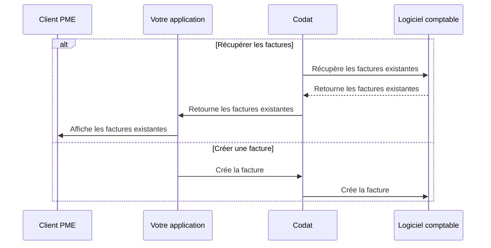

import Tabs from "@theme/Tabs";
import TabItem from "@theme/TabItem";
import RetrieveBills from "../_retrieve-bills.md";
import CreateBills from "../_create-bills.md";
import UploadAttachment from "../_upload-attachment.md";

:::tip Factures clients ou factures fournisseurs?

Nous distinguons les factures où l'entreprise _doit_ de l'argent et celles où l'entreprise _est due_ de l'argent. Si l'entreprise reçoit une facture et doit de l'argent en conséquence, nous appelons cela une **facture fournisseur** (bill).
:::

## Aperçu

Dans Codat, une facture fournisseur représente une facture de _comptes fournisseurs_ émise à une PME par son fournisseur. Avec le Bill Pay synchrone, vous pouvez :

- Récupérer les factures existantes de votre client.
- Créer de nouvelles factures dans votre système et les refléter dans le logiciel comptable de votre client.

Nous avons mis en évidence cette séquence alternative d'étapes dans notre diagramme de processus détaillé ci-dessous.

<b>Diagramme de processus détaillé</b>

## Récupérer les factures

:::tip Filtrer la liste des factures

Les points de terminaison des factures de la solution synchrone Bill Pay ne retournent que les factures **ouvertes** ou **partiellement payées** de la plateforme comptable. Vous pouvez utiliser les [paramètres de requête](/using-the-api/querying) pour modifier la portée des résultats.
:::

<RetrieveBills
  listendpoint="/sync-for-payables-v2-api#/operations/list-bills"
  createendpoint="/sync-for-payables-v2-api#/operations/create-bill"
  downloadendpoint="/sync-for-payables-v2-api#/operations/download-bill-attachment"
/>

## Créer une facture

:::tip Données de référence

Les factures doivent toujours correspondre à un fournisseur qui les a émises. Assurez-vous que le fournisseur concerné existe avant de créer une nouvelle facture.

Vous devez également associer les lignes de la facture à un compte ou un taux de taxe spécifique. Utilisez le point de terminaison [Obtenir les options de mappage des factures](/sync-for-payables-v2-api#/operations/get-mapping-options-bills) pour voir les comptes et les taux de taxe disponibles.

:::

<CreateBills endpoint="/sync-for-payables-v2-api#/operations/create-bill" />

<UploadAttachment
  endpoint="/sync-for-payables-v2-api#/operations/upload-bill-attachment"
  schema="/sync-for-payables-v2-api#/schemas/Attachment"
/>

---

## À lire ensuite

- Permettez à vos clients de [payer des factures individuelles](/payables/sync/pay-bill) pour compléter le processus Bill Pay.
