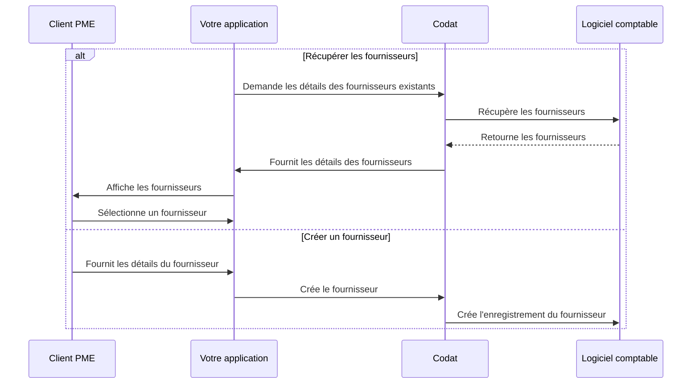

import Tabs from "@theme/Tabs";
import TabItem from "@theme/TabItem";
import ManageSuppliers from "../_manage-suppliers.md";

## Aperçu

Dans les comptes fournisseurs, chaque facture est associée à un _fournisseur_. Le fournisseur représente une entreprise ou un travailleur autonome qui fournit des biens ou des services à votre client PME.

Leurs dossiers contiennent également des informations clés, telles que les coordonnées, qui peuvent être utilisées pour notifier le fournisseur une fois qu'un paiement est effectué.

Pour payer une facture dans Bill Pay, vous pouvez utiliser les fournisseurs existants de votre client ou en créer un nouveau. Nous avons mis en évidence cette séquence alternative d'étapes dans notre diagramme de processus détaillé ci-dessous.

<b>Diagramme de processus détaillé</b>

:::tip Affiner la liste des fournisseurs

Les points de terminaison des fournisseurs de la solution synchrone Bill Pay ne retournent que les fournisseurs **actifs** de la plateforme comptable. Vous pouvez utiliser les [paramètres de requête](/using-the-api/querying) pour affiner davantage la liste des résultats.
:::

<ManageSuppliers
  listendpoint="/sync-for-payables-v2-api#/operations/list-suppliers"
  createendpoint="/sync-for-payables-v2-api#/operations/create-supplier"
/>

:::tip Récapitulatif

Vous avez appris comment afficher, créer et mettre à jour les fournisseurs de votre client qui leur fournissent des biens et des services.

Ensuite, vous pouvez choisir de gérer les factures de votre fournisseur ou les méthodes de paiement avant de régler ces factures.

:::

---

## À lire ensuite

- [Gérer les factures de votre client](/payables/sync/bills)
- [Payer les factures de votre client](/payables/sync/pay-bill)
