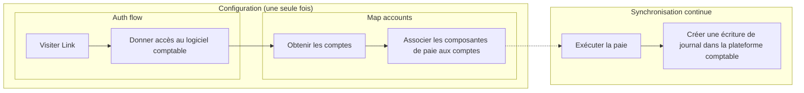

import Products from "@components/Products";
import { IntegrationsList } from "@components/Integrations";
import { integrationsFilterPayroll } from "@components/Integrations/integrations";

Utilisez Codat pour intégrer les données de paie de vos clients depuis leurs
plateformes de RH et de paie dans leur logiciel comptable et pour en soutenir la réconciliation.

### Comment Codat vous aide

[Sync for Payroll](/sync-for-payroll-api) aide les entreprises de RH, de paie et les
éditeurs SaaS verticaux à intégrer leur produit avec le logiciel comptable de leurs clients.

L'intégration avec Codat aide vos clients PME à éliminer la complexité et la répétition
du traitement de la paie, à supprimer la saisie et la correspondance manuelles des données de paie, et
à gagner du temps sur des tâches qui doivent habituellement être effectuées plusieurs fois par mois.

## Fonctionnalités

## Comment ça fonctionne

### [Se connecter au logiciel comptable de votre PME](/auth-flow/overview)

Codat gère l'autorisation et la liaison avec le logiciel comptable de votre PME et
tient compte de détails complexes tels que les limites de débit.

### [Catégoriser et associer les composantes de paie](mapping)

Chaque entreprise peut avoir besoin de réconcilier les coûts de paie, les pensions et les impôts vers
différents comptes nominaux, selon leur type d'entreprise et le logiciel
comptable qu'elles utilisent. Codat fournit un point de terminaison pour lire le plan comptable et
les données de catégories de suivi afin d'éviter les efforts de catégorisation manuelle et
offrir de la flexibilité aux PME pour la réconciliation des données. En tant que plateforme de paie, vous devrez
construire une interface flexible pour que votre client puisse effectuer la correspondance.

### [Synchroniser les cycles de paie avec le logiciel comptable de vos clients](sync-payroll)

Utilisez la fonctionnalité de création et de mise à jour de Codat pour publier un journal montrant les
montants corrects pour chaque compte. Ces transactions peuvent facilement être
réconciliées avec le flux bancaire de l'entreprise.

## Intégrations compatibles

<IntegrationsList filter={integrationsFilterPayroll} />
