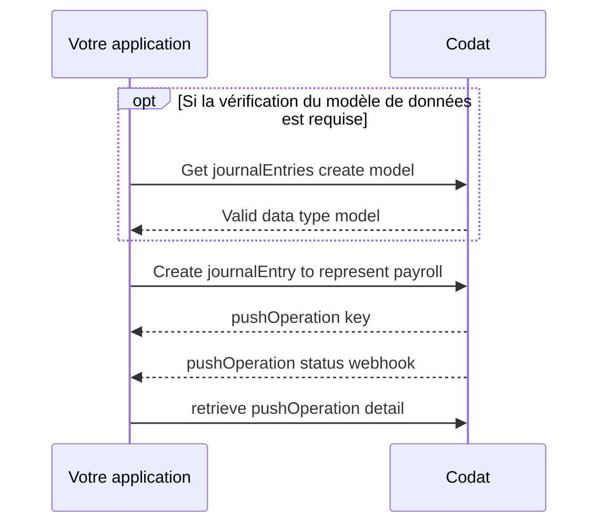

import Tabs from "@theme/Tabs";
import TabItem from "@theme/TabItem";

## Générer l'objet de paie

Avant de pouvoir enregistrer la paie dans le logiciel comptable, vous devrez
générer un objet de poste pour chaque employé pour chaque composante de paie
correspondante. Cela signifie que vous aurez probablement plusieurs postes pour chaque employé.

Chaque objet de poste doit contenir les informations suivantes :

- `description` - un titre tel que le mois de la paie ou du cycle de paie
- `accountRef` - Le compte correspondant
- `netAmount` - Montant net versé à l'employé
- `currency` - La devise correspondant au montant
- `tracking` - Une liste de références aux enregistrements pour le suivi

## Enregistrer la paie

Étapes :

- [Obtenir le modèle de publication de journal](sync-payroll#get-journal-push-model)
- [Créer une écriture de paie](sync-payroll#creating-a-payroll-entry)
- [Surveiller le statut de la requête](sync-payroll#monitoring-the-status-of-the-request)



Pour enregistrer les écritures de paie dans le logiciel comptable, vous pouvez utiliser le
point de terminaison [créer des écritures de journal](/sync-for-payroll-api#/operations/create-journal-entry)
pour publier la paie dans les comptes associés du grand livre de la PME.

L'écriture de journal peut ensuite être réconciliée avec l'écriture de débit dans
les flux bancaires de l'entreprise.

### Obtenir le modèle de publication de journal

Avant de créer une écriture de journal (journalEntry), vous devriez d'abord vérifier le modèle de données. Cela
vous aide à vous assurer que toutes les propriétés requises sont incluses dans votre requête.

La vérification du modèle peut être une activité ponctuelle (pour les intégrations avec des
propriétés statiques) ou être requise plus fréquemment (pour les intégrations ERP avec des options
de personnalisation plus élevées).

Utilisons notre point de terminaison Get create journalEntries model pour consulter les
exigences spécifiques à l'intégration pour la création du type de données journalEntries dans
Xero.

<Tabs>

<TabItem value="Request URL" label="URL de la requête">

```http
GET https://api.codat.io/companies/{companyId}/connections/{connectionId}/options/journalEntries
```

</TabItem>

<TabItem value="Sample Xero Response" label="Exemple de réponse Xero">

```json
{
  "type": "Object",
  "displayName": "JournalEntry",
  "properties": {
    "postedOn": {
      "type": "DateTime",
      "displayName": "Posted On",
      "description": "The date the entry was posted in the originating system",
      "required": true,
      "validation": {
        "warnings": [],
        "information": [
          {
            "field": "PostedOn",
            "details": "If no date is specified, it will default to today's date."
          }
        ]
      }
    },
    "journalLines": {
      "type": "Array",
      "displayName": "Journal Lines",
      "description": "A collection of detail lines that represent the transactions associated in this entry",
      "properties": {
        "description": {
          "type": "String",
          "displayName": "Description",
          "description": "The description for the journal line",
          "required": true,
          "validation": {
            "warnings": [],
            "information": [
              {
                "field": "JournalLines.Description",
                "details": "Must not be longer than 4000 characters long and must be the same for all lines."
              }
            ]
          }
        },
        "netAmount": {
          "type": "Number",
          "displayName": "Net Amount",
          "description": "The amount for the journal line, excluding tax",
          "required": true,
          "validation": {
            "warnings": [],
            "information": [
              {
                "field": "JournalLines.NetAmount",
                "details": "Must be provided."
              }
            ]
          }
        },
        "accountRef": {
          "type": "Object",
          "displayName": "Nominal Account Reference",
          "description": "Reference to the nominal account the line is linked to",
          "properties": {
            "id": {
              "type": "String",
              "displayName": "Account ID",
              "description": "The identifier for the account",
              "required": true,
              "validation": {
                "warnings": [
                  {
                    "field": "AccountRef.Id",
                    "details": "Must be a valid GUID."
                  },
                  {
                    "field": "AccountRef.Id",
                    "details": "Must match the ID of an existing account."
                  }
                ],
                "information": [
                  {
                    "field": "AccountRef.Id",
                    "details": "Must be provided."
                  }
                ]
              }
            }
          },
          "required": true,
          "validation": {
            "warnings": [],
            "information": [
              {
                "field": "JournalLines.AccountRef",
                "details": "Must be provided."
              }
            ]
          }
        },
        "tracking": {
          "type": "Object",
          "displayName": "Tracking",
          "description": "Information this item is being tracked against",
          "properties": {
            "recordRefs": {
              "type": "Array",
              "displayName": "Record References",
              "description": "A collection of records this item is being tracked against",
              "properties": {
                "id": {
                  "type": "String",
                  "displayName": "Identifier",
                  "description": "The reference identifier for the record",
                  "required": true,
                  "validation": {
                    "warnings": [],
                    "information": [
                      {
                        "field": "RecordRefs.Id",
                        "details": "Must not be a parent tracking category."
                      },
                      {
                        "field": "RecordRefs.Id",
                        "details": "Must be provided."
                      }
                    ]
                  }
                }
              },
              "required": false,
              "validation": {
                "warnings": [],
                "information": [
                  {
                    "field": "Tracking.RecordRefs",
                    "details": "Tracking categories must not have the same parent tracking category."
                  },
                  {
                    "field": "Tracking.RecordRefs",
                    "details": "Maximum of 2 Tracking Categories."
                  }
                ]
              }
            }
          },
          "required": false
        }
      },
      "required": true,
      "validation": {
        "warnings": [],
        "information": [
          {
            "field": "JournalLines",
            "details": "At least 2 must be provided."
          }
        ]
      }
    }
  },
  "required": true
}
```

</TabItem>

</Tabs>

La réponse indique que les propriétés suivantes doivent être renseignées
(`required: true`) lorsque vous créez une écriture de journal (journalEntry) pour représenter la paie dans Xero :

- `postedOn`
- `journalLines` qui requiert également les sous-propriétés suivantes
  - `description`
  - `netAmount`
  - `accountRef`
  - `tracking`

### Créer une écriture de paie

:::caution Propriétés absentes de la réponse _Get model_ Si vous tentez de créer
ou de mettre à jour un enregistrement en utilisant des propriétés non documentées dans la réponse _Get journalEntries
model_, vous pourriez recevoir des erreurs de validation en réponse à votre requête.
:::

Lors de la création de l'écriture de journal de paie, vous devez créer un poste pour chaque
composante de paie, et la somme des montants des composantes de paie doit être
égale à la somme du débit sur le compte bancaire associé à partir duquel le paiement est
effectué.

Dans l'exemple ci-dessous, il y a cinq postes d'écriture de journal :

1. Le premier poste crédite (augmente le solde) le compte "Payroll Wage Expenses"
   de 7 291,67 $
1. Le deuxième poste crédite le compte "Payroll Tax Payable" de 452,08 $
1. Le troisième poste crédite le compte "Payroll Expenses 401k" de 1 166,67 $
1. Le quatrième poste débite (réduit le solde) le compte "Checking" de
   8 910,42 $, le débit sur le compte bancaire devant être égal à la somme des
   composantes de paie.

<Tabs>

<TabItem value="Request URL" label="URL de la requête">

```http title="Create journal entries"
POST https://api.codat.io/companies/{companyId}/connections/{connectionId}/push/journalEntries
```

</TabItem>

<TabItem value="Example request body" label="Exemple de corps de requête">

```json title="Example request body"
{
  "postedOn": "2023-02-14T00:00:00",
  "createdOn": "2023-02-14T00:00:00",
  "journalLines": [
    {
      "description": "August Payroll",
      "netAmount": 7291.67,
      "currency": "USD",
      "accountRef": {
        "id": "92",
        "name": "Payroll Wage Expenses"
      },
      "tracking": {
        "recordRefs": [
          {
            "id": "DEPARTMENT_1",
            "dataType": "trackingCategories"
          }
        ]
      }
    },
    {
      "description": "August Payroll",
      "netAmount": 452.08,
      "currency": "USD",
      "accountRef": {
        "id": "96",
        "name": "Payroll Tax Payable"
      },
      "tracking": {
        "recordRefs": []
      }
    },
    {
      "description": "August Payroll",
      "netAmount": 1166.67,
      "currency": "USD",
      "accountRef": {
        "id": "97",
        "name": "Payroll Expenses 401k"
      },
      "tracking": {
        "recordRefs": []
      }
    },
    {
      "description": "August Payroll",
      "netAmount": -8910.42,
      "currency": "USD",
      "accountRef": {
        "id": "35",
        "name": "Checking"
      },
      "tracking": {
        "recordRefs": []
      }
    }
  ]
}
```

</TabItem>

<TabItem value="Example response" label="Exemple de réponse">

```json
{
  "changes": [
    {
      "type": "Created",
      "recordRef": {
        "dataType": "journalEntries"
      }
    }
  ],
  "data": {
    "postedOn": "2023-08-14T00:00:00",
    "createdOn": "2023-08-14T00:00:00",
    "journalLines": [
      {
        "description": "August Payroll",
        "netAmount": 7291.67,
        "currency": "USD",
        "accountRef": {
          "id": "92",
          "name": "Payroll Wage Expenses"
        },
        "tracking": {
          "recordRefs": [
            {
              "id": "DEPARTMENT_1",
              "dataType": "trackingCategories"
            }
          ]
        }
      },
      {
        "description": "August Payroll",
        "netAmount": 452.08,
        "currency": "USD",
        "accountRef": {
          "id": "96",
          "name": "Payroll Tax Payable"
        },
        "tracking": {
          "recordRefs": []
        }
      },
      {
        "description": "August Payroll",
        "netAmount": 1166.67,
        "currency": "USD",
        "accountRef": {
          "id": "97",
          "name": "Payroll Expenses 401k"
        },
        "tracking": {
          "recordRefs": []
        }
      },
      {
        "description": "August Payroll",
        "netAmount": -8910.42,
        "currency": "USD",
        "accountRef": {
          "id": "35",
          "name": "Checking"
        },
        "tracking": {
          "recordRefs": []
        }
      }
    ]
  },
  "dataType": "journalEntries",
  "companyId": "d7f743a9-1804-4116-8c8a-e606f7e2f66c",
  "pushOperationKey": "b9c1381a-8742-4a45-9dc5-528101dbd0e3",
  "dataConnectionKey": "fa139396-523a-4a58-bf2b-8da82c8a673f",
  "requestedOnUtc": "2023-08-14T14:53:44.6401039Z",
  "status": "Pending",
  "statusCode": 202
}
```

</TabItem>

</Tabs>

Lorsque vous effectuez la requête, vous recevrez une réponse pushOperation, qui
inclura les informations suivantes :

- **pushOperationKey** : un identifiant unique et idempotent généré par Codat pour
  représenter cette opération de publication unique, pouvant être utilisé pour suivre son statut
- **dataType** : le type de données créé, dans ce cas, `journalEntry`
- **status** : le statut de l'opération de création, qui peut être `Pending`,
  `Failed`, `Success` ou `TimedOut`
- **requestedOnUtc** : la date et l'heure (en UTC) auxquelles l'opération a été demandée
- **completedOnUtc** : la date et l'heure (en UTC) auxquelles l'opération a été complétée,
  null si `Pending`
- **validation** : un objet lisible par l'humain contenant les détails de validation,
  incluant les erreurs, rencontrées lors de l'opération.
- **changes** : un tableau qui communique quel enregistrement a changé (propriété `recordRef`)
  et la manière dont il a changé (propriété `type` qui peut être
  `Unknown`, `Created`, `Modified`, ou `Deleted`)

### Surveiller le statut de la requête

Après l'acceptation de votre requête, elle aura un statut de `Pending`. Vous
devriez utiliser le type d'événement
[PushOperationStatusChanged](../using-the-api/webhooks/event-types) pour suivre
le moment où le statut de votre opération de publication passe à `Success` ou `Failed`.

Si vous souhaitez consulter un historique de toutes les opérations de publication pour votre entreprise, vous pouvez
les récupérer depuis le point de terminaison
[list-push-operations](/sync-for-payroll-api#/operations/list-push-operations).
