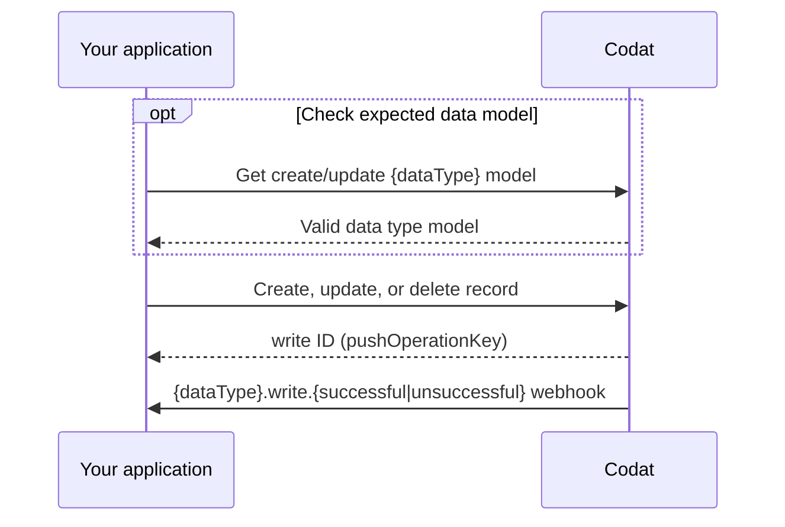
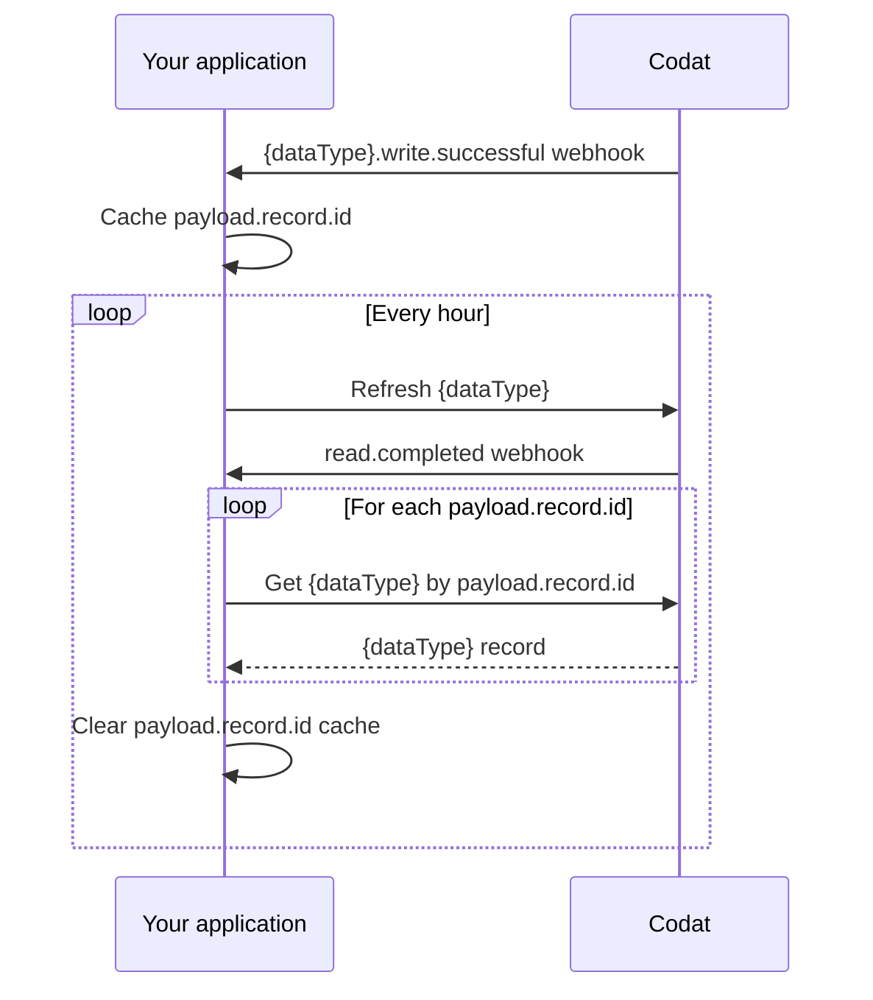

import Tabs from "@theme/Tabs";
import TabItem from "@theme/TabItem";
import Lottie from "@components/Lottie";
import webhooks from "../../static/animations/webhooks.json";

<Lottie animation={webhooks} />

Codat offre la possibilité de créer, mettre à jour et supprimer des enregistrements dans les plateformes sources de nos intégrations en utilisant nos modèles de données standard.
Nous prenons en charge les opérations d'écriture suivantes :

- **Créer** un nouvel enregistrement en utilisant la méthode `POST`.
- **Mettre à jour** un enregistrement existant en utilisant la méthode `PUT`.
- **Supprimer** un enregistrement existant en utilisant la méthode `DELETE`.

:::note Opérations push et requêtes d'écriture

Codat désigne désormais les opérations push comme des requêtes d'écriture.

:::

## Types de données comptables et types d'écriture pris en charge

| `dataType`       | Créer   | Mettre à jour | Supprimer |
| ---------------- | ------- | ------------- | --------- |
| bankAccounts     | &#9989; | &#9989;       | -         |
| bankTransactions | &#9989; | -             | -         |
| billCreditNotes  | &#9989; | &#9989;       | -         |
| billPayments     | &#9989; | -             | &#9989;   |
| bills            | &#9989; | &#9989;       | &#9989;   |
| chartOfAccounts  | &#9989; | -             | -         |
| creditNotes      | &#9989; | &#9989;       | -         |
| customers        | &#9989; | &#9989;       | -         |
| directCosts      | &#9989; | -             | &#9989;   |
| directIncomes    | &#9989; | -             | -         |
| invoices         | &#9989; | &#9989;       | &#9989;   |
| items            | &#9989; | -             | -         |
| journalEntries   | &#9989; | -             | &#9989;   |
| journals         | &#9989; | -             | -         |
| payments         | &#9989; | -             | -         |
| purchaseOrders   | &#9989; | &#9989;       | -         |
| suppliers        | &#9989; | &#9989;       | -         |
| transfers        | &#9989; | -             | -         |

## Processus

Pour effectuer une requête d'écriture, suivez ces étapes :

1. **[Vérifier le modèle de données attendu](#check-the-expected-data-model)** : Pour les requêtes de **création** et de **mise à jour**, assurez-vous d'utiliser le bon modèle de données pour le type de données que vous souhaitez écrire. Cela garantit que toutes les propriétés requises sont incluses. Selon l'intégration, cette étape peut être une tâche unique (pour les propriétés statiques) ou une vérification régulière (pour les intégrations hautement personnalisables).

2. **[Effectuer une requête d'écriture](#make-a-write-request)** : Vous recevrez un identifiant d'opération d'écriture en réponse. Celui-ci peut être utilisé pour [suivre le statut de l'opération](#monitor-the-status-of-your-operation).

3. **[Consommer le webhook `{dataType}.write.{successful|unsuccessful}` pertinent](#consume-the-data-types-write-webhook)** : Abonnez-vous à ces webhooks et nous vous informerons lorsque votre opération d'écriture sera terminée.



:::info Besoin d'accéder aux enregistrements?

Si votre cas d'utilisation implique l'affichage des enregistrements créés ou mis à jour à vos clients, [apprenez comment accéder aux enregistrements](#accessing-created-or-updated-records).

:::

## Opérations asynchrones

Les requêtes d'écriture sont des opérations asynchrones et prendront entre quelques secondes et quelques minutes pour se terminer, selon la plateforme sous-jacente.
Cela signifie que vous recevrez un statut `Pending` en réponse à votre requête d'écriture.

Une requête d'écriture peut rester `Pending` indéfiniment pour les intégrations utilisant des connecteurs hors ligne lorsque l'application de bureau est inaccessible.
Gérez cela en définissant des [délais d'expiration](/using-the-api/push#monitor-the-status-of-your-operation#timeouts).

## Données supplémentaires

Nous avons introduit les [données supplémentaires](/using-the-api/supplemental-data/overview) dans bon nombre de nos types de données, vous permettant d'enrichir ces types de données avec des propriétés supplémentaires non incluses dans les modèles de données prêts à l'emploi de Codat. Vous pouvez créer, mettre à jour et supprimer des données supplémentaires en utilisant le même processus que celui décrit ci-dessus.

## Vérifier le modèle de données attendu

Chaque intégration peut avoir des exigences différentes pour le corps d'une requête d'écriture.
Donc, avant d'effectuer la requête, vous devez savoir comment les données doivent être insérées dans la plateforme source.
Vous pouvez accéder aux exigences de modèle spécifiques à l'intégration en utilisant les endpoints _Obtenir le modèle_ de Codat.

Dans la plupart des cas, les modèles fournissent des données statiques, comme le détail des propriétés obligatoires.
Certaines plateformes, comme Netsuite, offrent une plus grande personnalisation à leurs utilisateurs, donc le modèle correspondant peut différer.

Utilisons notre endpoint [Obtenir le modèle de création de compte](/sync-for-expenses-api#/operations/get-create-chartOfAccounts-model) de la solution [Expenses](/expenses/overview) pour voir les exigences spécifiques à l'intégration pour la création du type de données `chartOfAccounts` dans Xero.

```sh
GET https://api.codat.io/companies/{companyId}/connections/{connectionId}/options/chartOfAccounts
```

La réponse indique que trois propriétés doivent être renseignées :

- `nominalCode`, une chaîne de caractères pouvant contenir jusqu'à 10 caractères
- `name`, une chaîne de caractères sans restriction
- `fullyQualifiedCategory`, une propriété de type énumération qui accepte une chaîne choisie parmi une liste d'options

Le `displayName` des options peut être utilisé pour afficher un nom plus descriptif, comme "Actifs courants".

<details>
  <summary><b>Réponse partielle du modèle de création de compte</b></summary>

```json
{
  "type": "Object",
  "displayName": "Nominal Account",
  "description": "Nominal Accounts are the categories a business uses to record transactions",
  "properties": {
    "nominalCode": {
      "type": "String",
      "displayName": "Nominal Code",
      "description": "Identifier for the nominal account.",
      "required": true,
      "validation": {
        "warnings": [
          {
            "field": "NominalCode",
            "details": "Max length of 10 characters."
          }
        ],
        "information": []
      }
    },
    "name": {
      "type": "String",
      "displayName": "Name",
      "description": "Name of account as it appears in the chart of accounts or general ledger.",
      "required": true,
      "validation": {
        "warnings": [],
        "information": [
          {
          ...
          }
        ]
      }
    },
    ...
    "fullyQualifiedCategory": {
      "type": "String",
      "displayName": "Fully Qualified Category",
      "description": "Account type and category for nominal account.",
      "options": [
        {
          "value": "Asset.Current",
          "type": "String",
          "displayName": "Current Asset",
          "required": false
        },
        ...
      ],
      "required": true
    }
  },
  "required": true
}
```

</details>

## Effectuer une requête d'écriture

:::caution Propriétés absentes de la réponse _Obtenir le modèle_
Si vous tentez de créer ou de mettre à jour un enregistrement en utilisant des propriétés non documentées dans la réponse _Obtenir le modèle_, vous pourriez recevoir des erreurs de validation en réponse à votre requête.

Dans certains cas, nos références API incluent `id`, `modifiedDate` et `sourceModifiedDate` dans les requêtes de création ou de mise à jour.
Ces propriétés sont en lecture seule et ne peuvent pas être utilisées dans les requêtes d'écriture.

:::

Créons un nouveau compte en utilisant notre endpoint [Créer un compte](/sync-for-expenses-api#/operations/create-account) de la solution [Expenses](/expenses/overview).
La requête doit satisfaire les exigences définies dans le [modèle de création de compte](/sync-for-expenses-api#/operations/get-create-chartOfAccounts-model) que nous avons appelé précédemment.

Nous allons créer un compte en utilisant une requête valide, et une requête qui mène à une erreur de validation :

<Tabs groupId="language">

<TabItem value="typescript" label="TypeScript">
  <Tabs>
    <TabItem value="wo" label="Créer un compte">

```typescript
const accountCreateResponse = await expensesClient.accounts.create({
  companyId: companyId,
  connectionId: connectionId,
  accountPrototype: {
    nominalCode: "4200123456",
    name: "Codat Assets Account",
    fullyQualifiedCategory: "Asset.Current",
  },
});
```

    </TabItem>

    <TabItem value="with" label="Créer un compte avec une erreur">

```typescript
const accountCreateResponse = await expensesClient.accounts.create({
  companyId: companyId,
  connectionId: connectionId,
  accountPrototype: {
    nominalCode: "350045006500", // Nominal code intentionally consists of too many characters
    name: "Excessive Length Account",
    fullyQualifiedCategory: "Asset.Current",
  },
});
```

    </TabItem>

  </Tabs>
</TabItem>

<TabItem value="python" label="Python">
  <Tabs>
    <TabItem value="wo" label="Créer un compte">

```python
account_create_response = expenses_client.accounts.create(
    request=operations.CreateAccountRequest(
      company_id=company_id,
	  connection_id=connection_id,
      account_prototype=shared.AccountPrototype(
        nominal_code='4200123456',
        name='Codat Assets Account',
        fully_qualified_category='Asset.Current',
      )
  )
)
```

    </TabItem>

    <TabItem value="with" label="Créer un compte avec une erreur">

```python
account_create_response = expenses_client.accounts.create(
    request=operations.CreateAccountRequest(
      company_id=company_id,
	  connection_id=connection_id,
      account_prototype=shared.AccountPrototype(
        nominal_code='350045006500', # Nominal code intentionally consists of too many characters
        name='Excessive Length Account',
        fully_qualified_category='Asset.Current',
      )
  )
)
```

    </TabItem>

  </Tabs>
</TabItem>

<TabItem value="csharp" label="C#">
  <Tabs>
    <TabItem value="wo" label="Créer un compte">

```c#
var accountCreateResponse = await expensesClient.Accounts.CreateAsync(new CreateAccountRequest() {
    CompanyId = companyId,
	ConnectionId = connectionId,
    AccountPrototype = new AccountPrototype(){
      NominalCode = "4200123456",
      Name = "Codat Assets Account",
      FullyQualifiedCategory = "Asset.Current",
	}
});
```

    </TabItem>

    <TabItem value="with" label="Créer un compte avec une erreur">

```c#
var accountCreateResponse = await expensesClient.Accounts.CreateAsync(new CreateAccountRequest() {
    CompanyId = companyId,
	ConnectionId = connectionId,
    AccountPrototype = new AccountPrototype(){
      NominalCode = "350045006500", // Nominal code intentionally consists of too many characters
      Name = "Excessive Length Account",
      FullyQualifiedCategory = "Asset.Current",
	}
});
```

    </TabItem>

  </Tabs>
</TabItem>

<TabItem value="go" label="Go">
  <Tabs>
    <TabItem value="wo" label="Créer un compte">

```go
ctx := context.Background()
accountCreateResponse, err := expensesClient.Accounts.Create(ctx, operations.CreateAccountRequest{
  CompanyID: companyID,
  ConnectionID: connectionID,
  AccountPrototype: &shared.AccountPrototype{
    NominalCode: syncforexpenses.String("4200123456"),
    Name: syncforexpenses.String("Codat Assets Account"),
    FullyQualifiedCategory: syncforexpenses.String("Asset.Current"),
  }
})
```

    </TabItem>

    <TabItem value="with" label="Créer un compte avec une erreur">

```go
ctx := context.Background()
accountCreateResponse, err := expensesClient.Accounts.Create(ctx, operations.CreateAccountRequest{
  CompanyID: companyID,
  ConnectionID: connectionID,
  AccountPrototype: &shared.AccountPrototype{
    NominalCode: syncforexpenses.String("350045006500"), // Nominal code intentionally consists of too many characters
    Name: syncforexpenses.String("Excessive Length Account"),
    FullyQualifiedCategory: syncforexpenses.String("Asset.Current"),
  }
})
```

    </TabItem>

  </Tabs>
</TabItem>

<TabItem value="java" label="Java">
  <Tabs>
    <TabItem value="wo" label="Créer un compte">

```java
CreateAccountRequest accountCreateRequest = CreateAccountRequest.builder()
  .companyId(companyId)
  .connectionId(connectionId)
  .accountPrototype(AccountPrototype.builder()
      .nominalCode("4200123456")
      .name("Codat Assets Account")
      .fullyQualifiedCategory("Asset.Current")
      .build())
  .build();

CreateAccountResponse accountCreateResponse = expensesClient.accounts().create()
  .request(accountCreateRequest)
  .call();
```

    </TabItem>

    <TabItem value="with" label="Créer un compte avec une erreur">

```java
CreateAccountRequest accountCreateRequest = CreateAccountRequest.builder()
  .companyId(companyId)
  .connectionId(connectionId)
  .accountPrototype(AccountPrototype.builder()
      .nominalCode("350045006500") // Nominal code intentionally consists of too many characters
      .name("Excessive Length Account")
      .fullyQualifiedCategory("Asset.Current")
      .build())
  .build();

CreateAccountResponse accountCreateResponse = expensesClient.accounts().create()
  .request(accountCreateRequest)
  .call();
```

    </TabItem>

  </Tabs>
</TabItem>

</Tabs>

Cela produit une réponse correspondante de l'endpoint, qui inclut les détails suivants :

- **pushOperationKey** : un identifiant unique généré par Codat pour représenter cette opération d'écriture unique qui peut être utilisé pour suivre son statut
- **dataType** : le type de données en cours de création, dans ce cas, `chartOfAccounts`
- **status** : le statut de l'opération de création, qui peut être `Pending`, `Failed`, `Success` ou `TimedOut`
- **requestedOnUtc** : la date et l'heure (en UTC) auxquelles l'opération a été demandée
- **completedOnUtc** : la date et l'heure (en UTC) auxquelles l'opération a été terminée, null si `Pending`
- **validation** : un objet lisible qui contient les détails de validation, y compris les erreurs, rencontrées pendant l'opération
- **changes** : un tableau qui communique quel enregistrement a changé (propriété `recordRef`) et la manière dont il a changé (propriété `type` qui peut être `Unknown`, `Created`, `Modified` ou `Deleted`)

<details>
  <summary><b>Exemples de réponses</b></summary>
  <Tabs>
    <TabItem value="wo" label="Réponse de création de compte">

    ```json
      {
        "changes": [...],
        "dataType": "chartOfAccounts",
        "companyId": "fa115de8-5269-474e-8b63-fd697ec04b1b",
        "pushOperationKey": "8e42e5f6-c596-4ddf-a5e4-fdc9977f5a99",
        "dataConnectionKey": "c39b4839-9017-4fed-b1c6-af6b31ae32a5",
        "requestedOnUtc": "2023-03-21T17:17:58.9235368Z",
        "completedOnUtc": "2023-03-21T17:17:59.4815194Z",
        "status": "Success",
        "validation": {
          "errors": [],
          "warnings": []
        },
        "statusCode": 200
      }
    ```

    </TabItem>

    <TabItem value="with" label="Création de compte avec une erreur de validation">

    ```json
      {
        "changes": [...],
        "dataType": "chartOfAccounts",
        "companyId": "fa115de8-5269-474e-8b63-fd697ec04b1b",
        "pushOperationKey": "8e42e5f6-c596-4ddf-a5e4-fdc9977f5a99",
        "dataConnectionKey": "c39b4839-9017-4fed-b1c6-af6b31ae32a5",
        "requestedOnUtc": "2023-03-21T17:17:58.9235368Z",
        "completedOnUtc": "2023-03-21T17:17:59.4815194Z",
        "status": "Failed",
        "errorMessage": "An error occurred in a downstream service. Correlation ID: 72e161a142c17bb5b3e480f873df0b21. Message: Push failed for Account: see validation for more information",
        "validation": {
          "errors": [
            {
              "itemId": "NominalCode",
              "message": "Failed to push to Account as NominalCode must not be longer than 10 characters long.",
              "validatorName": "Account"
            }
          ],
          "warnings": []
        },
        "statusCode": 400
      }
    ```
    </TabItem>

</Tabs>

</details>

:::info Suppression d'enregistrements

Nos endpoints de suppression de données, lorsque disponibles, nécessitent simplement que l'`id` de l'enregistrement, le `companyId` et le `connectionId` soient inclus dans l'URL de la requête.
:::

## Surveiller le statut de l'opération

Votre opération sera initialement dans un statut `Pending`. Vous pouvez suivre une mise à jour sur l'état final `Success` ou `Failed` pour communiquer le résultat de l'opération à l'utilisateur, ou prendre des mesures supplémentaires en cas d'échec. Nous recommandons [d'écouter nos webhooks](#consume-the-data-types-write-webhook) à cette fin.

Vous pouvez également utiliser nos endpoints pour surveiller le statut de votre opération de création, mise à jour ou suppression. Listez toutes les opérations d'une entreprise en utilisant l'endpoint [Lister les opérations push](/platform-api#/operations/get-company-push-history), ou obtenez une seule opération via [Obtenir l'opération push](/platform-api#/operations/get-push-operation).
C'est utile lorsque vous souhaitez inclure des informations récapitulatives pour vos clients décrivant le statut de leur historique d'écriture.

### Propriétés invalides

Une opération d'écriture peut échouer si la valeur d'un champ fait référence à un enregistrement inexistant dans le logiciel comptable.
Lorsque cela se produit, utilisez l'endpoint [Obtenir l'opération push](/platform-api#/operations/get-push-operation) pour vérifier l'objet de validation et obtenir des détails sur ce qui s'est mal passé.

### Erreurs d'application

Dans certains cas, Codat ou l'intégration peut générer une erreur.
Vous pouvez inspecter le champ `errorMessage` de votre opération d'écriture via l'endpoint [Obtenir l'opération push](/platform-api#/operations/get-push-operation) pour diagnostiquer le problème.

Si une erreur d'application est identifiée, veuillez soumettre un ticket de soutien pour obtenir de l'aide supplémentaire.

### Délais d'expiration

Les opérations d'écriture peuvent rester dans un état `Pending` indéfiniment. Par exemple, cela peut se produire avec nos intégrations sur site comme Sage 50 (UK) ou QuickBooks Desktop, qui dépendent d'un logiciel fonctionnant sur la machine d'un utilisateur.

Pour gérer cela, Codat offre une fonctionnalité de délai d'expiration. Vous pouvez utiliser le paramètre de requête `timeoutInMinutes` pour définir combien de temps l'opération d'écriture doit attendre. Si l'opération dépasse la limite de temps, son statut passera à `TimedOut`.

Cela ne change que le **statut** de l'opération d'écriture. Si l'opération a déjà progressé au-delà de l'étape `Pending` lorsque le délai d'expiration a été atteint, elle peut toujours créer ou modifier les données dans le logiciel cible.

Bien que le paramètre `timeoutInMinutes` fonctionne avec toute intégration, nous recommandons de l'utiliser avec les intégrations sur site, où les retards d'opération sont plus courants.

## Consommer le webhook d'écriture du type de données

Abonnez-vous au webhook [`{dataType}.write.{successful|unsuccessful}`](/platform-api#/webhooks/dataType-.write.successful/post) pour suivre le résultat d'une requête d'écriture terminée.
La charge utile inclut des informations sur l'entreprise et, en cas de succès, contient l'identifiant de l'enregistrement.

Dans la vue **Paramètres > Webhooks > Événements > Configurer le consommateur** [view](https://app.codat.io/monitor/events) du Portail Codat, cliquez sur **Ajouter un endpoint** pour créer un consommateur de webhook qui écoute les types d'événements `{dataType}.write.{successful|unsuccessful}`. Vous pouvez consulter les instructions détaillées dans notre documentation pour [consommer les messages webhook](/using-the-api/webhooks/create-consumer).

<details>
  <summary><b>Exemple de charge utile</b></summary>

```json
{
  "id": "bae71d36-ff47-420a-b4a6-f8c9ddf41140",
  "eventType": "bills.write.successful",
  "generatedDate": "2023-05-03T10:00:23.000Z",
  "payload": {
    "id": "a9367074-b5c3-42c4-9be4-be129f43577e",
    "type": "Create",
    "referenceCompany": {
      "id": "70af3071-65d9-4ec3-b3cb-5283e8d55dac",
      "name": "Toft stores"
    },
    "connectionId": "12571faf-0898-47e7-afdd-0fe9eb0a9bf5",
    "requestedOnDate": "2023-05-03T10:00:00.000Z",
    "completedOnDate": "2023-05-03T10:00:23.000Z",
    "status": "Success",
    "record": {
      "id": "bil_1Nispe2eZvKYlo2Cd31jOCgZ"
    }
  }
}
```

</details>

## Accéder aux enregistrements créés ou mis à jour

Codat ne stocke pas les enregistrements écrits dans son cache.
Pour récupérer un enregistrement créé ou mis à jour, nous recommandons de définir la fréquence de synchronisation du `dataType` pertinent sur horaire.

Ensuite, mettez en cache les propriétés suivantes de la charge utile `{dataType}.write.successful` envoyée par Codat :

- `payload.referenceCompany.id` -- L'identifiant de l'entreprise pour laquelle l'enregistrement a été écrit.
- `payload.connectionId` -- L'identifiant de connexion reliant l'entreprise au logiciel comptable où l'enregistrement a été créé ou mis à jour.
- `payload.record.id` -- L'identifiant de l'enregistrement qui a été créé ou mis à jour.

Une fois ces propriétés mises en cache, utilisez la requête `GET` du type de données pertinent pour accéder aux enregistrements modifiés.


