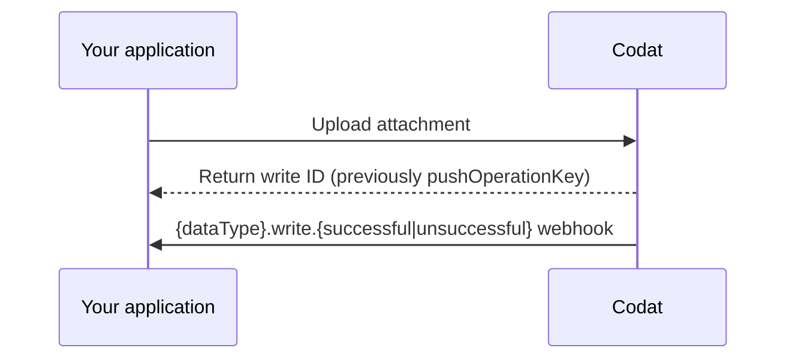

import Tabs from "@theme/Tabs";
import TabItem from "@theme/TabItem";

Codat offre la possibilité de téléverser des pièces jointes vers des enregistrements dans les logiciels comptables pris en charge. Vous pouvez écrire une pièce jointe pour les types de données comptables suivants :

| Type de données   | UploadAttachment |
| ----------------- | ---------------- |
| `billCreditNotes` | &#9989;          |
| `bills`           | &#9989;          |
| `directCosts`     | &#9989;          |
| `directIncomes`   | &#9989;          |
| `invoices`        | &#9989;          |
| `transfers`       | &#9989;          |

## Processus de téléversement de pièces jointes

Un processus de téléversement de pièce jointe chez Codat consiste en les étapes suivantes :

1. **[Effectuer une requête d'écriture](#make-a-write-request)**

   Une fois terminée, vous recevrez un identifiant de requête d'écriture. Utilisez-le pour suivre le statut de la requête.

2. **[Consommer le webhook d'écriture pertinent](#consume-the-write-webhook)**

   Abonnez-vous au webhook `{dataType}.write.{successful|unsuccessful}` pertinent pour recevoir des notifications de succès ou d'échec de la requête d'écriture.



### Effectuer une requête d'écriture

Pour téléverser une pièce jointe vers un enregistrement, incluez l'identifiant de l'entreprise, l'identifiant de connexion pertinent, l'identifiant de l'enregistrement pour le type de données et le fichier de la pièce jointe lui-même dans votre appel API.

Dans l'exemple ci-dessous, nous téléversons une pièce jointe pour notre type de données `bills`.

<Tabs groupId="language">

<TabItem value="typescript" label="TypeScript">

```typescript
const uploadAttachmentResponse = await sdk.bills.uploadAttachment({
  companyId: companyId,
  connectionId: connectionId,
  billId: billId,
  attachmentUpload: {
    file: {
      content: new TextEncoder().encode(fileContent),
      fileName: fileName,
    },
  },
});
```

</TabItem>

<TabItem value="python" label="Python">

```python
upload_attachment_response = sdk.bills.upload_attachment(operations.UploadBillAttachmentRequest(
    company_id=company_id,
    connection_id=connection_id,
    bill_id=bill_id,
    attachment_upload=shared.AttachmentUpload(
        file=shared.CodatFile(
            content=file_content.encode(),
            file_name=file_name,
        )
    )
))
```

</TabItem>

<TabItem value="csharp" label="C#">

```c#
var uploadAttachmentResponse = await sdk.Bills.UploadAttachmentAsync(new UploadBillAttachmentRequest() {
    CompanyId = companyId,
	ConnectionId = connectionId,
    BillId = billId,
    File = new CodatFile(){
        Content = fileContent,
        FileName = fileName
    }
});
```

</TabItem>

<TabItem value="go" label="Go">

```go
ctx := context.Background()
uploadAttachmentResponse, err := sdk.Bills.UploadAttachment(ctx, operations.UploadBillAttachmentRequest{
    CompanyID: companyID,
    ConnectionID: connectionID,
    BillID: billID,
    AttachmentUpload: &shared.AttachmentUpload{
        File: shared.CodatFile{
            Content: []byte(fileContent),
            FileName: fileName,
        },
    },
})
```

</TabItem>

<TabItem value="java" label="Java">

```java
UploadBillAttachmentRequest uploadAttachmentRequest = UploadBillAttachmentRequest.builder()
    .companyId(companyId)
    .connectionId(connectionId)
    .billId(billId)
    .attachmentUpload(AttachmentUpload.builder()
        .file(CodatFile.builder()
                .content(fileContent.getBytes())
                .fileName(fileName)
                .build())
        .build())
    .build();

UploadBillAttachmentResponse uploadAttachmentResponse = sdk.bills().uploadAttachment()
    .request(uploadAttachmentRequest)
    .call();
```

</TabItem>

</Tabs>

### Consommer le webhook d'écriture

Abonnez-vous à nos webhooks spécifiques aux types de données pour suivre le résultat d'une requête d'écriture terminée :

- `{dataType}.write.successful`
- `{dataType}.write.unsuccessful`

Pour créer un consommateur de webhook pour ces types d'événements, naviguez vers **Paramètres > Webhooks > Événements > Configurer le consommateur** dans le [Portail Codat](https://app.codat.io) et cliquez sur **Ajouter un endpoint**. Consultez [Créer des consommateurs de webhooks pour s'abonner aux événements](/using-the-api/webhooks/create-consumer) pour des instructions détaillées.

La charge utile du webhook inclut des informations sur l'identifiant de l'entreprise et l'identifiant de l'enregistrement pour lequel le téléversement de la pièce jointe a été tenté. Si l'opération d'écriture réussit, la charge utile inclut également l'identifiant de la pièce jointe. Nous avons fourni un exemple de charge utile webhook pour une opération d'écriture réussie téléversant une pièce jointe vers une facture fournisseur.

<details>
  <summary><b>Exemple de charge utile webhook</b></summary>

```json
{
  "id": "bae71d36-ff47-420a-b4a6-f8c9ddf41140",
  "eventType": "bills.write.successful",
  "generatedDate": "2023-05-03T10:00:23.000Z",
  "payload": {
    "id": "a9367074-b5c3-42c4-9be4-be129f43577e",
    "type": "Create",
    "referenceCompany": {
      "id": "70af3071-65d9-4ec3-b3cb-5283e8d55dac",
      "name": "Toft stores"
    },
    "connectionId": "12571faf-0898-47e7-afdd-0fe9eb0a9bf5",
    "requestedOnDate": "2023-05-03T10:00:00.000Z",
    "completedOnDate": "2023-05-03T10:00:23.000Z",
    "status": "Success",
    "record": {
      "id": "bil_1Nispe2eZvKYlo2Cd31jOCgZ"
    },
    "attachmentId": "att_2Ksoie6eDvErJo249lsieqpD9"
  }
}
```

</details>
